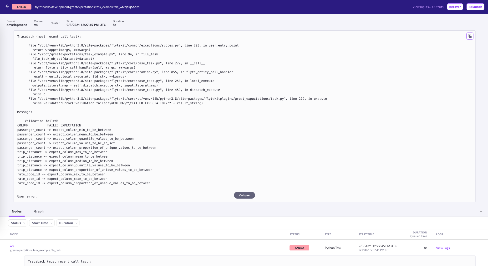

import Prerequisites from '../guides/connecting_to_your_data/components/prerequisites.jsx'

*This piece of documentation was authored by [Samhita Alla](https://www.linkedin.com/in/samhita-alla) and the [Flyte](https://flyte.org/) team*

This guide will help you run a Great Expectations in [Flyte](https://flyte.org/)

<Prerequisites>

- [Set up a working deployment of Great Expectations](../tutorials/getting_started/intro.md)
- [Created an Expectation Suite](../tutorials/getting_started/create_your_first_expectations.md)
- [Connecting to Data](../tutorials/getting_started/connect_to_data.md)
- Flyte [Getting Started Guide](https://docs.flyte.org/en/latest/getting_started.html) 

</Prerequisites>

The power of data validation in Great Expectations can be integrated with Flyte to validate the data moving in and out of the pipeline entities you may have defined in Flyte. This helps establish stricter boundaries around your data to ensure that everything works as expected and data does not crash your pipelines anymore unexpectedly!

[Flyte](https://flyte.org/) is a structured programming and distributed processing platform that enables highly concurrent, scalable, and maintainable workflows for Machine Learning and Data Processing. It is a fabric that connects disparate computation backends using a type-safe data dependency graph. It records all changes to a pipeline, making it possible to rewind time. It also stores a history of all executions and provides an intuitive UI, CLI, and REST/gRPC API to interact with the computation.

### Key Benefits of Flyte
* Kubernetes-Native Workflow Automation Platform
* Ergonomic SDKs in Python, Java & Scala
* Versioned & Auditable
* Reproducible Pipelines
* Strong Data Typing
See all of the features offered by Flyte in the [README](https://github.com/flyteorg/flyte#readme).

Here’s a simple Flyte code snippet using the Python Flytekit API that defines a [Flyte task](https://docs.flyte.org/projects/flytekit/en/latest/generated/flytekit.task.html#flytekit-task) to compute the total pay, which returns the output as a pandas DataFrame:

```python
import pandas as pd
from flytekit import Resources, task


@task(limits=Resources(cpu="2", mem="150Mi"))
def total_pay(hourly_pay: float, hours_worked: int, df: pd.DataFrame) -> pd.DataFrame:
   return df.assign(total_pay=hourly_pay * hours_worked)
```

## The Idea
Flyte helps automate how we architect our ML or data pipelines, which means data is an integral part of Flyte, and lots of data points flow in and out of the pipelines. Keeping an eye on data all the time isn’t a feasible solution. What we need is an automated mechanism that validates our data thoroughly.

Flyte does have a [native type system](https://docs.flyte.org/projects/cookbook/en/latest/auto/core/type_system/flyte_python_types.html) that enforces the correctness of data; however, that alone doesn’t suffice in performing comprehensive data validation. This is where Great Expectations can help Flyte take its data validation system to the next level!

*If you haven’t worked with Flyte before, jump right into the [getting started tutorial](https://docs.flyte.org/en/latest/getting_started.html).*

## Background
As mentioned earlier, Flyte has a native type system. This includes support for FlyteFile and FlyteSchema. 
* [FlyteFile](https://docs.flyte.org/projects/flytekit/en/latest/generated/flytekit.types.file.FlyteFile.html#flytekit.types.file.FlyteFile): FlyteFile represents an automatic persistence object in Flyte. It represents files in remote storage, and Flyte will transparently materialize them in every task execution.
* [FlyteSchema](https://docs.flyte.org/projects/flytekit/en/latest/generated/flytekit.types.schema.FlyteSchema.html#flytekit.types.schema.FlyteSchema): FlyteSchema supports tabular data. Examples include pandas DataFrame, Spark DataFrame, etc. 

The integration has been written such that both FlyteFile and FlyteSchema are inherently supported. So you can validate FlyteFile and FlyteSchema using Great Expectations within any Flyte pipeline!

*Flyte types have been added because, in Great Expectations, we have the ability to pass a non-string (Pandas/Spark DataFrame) when using a [RuntimeDataConnector](https://docs.greatexpectations.io/docs/reference/datasources#runtimedataconnector-and-runtimebatchrequest) but not when using an [InferredAssetFilesystemDataConnector](https://legacy.docs.greatexpectations.io/en/latest/autoapi/great_expectations/datasource/data_connector/inferred_asset_filesystem_data_connector/index.html?highlight=InferredAssetFilesystemDataConnector#great_expectations.datasource.data_connector.inferred_asset_filesystem_data_connector.InferredAssetFilesystemDataConnector) or a [ConfiguredAssetFilesystemDataConnector](https://legacy.docs.greatexpectations.io/en/latest/autoapi/great_expectations/datasource/data_connector/configured_asset_filesystem_data_connector/index.html#great_expectations.datasource.data_connector.configured_asset_filesystem_data_connector.ConfiguredAssetFilesystemDataConnector). For the latter case, with the integration of Flyte types, we can give a Pandas/Spark DataFrame or a remote URI as the dataset.*

## Ways to Define the Integration
To use the plugin, run the following commands:

```
pip install flytekit
pip install flytekitplugins-great_expectations
```
An integration in Flyte can be a task or a type. 
* **Flyte Task**: A Flyte task defines the task prototype that one could use within a task or a [workflow](https://docs.flyte.org/projects/flytekit/en/latest/generated/flytekit.workflow.html#flytekit-workflow). Example: [Papermill](https://docs.flyte.org/projects/cookbook/en/latest/auto/integrations/flytekit_plugins/papermilltasks/simple.html)
* **Flyte Type**: A Flyte type is a custom data type that one could attach to the data flowing through Flyte pipelines. Example: [Pandera](https://docs.flyte.org/projects/cookbook/en/latest/auto/integrations/flytekit_plugins/pandera_examples/basic_schema_example.html)

Great Expectations in Flyte is available both as a task and a type.

### Task Example
Great Expectations can be written as a Flyte task. Before running the code examples, make sure to have the Great Expectations configuration and expectation suites set up. Here’s an example using `FlyteFile`:

```python
import pandas as pd
from flytekit import Resources, kwtypes, task, workflow
from flytekit.types.file import CSVFile
from flytekitplugins.great_expectations import GreatExpectationsTask

file_task_object = GreatExpectationsTask(
   name="great_expectations_task_flytefile",
   datasource_name="data",
   inputs=kwtypes(dataset=CSVFile),
   expectation_suite_name="test.demo",
   data_connector_name="data_flytetype_data_connector",
   local_file_path="/tmp",
   context_root_dir="great_expectations",
)


@task(limits=Resources(mem="500Mi"))
def file_task(
   dataset: CSVFile,
) -> int:
   file_task_object(dataset=dataset)
   return len(pd.read_csv(dataset))


@workflow
def file_wf(
   dataset: CSVFile = "https://raw.githubusercontent.com/superconductive/ge_tutorials/main/data/yellow_tripdata_sample_2019-01.csv",
) -> int:
   return file_task(dataset=dataset)

```
Note: Additional Batch Request parameters can be given using [`BatchRequestConfig`](https://github.com/flyteorg/flytekit/blob/b8a3c7d34e6b19722a6a968dc05506ad1eb26912/plugins/flytekit-greatexpectations/flytekitplugins/great_expectations/task.py#L22-L39).

In the code, we define a `file_task_object` that encapsulates the Great Expectations configuration. Later, we initialize a Flyte task that performs data validation and returns the length of the DataFrame once the validation succeeds. 

`CSVFile`—a variant of FlyteFile, accepts remote dataset and downloads it to the user-given `local_file_path`. The plugin then fetches the file from that specific path and does validation. If the validation fails, the plugin shows the data columns and the associated expectations. 



<small>Figure: Validation failure message on the Flyte console</small>

**Note**: `local_file_path`’s directory and `base_directory` in Great Expectations config should be the same.

### Type Example
Great Expectations validation can be encapsulated in Flyte’s type-system. Here’s an example using `FlyteSchema`:

```python
import pandas as pd
from flytekit import Resources, task, workflow
from flytekit.types.schema import FlyteSchema
from flytekitplugins.great_expectations import (
   BatchRequestConfig,
   GreatExpectationsFlyteConfig,
   GreatExpectationsType,
)


@task(limits=Resources(mem="500Mi"))
def schema_task(
   dataframe: GreatExpectationsType[
       FlyteSchema,
       GreatExpectationsFlyteConfig(
           datasource_name="data",
           expectation_suite_name="test.demo",
           data_connector_name="data_flytetype_data_connector",
           batch_request_config=BatchRequestConfig(data_connector_query={"limit": 10}),
           local_file_path="/tmp/test.parquet",
           context_root_dir="great_expectations",
       ),
   ]
) -> int:
   return dataframe.shape[0]


@task
def to_df(dataset: str) -> pd.DataFrame:
   return pd.read_csv(dataset)


@workflow
def schema_wf() -> int:
   return schema_task(
       dataframe=to_df(
           dataset="https://raw.githubusercontent.com/superconductive/ge_tutorials/main/data/yellow_tripdata_sample_2019-01.csv"
       )
   )

```
In the code, we define a `schema_task` that accepts a `dataframe` argument, which is associated with the `GreatExpectationsType`. The first argument denotes the data type, which in our case is a `FlyteSchema`, and the second argument represents the Great Expectations configuration. 

The `GreatExpectationsType` generates a parquet file and copies it to the `local_file_path` when inputting the tabular data. This path is then used to perform data validation.

## But Wait, There’s More
Great Expectations’ `RunTimeBatchRequest` can be used just like a simple `BatchRequest` in Flyte. Make sure to set up the data connector correctly. The plugin then automatically checks for the type of batch request and instantiates it. Check `RunTimeBatchRequest` in [task](https://docs.flyte.org/projects/cookbook/en/latest/auto/integrations/flytekit_plugins/greatexpectations/task_example.html#runtimebatchrequest) and [type](https://docs.flyte.org/projects/cookbook/en/latest/auto/integrations/flytekit_plugins/greatexpectations/type_example.html#runtimebatchrequest) examples.

In the future, we plan to integrate Great Expectations data docs with Flyte UI. This can enhance the visualization of errors and capture the key characteristics of the dataset.

## Here’s Where to Go Next
Refer to the fully worked [task](https://docs.flyte.org/projects/cookbook/en/latest/auto/integrations/flytekit_plugins/greatexpectations/task_example.html) and [type](https://docs.flyte.org/projects/cookbook/en/latest/auto/integrations/flytekit_plugins/greatexpectations/type_example.html) examples in the Flyte documentation to understand how well Great Expectations integrates with Flyte. To run the code examples in Flyte sandbox, refer to the [setting up the environment section](https://docs.flyte.org/projects/cookbook/en/latest/index.html#setting-up-your-environment-to-run-the-examples).

Let us know if you have any questions or suggestions and feel free to jump into the [Great Expectations Slack](http://greatexpectations.io/slack) as well as [Flyte's Slack](https://docs.google.com/forms/d/e/1FAIpQLScWPJZncyL-bBCWbuQ9HWuMzA8-r2RJc__CSWJoAYUQADN-BQ/viewform)!
