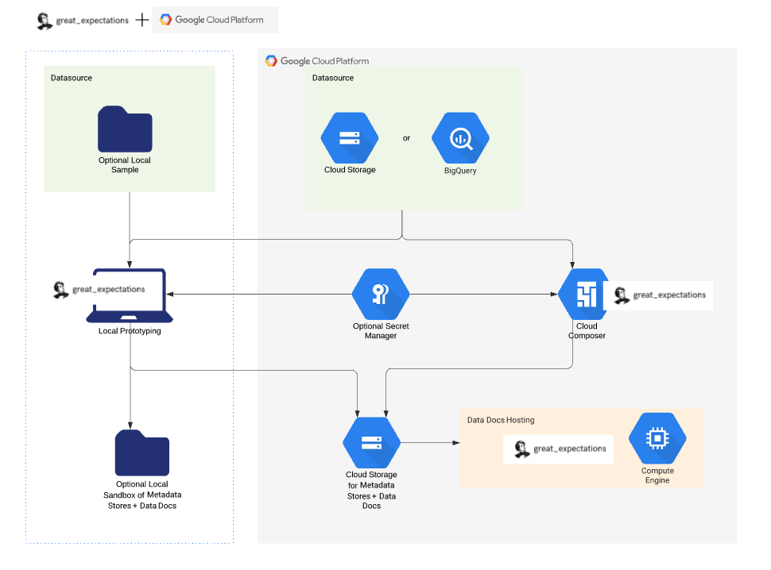

import Prerequisites from './components/deployment_pattern_prerequisites.jsx'
import Tabs from '@theme/Tabs';
import TabItem from '@theme/TabItem';
import Congratulations from '../guides/connecting_to_your_data/components/congratulations.md'

Great Expectations works well with many types of Google Cloud Platform (GCP) workflows (including with BigQuery datasources). This guide will help you run Great Expectations in [Google Cloud Platform](https://cloud.google.com/gcp).

# TODO: Check and make sure this acronym list is complete

  
What are all these acronyms?

Before we get started, here is a glossary of some key acronyms used in this guide:
<ul>
    <li>GCP: Google Cloud Platform</li>
    <li>GCS: Google Cloud Storage</li>
    <li>GCC: Google Cloud Composer</li>
    <li>TODO: Check and make sure this list is complete</li>
</ul>
 

# TODO: Fill in better Prereqs

<Prerequisites>

- Have read through the documentation and become familiar with the Google Cloud Platform features that are used in this guide.
- Have completed GCP setup including having a running ????
- If you are using the file based version of this guide, you'll need to have GCS set up with ???? permissions

</Prerequisites>

# TODO: Flesh out this OUTLINE 
This outline follows our Universal Map:
1. Set Up Great Expectations
2. Connect to your Data
3. Create Expectations
4. Validate your Data

Our recommended approach to using Great Expectations in a purely Google Cloud Platform environment is to use the following services:
- Google Cloud Composer (which is backed by Airflow) for managing workflow orchestration including running Checkpoints. TODO: Steer toward Airflow 2.0? TODO: Use Airflow GE operator? No, not yet updated for v3. Maybe mention it.
  - TODO: (Potential TODO) Investigate and Mention other options
      1. "Workflows" https://cloud.google.com/workflows automate serverless workflows
      2. "Dataflow" https://cloud.google.com/dataflow "Fully managed data processing service" - NO this does not do scheduling, but consider mentioning it if it's possible to use to run GE, kicked off from another service.
- BigQuery or Google Cloud Storage as your datasource
- Google Cloud Storage for storing metadata (Expectation Suites, Validation Results, Data Docs)
- Google App Engine for hosting and controlling access to Data Docs

# TODO: Improve this diagram (at least clean it up and get higher res output)

If you use a different configuration and have ideas about how this guide can be improved, please connect with us on slack or submit a PR - we love to make things better. 

This Guide:

NOTE: This guide recommends in-code data context use. For file based data contexts we may add parenthetical statements.
NOTE: This guide recommends prototyping locally using sample data when possible. TODO: Describe this more fully

1. Install Great Expectations
   1. Show GCC docs for installing 3rd party libraries from pypi, maybe add screenshots: https://cloud.google.com/composer/docs/how-to/using/installing-python-dependencies#console. TODO: Recommend installing without version pin - but maybe <0.14.0 since we use minor versions for breaking changes? Mention other ways of running GE, but this is recommended.
   2. Link to installing GE doc locally, describe again why this may help you speed up your dev loop. Explain how to set up your metadata stores in your local env to push expectation suites to your prod env.
2. Set up Great Expectations
   1. Show in-code context (using GCS default configs, GCS as metadata and data docs stores)
   2. Reference in expandable block that you can also use great_expectations.yml (in GCS) - see Rex's approach from last year. You'll need to configure this manually or via CLI. TODO: Try this approach - does this work easily if you can't access your datasources when you are configuring them?
   3. If file based works sufficiently well - In collapse: <What is the difference?> We recommend either way, as long as you keep your config under version control (TODO: Also add this note to databricks guide?)
   4. Mention secrets store: https://docs.greatexpectations.io/docs/guides/setup/configuring_data_contexts/how_to_configure_credentials_using_a_secrets_store/ - TODO: how does this work under the hood? Can this be used easily with an in-code config?
   5. Mention and link(s) to substitution variables content e.g. https://docs.greatexpectations.io/docs/guides/setup/configuring_data_contexts/how_to_configure_credentials_using_a_yaml_file_or_environment_variables/
   6. Discuss setting up data docs using https://docs.greatexpectations.io/docs/guides/setup/configuring_data_docs/how_to_host_and_share_data_docs_on_gcs
   7. Mention that you may be able to use BigQuery as a metadata store backend but that it is not currently supported.
3. Prepare your data
   1. GCS / File based: Pull taxi data from our repo or another source
   2. BigQuery: Use pre-packaged sample data if exists, otherwise load taxi data from our repo or another source
4. Connect to your data
   1. Mention that if you want to use an interactive configuration loop to connect to your data using `test_yaml_config` then you can either spin up a local notebook or possibly use something like https://cloud.google.com/vertex-ai-workbench for a hosted notebook environment (add this as an untested note unless we have a chance to test). Note that you'll need to copy and paste your datasource config into your in-memory context or upload your file based context.
   2. GCS / File based (yaml + python config tabs): Show InferredAssetGCSDataConnector but mention Configured and link to other docs incl doc explaining the difference. Link to existing docs: https://docs.greatexpectations.io/docs/guides/connecting_to_your_data/cloud/gcs/pandas, https://docs.greatexpectations.io/docs/guides/connecting_to_your_data/cloud/gcs/spark
   3. BigQuery (yaml + python config tabs): Show InferredAssetSqlDataConnector but mention Configured and link to other docs incl doc explaining the difference
      1. Configuration details here, reference this doc: https://docs.greatexpectations.io/docs/guides/connecting_to_your_data/database/bigquery
5. Create Expectations
   1. Discuss 3 ways (manual, interactive, profile) link to docs where possible
      1. https://docs.greatexpectations.io/docs/guides/expectations/how_to_create_and_edit_expectations_with_instant_feedback_from_a_sample_batch_of_data
      2. https://docs.greatexpectations.io/docs/guides/expectations/how_to_create_and_edit_expectations_based_on_domain_knowledge_without_inspecting_data_directly
      3. https://docs.greatexpectations.io/docs/guides/expectations/advanced/how_to_create_a_new_expectation_suite_using_rule_based_profilers
   2. Set up GE locally using local datasource / remote GCS expectation store (mention also you can use local expectation store and then upload to remote GCS expectation store)
   3. For interactive & profile discuss creating a sample of data - e.g. output csv to GCS or locally. Then create datasource to read that to use cli workflow.
6. Validate your data
   1. Create a checkpoint locally, testing using `test_yaml_config` and then either push to remote store or copy configuration into your cloud composer task, or possibly use something like https://cloud.google.com/vertex-ai-workbench to create in a hosted notebook environment (add this as an untested note unless we have a chance to test).
      1. Note - checkpoint should be SimpleCheckpoint or at least contain the build data docs action.
   2. Use Google Cloud Composer to run this - check versioning, some GE versions used to not work with GCC. V 1.10 or V 2.0 - steer toward airflow 2.0?
   3. TODO: You may be able to check this locally if you can access your datasource / expectation store locally, or possibly use something like https://cloud.google.com/vertex-ai-workbench for a hosted notebook environment (add this as an untested note unless we have a chance to test). 
   4. TODO: Does the GE Airflow provider work with v3 API? https://github.com/great-expectations/airflow-provider-great-expectations No. Make a note here that it is not yet updated.
7. Build and view Data Docs
   1. Build should happen automatically because of the action above
   2. View 
8. Congratulations!