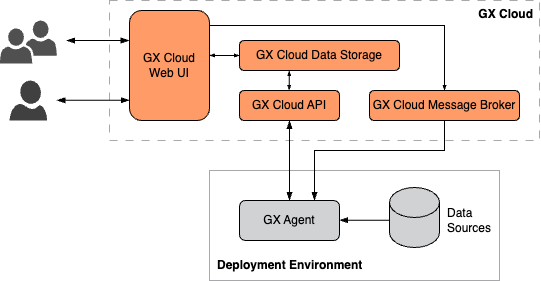

GX Cloud builds on the innovative features of GX open source software (OSS). Its easy-to-use web interface lets you quickly validate your data without creating and running complex Python code. With GX Cloud you can work collaboratively with your teammates to define and test reusable data queries that alert you to changes in your data.

While it is possible to design and deploy a functioning data quality ecosystem with GX OSS, GX Cloud simplifies infrastructure and deployment significantly. With GX Cloud, you'll save time, money, and effort implementing your data quality management and monitoring solution.

Here are just a few of the benefits you'll get with GX Cloud:

- It's web-based and browser- and platform-independent.

- A hosted environment and intuitive interface makes it faster to set up and run your data Validations.

- Features such as Validation run histories, Data Asset metrics, and more.

- No more need to create, run, and maintain complex code for your data queries.

- No more need to host GX OSS Data Docs. GX Cloud takes care of hosting and allows your organization to focus on managing and monitoring data.

- Hosted backend storage for GX deployments. With GX OSS, you need to set up and maintain a collection of required backend stores, including stores for your GX component configurations, data quality metadata, and data validation history. GX Cloud removes the need to deploy and maintain this additional internal infrastructure&mdash;with GX Cloud, your backend stores are fully-managed.

## GX Cloud architecture

The following diagram provides an overview of the key GX Cloud architecture components:

### GX Cloud components

- **GX Cloud data storage** - Stores your organization's Data Source, Data Asset, Expectation Suite, and Checkpoint configurations and your organization's Validation run histories and Data Asset descriptive metrics.

- **GX Cloud web UI** - Provides a portal to manage and validate your organization's data quality without running Python code, and enables shared visibility into your organization's Validation Results and Checkpoint run history. It's browser- and platform-independent.

- **GX Cloud API** - Provides a REST API to programmatically access and manage GX Cloud data and configurations. Both the GX open source software (OSS) client and the GX Agent use the GX Cloud API to query data from and send data to GX Cloud. Documentation for the GX Cloud API is not currently available, and it is not yet intended for use outside the GX OSS client and the GX Agent.

- **GX Cloud message broker** - Enables communication between GX Cloud and the GX Agent.

### Local and deployment components

- **GX OSS client** - The Python library that powers GX Cloud and provides a Python client for programmatic access to GX Cloud. GX OSS contains the logic needed to test and document your organization's data, and you can also use it to create, manage, and interact with GX Cloud components.

- **GX Agent** - A utility that runs in your organization's deployment environment. While running, the GX Agent can receive tasks generated from the GX Cloud web UI, such as running a Checkpoint or fetching Column Descriptive Metrics, and execute these tasks against your Data Assets.

## GX Agent

The GX Agent serves as an intermediary between GX Cloud and your organization's data stores. The GX Agent performs jobs initiated from the GX Cloud web UI; GX Cloud does not connect directly to your data. All data access occurs within the Agent, and the results of jobs are sent from the Agent to GX Cloud.

The GX Agent is [typically deployed in your organization's cloud services environment](./connect/connect_snowflake#deploy-the-gx-agent) and serves all GX Cloud users within your organization. It can be run as part of development or production workflows.

## GX Cloud deployment patterns

GX Cloud deployments can be tailored to meet your specific business requirements. The following factors determine what deployment pattern is most suited for your organization:

- Whether your users want to interact with the GX OSS client locally, or use only the GX Cloud web UI.

- The deployment environment in which you run the GX Agent - for example, development or production.

- Whether you choose to integrate GX Cloud into your data pipeline infrastructure via an orchestrator.

### Users interact with the GX Cloud web UI only

GX Cloud supports the creation of multiple types or Data Sources and Data Assets within the web UI. If your organization is using GX Cloud to test and validate data from these sources, a deployment pattern in which the GX Agent runs in your organization's deployment environment and users leverage the GX Cloud web UI to manage GX workflows is recommended.

### Users interact with both the GX Cloud web UI and GX OSS client

If your organization needs to use GX to connect to, test, and validate multiple Data Sources supported by GX OSS, a deployment pattern that allows users to interact with the GX Cloud web UI and with the GX OSS client locally is recommended.

### Run GX OSS within an orchestrator

If your organization needs to integrate GX Cloud with an orchestrator, or needs to run GX Cloud workflows on a schedule, you can run the GX OSS client within your organization's data pipeline and store the test and validation results in GX Cloud for shared viewing in the GX Cloud web UI.

### Custom deployment patterns

The deployment patterns described previously are not an exhaustive collection of the ways you can deploy GX Cloud. Instead, these patterns are meant to illustrate the building blocks of a GX Cloud deployment and how your organization can configure and connect those blocks to form a functioning data quality ecosystem.

For example, you might opt to run and interact with the GX OSS client locally to define your Data Sources, Data Assets, Expectation Suites, and Checkpoints, run the GX OSS client in your Airflow pipeline to execute Checkpoints on a regular schedule, run the GX Agent in your production environment to fetch Data Asset metrics from the GX Cloud web UI, and access the GX Cloud web UI to view Validation and Checkpoint run histories.

GX provides flexible, robust products that allow your organization to quickly deploy GX Cloud or GX OSS to fit your unique requirements.

## GX Cloud deployment options

Your data quality testing and morntoring requirements determine what deployment option is best for you or your organzation. The following table lists the available GX Cloud deployment options.

| Deployment Option          | Description                                                               | GX Cloud       | GX OSS        |
|----------------------------|---------------------------------------------------------------------------|----------------|---------------|
| Self-hosted                | The GX Agent or GX OSS Client is deployed locally for testing.            |     ✔️️         |      ✔️️      |
| Deployed                   | The GX Agent or GX OSS Client is deployed in your deployment environment. |     ✔️️         |      ✔️️      |
| Programmatic               | You interact with GX Cloud or GX OSS programatically with Python.         |     ✔️️         |      ✔️️      |

## Workflow optimization

GX Cloud helps you get started faster and simplifies your data Validation workflows. Here's how:

- You can identify your Data Source, connect to a Data Asset, create Expectations, and then run Validations without running a single line of Python code. 

- You can reuse or modify your Expectations as your business requirements change. No need to create new Expectations every time you need to validate your data.

- You can execute Validations with the click of a button and get your results immediately.

- You can share Validation data quickly and make it accessible to all users regardless of their technical knowledge.

## GX Cloud workflow

The GX Cloud workflow is a sequence of tasks you complete to perform Data Validations. 

You connect GX Cloud to a Data Asset stored on your Data Source, you define and create an Expectation, and then you run a Validation on the data defined in the Expectation. Knowing that your data meets your Expectations helps you ensure your data is accurate and reliable and alerts you to issues before they become problematic.

The following table lists the sequence of tasks that you complete in a typical GX Cloud workflow. A brief description of the task and links to the relevant topics are provided.

| Task                                     | Description                                                        |
|------------------------------------------|--------------------------------------------------------------------|
|[Connect GX Cloud](connect/connect_lp.md) | Set up your production environment to get the most out of GX Cloud. Do it once, and you don't need to do it again. If you're not ready to use GX Cloud in your production environment, see [Try GX Cloud](./try_gx_cloud.md).                                   | 
| [Connect to a Data Asset on a Data Source](./data_assets/manage_data_assets.md#create-a-data-asset) | The Data Asset contains the data you want to examine and validate, and the Data Source is where the Data Asset is located. | 
| [Create an Expectation](./expectations/manage_expectations.md)    | Define verifiable assertions about your data.                       |  
| [Run Validations](./validations/manage_validations.md)                          | Run a Validation to determine if your data meets the assertions in the Expectation.                       |
| (Optional) [Add and run Checkpoints](./checkpoints/manage_checkpoints.md)       | Add and run Checkpoints to refine and confirm your Data Validations. |

## Roles and responsibilities

How you interact with GX Cloud is dependent on the role you're assigned by your Admin. The following table lists GX Cloud roles and responsibilities. 

| Role          | Responsibilities                                  |
|---------------|---------------------------------------------------|
| Viewer        | View Checkpoints and Validation Results           | 
| Editor        | Create Data Assets Create and edit Expectations Create access tokens Create and edit Checkpoints |
| Admin         | Full access Perform all GX Cloud administrative functions including user and role assignment |

## Supported browsers

The following browsers are supported by GX Cloud:

- [Google Chrome](https://www.google.com/chrome/) — the latest version is fully supported

- [Mozilla Firefox](https://www.mozilla.org/en-US/firefox/) — the latest version is fully supported

- [Apple Safari](https://www.apple.com/safari/) — the latest version is fully supported

- [Microsoft Edge](https://www.microsoft.com/en-us/edge?ep=82&form=MA13KI&es=24) — the latest version is fully supported

### Browser session duration

A session is the period of time that you’re signed in to your GX Cloud account from a browser. If you close the browser, your session ends, and you're signed out. You'll need to sign in again to access GX Cloud.

## Get support

If you can't find what you need in the documentation, we're here to help! You can 
email us at [support@greatexpectations.io](mailto:support@greatexpectations.io) or create a ticket on our [support portal](https://support.greatexpectations.io).

Additionally, we have a community to support you.  You can start a thread about your topic in the community [discourse forum](https://discourse.greatexpectations.io/c/cloud-support/) or [discuss your issue with GX community members on Slack](https://greatexpectationstalk.slack.com/).
