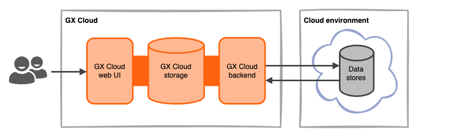
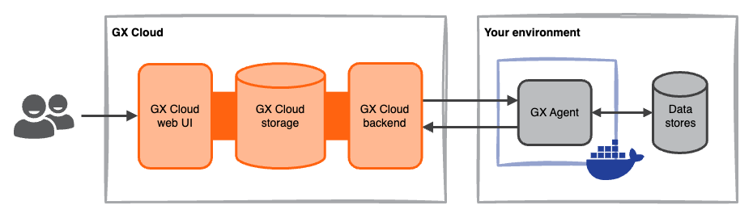
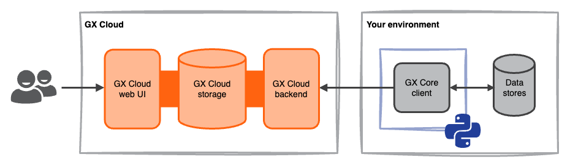

GX Cloud deployment patterns are defined by how GX Cloud connects to your data. The primary deployment pattern is a [fully-hosted deployment](#fully-hosted-deployment).

| Deployment pattern | Summary | When to use |
| :-- | :-- | :-- |
| [Fully-hosted](#fully-hosted-deployment) | GX Cloud connects directly to your data through a secure, cloud-to-cloud connection. | You want to get started quickly and securely with GX Cloud and use direct Data Source connections. |
| [Agent-enabled](#agent-enabled-deployment) | GX Cloud connects to your data through the GX Agent, a utility that you run in your environment. The Agent serves as an intermediary between GX Cloud and your data; in this deployment pattern, GX Cloud does not connect directly to your data. | You want to connect to Data Sources using your organization's environment and infrastructure, for enhanced control and security. |
| [Read-only](#read-only-deployment) | GX Cloud does not connect to your data. You use the GX Core Python library to define your GX workflows, to connect to your data, and to run Validations in your environment. GX Cloud serves as a read-only store for your Data Asset and Expectation configurations, and provides a web interface to view Validation Results. | You want to use GX Cloud as a read-only store to view and share Validation Results. |

## Fully-hosted deployment

In a fully-hosted deployment, GX Cloud connects directly to your organization's data using a cloud-to-cloud connection. Connection to your data is read-only and uses encrypted communication. Fully-hosted deployments are the quickest way to get started with GX Cloud.

If you are using a fully-hosted deployment, ensure that the following GX Cloud IPs are in your organization's allow list for ingress traffic.
- `44.209.54.123`
- `54.235.167.60`
- `34.194.243.19`

## Agent-enabled deployment

In an agent-enabled deployment, the GX Agent runs in your environment and serves as an intermediary between GX Cloud and your data. GX Cloud sends jobs to the GX Agent, the GX Agent connects to and interacts with your data, and the GX Agent reports job results back to GX Cloud.

The GX Agent is a Docker container that can be run in your organization's deployment environment or locally. See [Deploy the GX Agent](/cloud/deploy/deploy_gx_agent.md) for setup details.

## Read-only deployment

In a read-only deployment, you use the GX Core Python library to push GX metadata to GX Cloud. You run the GX Core Python library in your environment to define your GX data validation workflows, connect to your data, and to run Validations. GX Cloud serves as a backend store for programmatically created Data Asset configurations, Expectation configurations, and Validation Result history.

In this deployment scenario, there is a one-way flow of information from your environment to GX Cloud.

