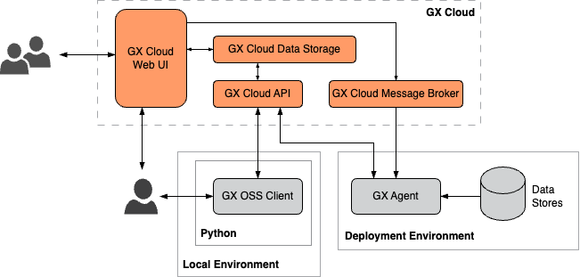
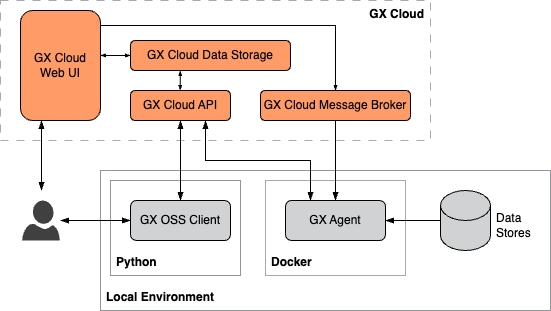
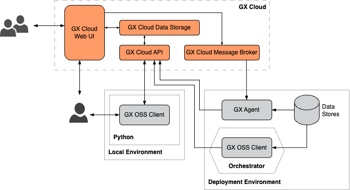

# GX Cloud deployment patterns

GX Cloud deployments can be tailored to meet your specific business requirements. How your data is accessed and how you want your users to interact with GX Cloud determine which deployment pattern and GX architectural components are suitable for your organization.

| Deployment pattern               | Description                                                                                                                                                                                                                                                                                      | When to use                    |
|----------------------------------|--------------------------------------------------------------------------------------------------------------------------------------------------------------------------------------------------------------------------------------------------------------------------------------------------|--------------------------------|
| [Fully hosted](#fully-hosted) | You connect your data to GX Cloud entirely through its web interface, in a fully hosted GX-managed environment. Connections to your data are read-only, using secure, encrypted methods.                                                                                                         | You want to get started quickly and securely with GX Cloud using direct cloud-to-cloud Data Source connection. |
| [Org-hosted GX Agent](#org-hosted-gx-agent) | You connect your data to GX Cloud using a utility that runs in your organization's deployment environment. While running, the GX Agent can receive tasks generated from the GX Cloud web UI, such as running a Validation or fetching Metrics, and execute these tasks against your Data Assets. | You want to connect to Data Sources using your organization's cloud infrastructure, for enhanced control and security. |
| [Self-hosted GX Agent](#self-hosted-gx-agent) | You connect your data to GX Cloud using a utility that runs on your local machine. While running, the GX Agent can receive tasks generated from the GX Cloud web UI, such as running a Validation or fetching Metrics, and execute these tasks against your Data Assets.                         |  You want to test the Agent setup on your own machine, before moving to a shared production Agent deployment. |
| [API-only](#api-only)  | You integrate with GX Cloud using Python scripts, the GX Core Python library, and an orchestrator. The GX Cloud web UI is used primarily to view results; all tasks are executed in your own environment.                                                                                        | You want to use GX Cloud as a data store for Expectations and Validation results only. |

## Fully hosted
In a fully hosted deployment, you get started with GX Cloud by connecting directly to your organization's cloud data stores via the GX Cloud UI. This is the fastest path to setup.

If you are using this option please ensure that the GX Cloud IPs are in your organizations allow list for ingress traffic.
- 44.209.54.123
- 54.235.167.60
- 34.194.243.19

## Org-hosted GX Agent

In an org-hosted deployment, you run the GX Agent in your organization's deployment environment. The GX Agent is an intermediary between GX Cloud and your organization's deployment environment data stores. Organization users can interact with GX Cloud using the web UI, the GX Core client, or both.

## Self-hosted GX Agent

In a self-hosted deployment, you use Docker to run the GX Agent in your local environment. The GX Agent is an intermediary between GX Cloud and your local data stores. You can interact with GX Cloud using the web UI, the GX Core Python library, or both.

## API-only

Use Python scripts and an orchestrator to integrate GX Cloud into your existing data pipeline. The GX Core Python library can be used to access your organization's data stores and to store job results in GX Cloud. Users can interact with GX Cloud using the web UI, the GX Core Python library, or both.

## Custom deployment patterns

The deployment patterns described previously are not an exhaustive collection of the ways you can deploy GX Cloud. Instead, these patterns are meant to illustrate the building blocks of a GX Cloud deployment and how your organization can configure and connect those blocks to form a functioning data quality ecosystem.

For example, you might opt to run and interact with the GX Core Python library locally to define your Data Sources, Data Assets, Expectation Suites, and Checkpoints, run the Python scripts utilizing the GX Core library in your Airflow pipeline to execute Checkpoints on a regular schedule, run the GX Agent in your production environment to fetch Data Asset metrics from the GX Cloud web UI, and access the GX Cloud web UI to view Validation and Checkpoint run histories.

GX provides flexible, robust products that allow your organization to quickly deploy GX Cloud or GX Core to fit your unique requirements.