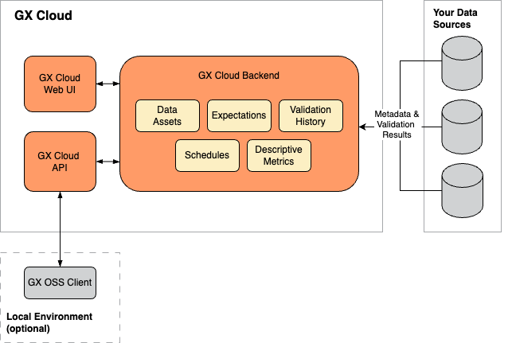
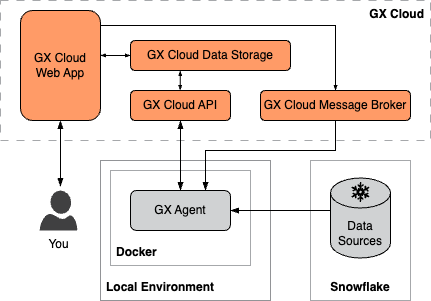
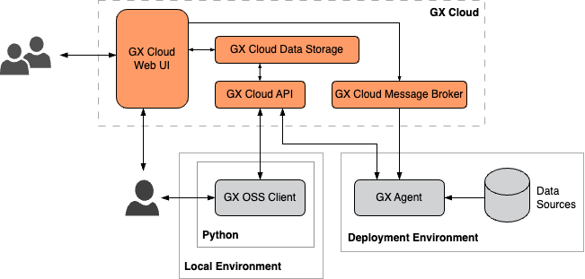
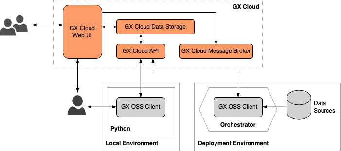

GX Cloud provides a secure, fully-managed SaaS solution to monitor, manage, and share your data quality ecosystem. GX Cloud offers flexible deployment patterns that accommodate your environment and supported data sources.

## GX Cloud architecture

GX Cloud's architecture is depicted in the below diagram and is comprised of the following key components:

- **Cloud storage for data quality configuration, metadata, and history.** GX Cloud provides cloud storage for the Data Source, Data Asset, Expectation Suite, and Checkpoint configurations that comprise your GX workflows. GX Cloud also stores your Validation run histories and Data Asset descriptive metrics.

- **GX Cloud Web App.** GX Cloud includes a web app that is browser- and platform-independent. The GX Cloud Web App enables you to manage and validate your data without running Python code, and provides shared visibility into your Validation Results and Checkpoint run history.

- **GX Cloud REST API.** The GX Cloud REST API provides an interface to programmatically access and manage GX Cloud data and configurations. Both the GX open source software (OSS) client and the GX Agent utilize the GX Cloud REST API to query data from and send data to GX Cloud. The GX Cloud REST API is not currently publicly documented.

- **GX Cloud AMQP Broker.** The GX Cloud Advanced Message Queuing Protocol (AMQP) broker enables connection between GX Cloud and your locally running GX Agent.

GX Cloud operates in tandem with two components that are run within your environment:

- **GX OSS Client.** GX OSS is the Python library that powers GX Cloud and that provides a Python client for GX Cloud when using GX OSS locally in a deployment. GX OSS contains the logic needed to test and document your data, and you can also use it to create, manage, and interact with your GX Cloud entities.

- **GX Agent.** The GX Agent is a utility that runs locally in your environment. When running, the GX Agent can receive tasks generated from the GX Cloud Web App, such as running a Checkpoint or fetching Column Descriptive Metrics, and execute these tasks against your data sources.

## GX deployment patterns

GX deployment is flexible and can be tailored to your use case and requirements. The deployment pattern that you employ is driven by two factors:

1. Whether or not you interact with the GX OSS client locally, or use only the GX Cloud Web App.

2. Where and how you want to run the GX Agent. The GX Agent can be run in your local environment as a Docker container (the recommended approach) or Python program.

### Common deployment patterns

There are several common GX deployment patterns that accommodate a variety of use cases.

#### Run the GX Agent locally and interact with the GX Cloud Web App only
GX Cloud currently supports creation of Snowflake Data Sources and Data Assets directly from the GX Cloud Web App. If you are using GX to test and validate Snowflake data, then you can opt for a deployment pattern in which you run the GX Agent locally and interact solely with the GX Cloud Web App to manage your GX workflows.

#### Run the GX Agent locally and interact with both the GX Cloud Web App and GX OSS client
If you need to use GX to connect to, test, and validate the array of data sources supported by GX OSS, then your deployment pattern will require you to interact with both the GX Cloud Web App and with the GX OSS client locally.

#### Run GX OSS within an orchestrator
If you prefer to integrate GX with an orchestrator or workflow framework to execute GX workflows on a scheduled basis, you can run the GX OSS client within your pipeline and store the test and validation results in GX Cloud for shared viewing in the GX Cloud Web App.

### Custom deployment patterns
The common deployment patterns depicted in the previous section are not an exhaustive collection of the ways you can deploy GX. Rather, these patterns are meant to illustrate the building blocks of a GX deployment and how you can configure and connect those blocks to form a functioning data quality ecosystem.

For instance, you might opt to run and interact with the GX OSS client locally to define your Data Sources, Data Assets, Expectation Suites, and Checkpoints, run the GX OSS client in your Airflow pipeline to execute Checkpoints on a regular schedule, run the GX Agent locally as a Python program to enable fetching Column Descriptive Metrics from the GX Cloud Web App, and access the GX Cloud Web App to view validation and Checkpoint run history.

Our goal at Great Expectations is to provide you with flexible, robust tooling that integrates easily and quickly with GX Cloud so that you can deploy GX in a way that fits your use case and your data.

## How GX Cloud simplifies your GX deployment
GX Cloud builds on the innovative features of GX OSS. While it is possible to design and deploy a functioning data quality ecosystem using just GX OSS, GX Cloud simplifies infrastructure and deployment significantly over GX OSS alone, saving you time, money, and effort when standing up a solution to manage and monitor your data quality.

- **GX Cloud provides an intuitive web UI that eliminates the need to host GX OSS Data Docs.** GX Cloud offers a user-friendly, browser- and platform-independent web app that replaces and improves upon the OSS Data Docs. GX Cloud handles the hosting and frees you (and your organization) to focus on managing and monitoring your data.

- **GX Cloud hosts and manages the backend storage required for a GX deployment.** A successful GX OSS deployment requires that you set up and maintain a collection of required backend stores, including stores for your GX component configurations, data quality metadata, and data validation history. GX Cloud removes the need to deploy and maintain this additional internal infrastructure&mdash;with GX Cloud, your backend stores are fully-managed.