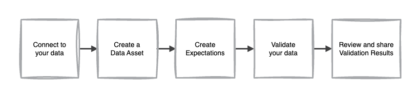
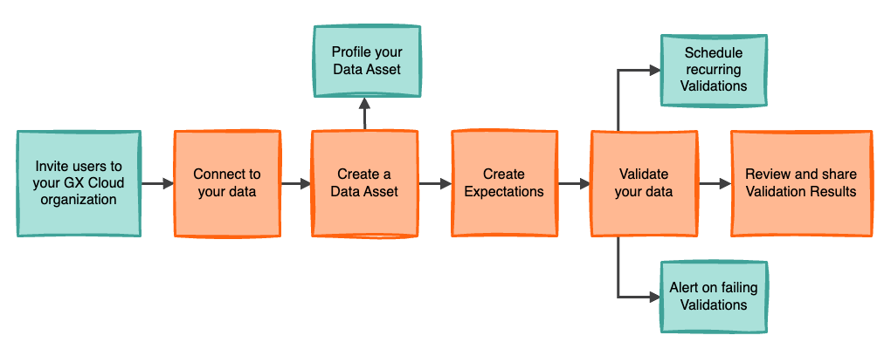
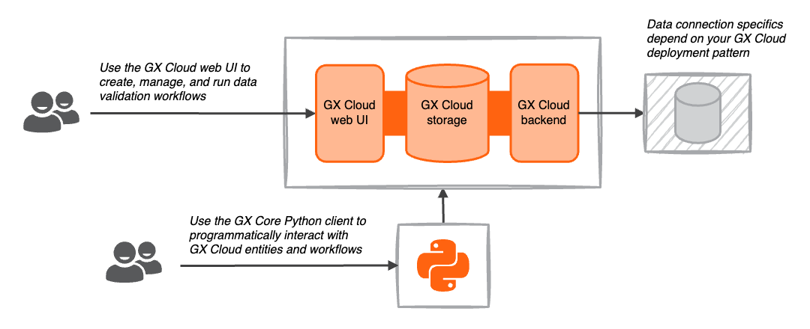

GX Cloud is a fully managed SaaS platform that simplifies data quality management and monitoring. With GX Cloud, you and your organization can work collaboratively to define and maintain shared understanding of your data.

## GX Cloud concepts

The key GX Cloud concepts described below provide a data validation vocabulary that represents your data, your data validation criteria, and the results of data validation. Within GX Cloud, these concepts are applied to define components and implement data validation workflows.

|  |  |
| :--: | :--- |
|  | **Data Source** A Data Source is the GX representation of a database or data store. |
|  | **Data Asset** A Data Asset is a collection of records within a Data Source.  |
|  | **Expectation** An Expectation is a declarative, verifiable assumption about your data. Expectations serve as unit tests for your data. |
|  | **Validation** A Validation runs selected Expectations against a Data Asset to validate the data defined by that Data Asset. |
|  | **Validation Result** A Validation Result captures the outcome of a Validation and related metadata that describes passing and failing data. |

## GX Cloud workflow

GX Cloud data validation workflows are created using GX Cloud components, entities that represent GX Cloud data validation concepts.

### Standard data validation workflow

A GX Cloud data validation workflow can be implemented using the following steps:

1. Connect to your data.
2. Create a Data Asset.
3. Define Expectations.
4. Validate your data.
5. Review and share your Validation Results with your organization.

### Additional workflow features
There are a variety of GX Cloud features that support additional enhancements to your GX Cloud data validation workflow.

* **GX Cloud user management.** GX Cloud functions as a shared portal to manage and monitor your organization's data quality. Users can be invited to your GX Cloud organization and assigned a role that governs their ability to view and edit components and workflows in GX Cloud. See [Manage users and access tokens](/cloud/users/manage_users.md) for more details.

* **Data Asset profiling.** GX Cloud introspects your data schema by default on Data Asset creation, and also offers one-click fetching of additional descriptive metrics including column type and statistical summaries. Data profiling results are used to suggest parameters for Expectations that you create.

* **Schedule Validations.** GX Cloud enables you to schedule validations, so that you can test and assess your data on a regular cadence and monitor data quality over time. See [Manage schedules](/cloud/schedules/manage_schedules.md) for more detail.

* **Alerting.** GX Cloud provides the ability to send alerts when validations fail, enabling your organization to remain proactively aware of the health of your Data Assets. See [Manage alerts](/cloud/alerts/manage_alerts.md) for more detail.

## GX Cloud architecture

GX Cloud architecture comprises a frontend web UI, storage for entity configuration and metadata, a backend application, and a Python client.

* **GX Cloud frontend web UI**. Enables you to manage and validate your organization's data quality without running code and provides shared visibility into your organization's Validation Results history. The GX Cloud web UI is browser- and platform-independent.

* **GX Cloud data storage**. Stores the configurations for your organization's Data Sources, Data Assets, Expectations, and Validations alongside your organization's Validation Result histories and Data Asset descriptive metrics.

* **GX Cloud backend application**. Contains the necessary logic and compute to connect to data and run queries. The specifics of how the GX Cloud backend connects to your data is described in [Deployment patterns](/cloud/deploy/deployment_patterns.md).

* **GX Core Python client**. Enables you to interact programmatically with the GX Cloud backend application. The [GX Core Python client](/core/introduction/introduction.mdx) can complement and extend your web UI-created workflows.