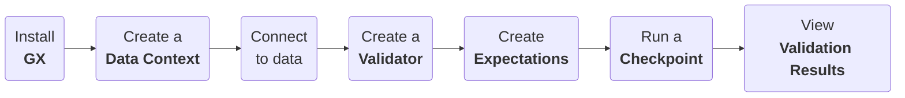

import Prerequisites from '/docs/components/_prerequisites.jsx'
import PrereqPython from '/docs/components/prerequisites/_python_version.md'
import SetupAndInstallGx from '/docs/components/setup/link_lists/_setup_and_install_gx.md'
import DataContextInitializeInstantiateSave from '/docs/components/setup/link_lists/_data_context_initialize_instatiate_save.md'

In this quickstart, you'll learn how to use GX Cloud from a Python script or interpreter, such as a Jupyter Notebook. You'll install Great Expectations, configure your GX Cloud environment variables, connect to sample data, build your first Expectation, validate data, and review the validation results through Python code.

## Data validation workflow

The following diagram illustrates the end-to-end GX data validation workflow that you'll implement with this quickstart. Click a workflow step to view the related content.



## Prerequisites

- <PrereqPython />
- pip
- An internet browser


## Prepare your environment

1. Download and install Python. See [Active Python Releases](https://www.python.org/downloads/).

2. Download and install pip. See the [pip documentation](https://pip.pypa.io/en/stable/cli/pip/).


## Install GX

1. Run the following command in an empty base directory inside a Python virtual environment:

    ```bash title="Terminal input"
    pip install great_expectations
    ```

    It can take several minutes for the installation to complete.

2. Configure your GX Cloud environment variables
3. Run the following Python code to import the `great_expectations` module:

    ```python name="tutorials/quickstart/quickstart.py import_gx"
    ```
## Create a Data Context

- Run the following command to create a <TechnicalTag tag="data_context" text="Data Context"/> object:

    ```python name="tutorials/quickstart/quickstart.py get_context"
    ```
## Connect to data

- Run the following command to connect to existing `.csv` data stored in the `great_expectations` GitHub repository and create a <TechnicalTag tag="validator" text="Validator"/> object:

    ```python name="tutorials/quickstart/quickstart.py connect_to_data"
    ```

    The code example uses the default <TechnicalTag tag="data_context" text="Data Context"/> <TechnicalTag tag="datasource" text="Data Source"/> for Pandas to access the `.csv` data from the file at the specified URL path.

## Create Expectations

- Run the following commands to create two <TechnicalTag tag="expectation" text="Expectations"/> and save them to the <TechnicalTag tag="expectation_suite" text="Expectation Suite"/>:

    ```python name="tutorials/quickstart/quickstart.py create_expectation"
    ```

  The first <TechnicalTag tag="expectation" text="Expectation"/> uses domain knowledge (the `pickup_datetime` shouldn't be null).

  The second <TechnicalTag tag="expectation" text="Expectation"/> uses explicit kwargs along with the `passenger_count` column.

## Validate data

1. Run the following command to define a <TechnicalTag tag="checkpoint" text="Checkpoint"/> and examine the data to determine if it matches the defined <TechnicalTag tag="expectation" text="Expectations"/>:

    ```python name="tutorials/quickstart/quickstart.py create_checkpoint"
    ```

2. Run the following command to return the <TechnicalTag tag="validation_result" text="Validation Results"/>:

    ```python name="tutorials/quickstart/quickstart.py run_checkpoint"
    ```

3. Run the following command to view an HTML representation of the <TechnicalTag tag="validation_result" text="Validation Results"/> in the generated <TechnicalTag tag="data_docs" text="Data Docs"/>:

    ```python name="tutorials/quickstart/quickstart.py view_results"
    ```

## Related documentation

If you're ready to continue your GX journey, the following topics can help you implement a solution for your specific environment and business requirements:

- [Install GX in a specific environment with support for a specific Data Source](/docs/oss/guides/setup/installation/install_gx).
- [Initialize, instantiate, and save a Data Context](/docs/oss/guides/setup/configure_data_contexts_lp).
- [Connect to Data Sources](/docs/oss/guides/connecting_to_your_data/connect_to_data_lp).
- [Create and manage Expectations and Expectation Suites](/docs/oss/guides/expectations/expectations_lp/).
- [Create, manage, and run Checkpoints](/docs/oss/guides/validation/checkpoints/checkpoint_lp/).