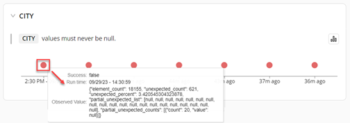

When you run a validation on an Expectation, a Checkpoint is added. The Checkpoint saves the Validation Results, runs the Actions you specify, and displays the Validation Results.

## Prerequisites

- You have [set up your environment](../set_up_gx_cloud.md). 

- You have created an [Expectation](../expectations/manage_expectations#create-an-expectation).

## Run a Validation

1. In GX Cloud, click **Data Assets**.

2. Click a Data Asset in the **Data Assets** list.

3. On the **Expectations** page, select one of the following options:

    - To run a Validation on a specific column, click the column name in the **Columns** pane, and then click **Validate**.

    - To run a Validation on all columns, click **Validate**.

4. When the confirmation messages appears, click **See results**, or click the Validations tab and select the Validation in the **Run History** pane.

5. Optional. Click **Share** to copy the URL for the Validation Results that you can share with another GX Cloud user.

## View Validation run history

1. In GX Cloud, click **Data Assets**.

2. Click a Data Asset in the **Data Assets** list.

3. Click the **Validations** tab.

4. On the **Validations** page, select one of the following options:

    - To view the run history for specific Validation, select a Validation in the **Run History** pane.
    
    - To view the run history of all Validations, select **All Runs** to view a graph showing the Validation run history for all columns.

    - To view only run validation failures, click **Failures Only**.

5. Optional. Hover over a circle in the Validation timeline to view details about a specific Validation run including the observed values.

    

6. Optional. To hide the Validation timeline, click the **Validation timeline** () icon.

