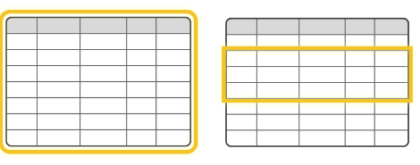
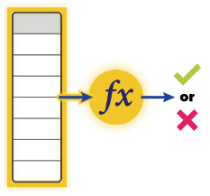
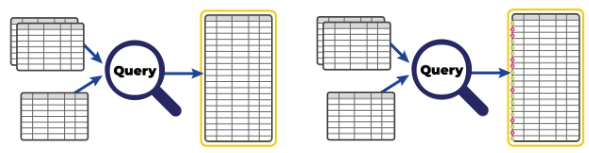

In our daily lives and our data, we expect different things from different types of objects. After all, it would be both alarming and disturbing if a chair suddenly behaved like a cat! Similarly, it is entirely reasonable to expect different results when we evaluate the contents of an entire table and when we evaluate the contents of a single column. Expectation classes have been created to help make sure Custom Expectations return the expected results. This document provides an overview of the available Expectation classes, why they are helpful, and when they should be used.

## Class hierarchy

The following is the Expectation class hierarchy:

```text
Expectation
    BatchExpectation
        ColumnAggregateExpectation
        ColumnMapExpectation
            RegexBasedColumnMapExpectation
            SetBasedColumnMapExpectation
        ColumnPairMapExpectation
        MulticolumnMapExpectation
        QueryExpectation
```

Most Expectations are a combination of a Domain (Batch, Column, ColumnPair, Multicolumns) and an approach (Map or Aggregate). In some cases, the Expectation classes include a prefix such as `RegexBasedColumnMapExpectation`. There are also two classes that don’t follow the standard naming convention; `BatchExpectations` and `QueryExpectations`.

## Expectation Domain types

Domains provide a way to address a specific set of data, such as a Batch within a table, or a column within a Batch. Domains do this by describing the data locale. The data locale is the conceptual equivalent of “data that arrived last Tuesday in the UserEvents table in the Redshift database,” or “the timestamp column in the User's table in the Redshift database”.

The following are the four Expectation Domains:

- Batch
- Column
- ColumnPair
- Multicolumn

### ColumnPair

A ColumnPair is the special case of a MultiColumn where the number of columns equals two. A Column Expectation is the special case where the number equals one.

From a software engineering perspective, there are meaningful differences between Expectations with different domains. Specifically, all Column Expectations accept a `column` argument, all ColumnPair Expectations accept a pair of arguments, usually named `column_A` and `column_B`, and all MultiColumn Expectations accept a `column_list` argument.

As the arguments for each Expectation are different, they are implemented as different classes. However, this can affect the logic for query optimization. For this reason, GX recommends using the smallest applicable domain when you’re implementing a custom Expectation. For example, don't subclass a MultiColumn Expectation when a ColumnPair Expectation will do.

Column Expectations operate on individual columns. ColumnPair and Multicolumn Expectations operate on column pairs, in the same Batch, but not necessarily adjacent to each other.


GX doesn’t have a TableExpectation type because you can get the same functionality from a BatchExpectation. If you want to run Expectations on an entire table, you configure a DataAsset to use an entire table as its domain.



## Aggregate Expectations

Aggregate Expectations are based on a single Metric for the whole Batch. This Metric is called the `observed_value` for the Expectation. 

A common pattern is to calculate a numeric Metric, and then verify that it falls between a `min_value` and `max_value`, as in `expect_column_mean_to_be_between`. However, some Expectations only have a max or a min, such as `expect_column_kl_divergence_to_be_less_than`. 

Some Expectations don’t use a numeric Metric for the observed_value. For example, [`expect_column_distinct_values_to_equal_set`](https://greatexpectations.io/expectations/expect_column_distinct_values_to_equal_set?filterType=Backend%20support&gotoPage=1&showFilters=true&viewType=Summary) creates a set of distinct column values, that is then compared against a specified set and [`expect_column_to_have_no_days_missing`](https://greatexpectations.io/expectations/expect_column_distinct_values_to_equal_set?filterType=Backend%20support&gotoPage=1&showFilters=true&viewType=Summary) looks for continuity within the column’s values.



Aggregate Expectations calculate summary statistics across Batches of data. As a result, they can be a computationally efficient way to gain insight into the overall behavior of a dataset and can provide a useful foundation for identifying trends, patterns, and outliers. However, because Aggregate Expectations do not verify individual rows of data, they can't identify specific data issues.

## Map Expectations

Map Expectations are evaluated on a row-by-row basis and each row is checked independently. For example, [`expect_column_values_to_not_be_null`](https://greatexpectations.io/expectations/expect_column_values_to_not_be_null?filterType=Backend%20support&gotoPage=1&showFilters=true&viewType=Summary), [`expect_column_values_to_be_in_set`](https://greatexpectations.io/expectations/expect_column_values_to_not_be_null?filterType=Backend%20support&gotoPage=1&showFilters=true&viewType=Summary), [` expect_column_pair_values_to_be_equal`](https://greatexpectations.io/expectations/expect_column_pair_values_to_be_equal?filterType=Backend%20support&gotoPage=1&showFilters=true&viewType=Summary).


Map Expectations are useful when you want to be certain that the content of a given dataset is correct. If you’re validating data within a pipeline, Map Expectations can help you identify invalid rows, remove invalid rows from the dataset, and process the remaining data. Unfortunately, because Map Expectations evaluate every row of data, they can be computationally intensive.

Every Map Expectation includes a `mostly` parameter. The `mostly` parameter allows you to specify a minimum percentage of rows that must validate successfully to pass the Expectation. The Expectation can still succeed when individual rows fail validation. This can be useful if you want your pipelines to have invalid data tolerance.

### Terminology

Row Expectations was considered as an alternative name for Map Expectations, but it would have led to formulations such as `ColumnRowExpectations` and this might have confused users. Instead, Map Expectations was selected as a reference to `map()` functions and `map-reduce` algorithms. The naming convention requires an explanation, but conversations with users indicate that the meaning of the selected naming convention is clear.  

## Subclasses

Beyond the `[Domain][Approach]Expectation` naming convention, the specialized subclasses `RegexBasedColumnMapExpectation` and `SetBasedColumnMapExpectation` are supported. These extend `ColumnMapExpectation` and make it easier to define Expectations based on regexes and sets. For more information, see [How to create a Custom Regex-Based Column Map Expectation](../guides/expectations/creating_custom_expectations/how_to_create_custom_regex_based_column_map_expectations.md) and [How to create a Custom Set-Based Column Map Expectation](../guides/expectations/creating_custom_expectations/how_to_create_custom_set_based_column_map_expectations.md).

## BatchExpectations

BatchExpectations do not currently have a special subclass for Map Expectations. Essentially, BatchMapExpectations would apply row-by-row validation to all the columns in a Batch. When there is demand for this Expectation type, the class hierarchy will be refactored to accommodate it.

## QueryExpectations

QueryExpectations allow you to set Expectations against the results of custom SQL or Spark queries. QueryExpectations can be useful if you’re comfortable working in SQL or Spark or a specific dialect. They can also allow you to embed arbitrarily complex logic in your Expectations, such as combining data from multiple tables, or applying complex logic within a query.



QueryExpectations bypass most of the logic that GX uses for grouping queries on related Domains. As a result, QueryExpectations can increase database traffic and consume computational resources. If you’re not careful when you construct your Expectation, you can also misattribute results to the wrong Domain.

For most use cases, QueryDataAssets are the better option. This option allows you to separate the logic of assembling data for validation from the logic of evaluating it.

The other limitation of QueryExpectations is that they are tightly bound to a specific SQL or Spark dialect. This can be a good way to get started, but if you use pandas, or more than one dialect of SQL or Spark, GX recommends that you port your QueryExpectation into a more general-purpose Expectation.

## Conclusion

This concludes the review of GX Expectation classes. You've learned:

- What Expectation Domains are and how to select one

- When to use Map and Aggregate data validation approaches

- What specialized subclasses are available for making set-based and regular-expression-based Expectations

- What the QueryExpectation class is and when you should use it

## Related documentation

Now that you've learned about Expectation classes, you can use the following resources to learn how to put them into practice:

- [Explore Expectations](https://greatexpectations.io/expectations/?filterType=Backend%20support&gotoPage=1&showFilters=true&viewType=Summary)

- [How to create and edit Expectations based on domain knowledge, without inspecting data directly](../guides/expectations/how_to_create_and_edit_expectations_based_on_domain_knowledge_without_inspecting_data_directly.md)

- [Creating Custom Expectations - Overview](../guides/expectations/creating_custom_expectations/overview.md)

- [Expectations naming conventions](../contributing/style_guides/code_style.md#expectations)

- [Standard arguments for Expectations](../reference/expectations/standard_arguments.md)

- [Result format](../reference/expectations/result_format.md)
