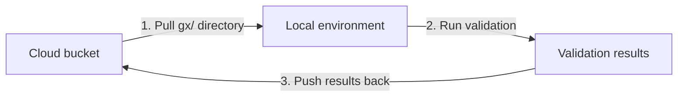

import TabItem from '@theme/TabItem';
import Tabs from '@theme/Tabs';

import PrereqPythonInstalled from '../../_core_components/prerequisites/_python_installation.md';
import PrereqGxInstalled from '../../_core_components/prerequisites/_gx_installation.md'
import PrereqFileDataContext from '../../_core_components/prerequisites/_file_data_context.md'

import EnvironmentGCS from './_backends/_gcs.md'
import EnvironmentAWS from './_backends/_aws.md'
import EnvironmentAzure from './_backends/_azure.md'

Great Expectations 1.0 removed the cloud-specific store backends (`TupleGCSStoreBackend`, `TupleS3StoreBackend`, `TupleAzureBlobStoreBackend`). This guide shows the supported replacement: a sync-based workflow that treats cloud storage as the source of truth and uses local execution for validations.

### Why sync instead of direct cloud storage?

The old cloud store backends were thin wrappers around cloud SDKs. They introduced complexity, dependency conflicts, and hard-to-debug failures when cloud operations timed out or failed mid-validation. The sync pattern is:

- **Simpler**: Uses standard cloud CLI tools (`gsutil`, `aws s3`, `az storage blob`) or SDKs
- **Faster**: Local execution avoids network latency during validation
- **Safer**: Concurrent runs don't collide; results are uploaded with unique keys
- **Portable**: The same workflow works across GCS, S3, and Azure Blob Storage

### Prerequisites

- <PrereqPythonInstalled/>
- <PrereqGxInstalled/>
- <PrereqFileDataContext/>
- A cloud storage bucket (GCS, S3, or Azure Blob) with read/write access
- The corresponding cloud CLI or SDK installed and authenticated

### The sync workflow



**Step 1: Pull the `gx/` directory from cloud storage**

Before running any validations, download the latest configuration from your bucket. This ensures you're working with the most recent Expectations, Checkpoints, and Validation Definitions.

**Step 2: Run your validation locally**

Execute your Checkpoint or Validation Definition against your local data. GX writes results to the local `gx/uncommitted/` directory.

**Step 3: Push results back to cloud storage**

Upload only the new validation results (not the entire `gx/` folder) using a unique key to avoid collisions with concurrent runs.

### Configuration as read-only

Your `gx/` configuration (Expectations, Checkpoints, Validation Definitions) should be treated as **read-only** during validation runs:

- ✅ Multiple validation functions can pull the same config simultaneously
- ❌ Never write config changes during a validation run
- ✅ Store config in Git and push updates from CI/CD
- ✅ If you must update config manually, do it from a single location

### Safe results syncing

When uploading validation results back to cloud storage:

- ✅ Upload only the specific result directory (e.g., `gx/uncommitted/validations/my_suite/my_run/`)
- ✅ Use a unique run name or timestamp to avoid overwriting previous results
- ❌ Never use destructive sync commands like `gsutil rsync -d`, `aws s3 sync --delete`, or `azcopy sync --delete-destination`

### Data Docs: single-writer pattern

Data Docs generation must be handled separately from validation runs:

- ❌ Don't build Data Docs concurrently from multiple validation functions
- ✅ Use a dedicated publishing step (scheduled job, post-validation trigger, or manual workflow)
- ✅ Build Data Docs from a single location to avoid race conditions

### Example: GCS, S3, and Azure Blob workflows

<Tabs 
   queryString="cloud_backend"
   defaultValue="gcs"
   values={[
      {value: 'gcs', label: 'Google Cloud Storage'},
      {value: 'aws', label: 'Amazon S3'},
      {value: 'azure', label: 'Azure Blob Storage'}
   ]}
>

<TabItem value="gcs" label="Google Cloud Storage">
   <EnvironmentGCS/>
</TabItem>

<TabItem value="aws" label="Amazon S3">
   <EnvironmentAWS/>
</TabItem>

<TabItem value="azure" label="Azure Blob Storage">
   <EnvironmentAzure/>
</TabItem>

</Tabs>

### Full example script

<Tabs 
   queryString="procedure"
   defaultValue="instructions"
   values={[
      {value: 'instructions', label: 'Instructions'},
      {value: 'sample_code', label: 'Sample code'}
   ]}
>

<TabItem value="instructions" label="Instructions">

1. Pull the `gx/` directory from your cloud bucket to your local environment.

2. Run your validation locally:

```python title="Python" name="docs/docusaurus/docs/core/configure_project_settings/cloud_store_backend_sync/_examples/cloud_store_backend_gcs.py - run validation locally"
```

3. Push the validation results back to cloud storage with a unique key.

4. Optional: Build and upload Data Docs from a separate step.

</TabItem>

<TabItem value="sample_code" label="Sample code">

```python title="Python" name="docs/docusaurus/docs/core/configure_project_settings/cloud_store_backend_sync/_examples/cloud_store_backend_gcs.py - full code example"
```

</TabItem>

</Tabs>

### Common pitfalls

| Pitfall | Problem | Solution |
|---------|---------|----------|
| Using `sync --delete` | Wipes out previous validation results | Use `cp` or `upload` instead of `sync` |
| Building Data Docs in validation function | Race conditions when multiple runs complete simultaneously | Use a separate publishing step |
| Writing config during validation | Concurrent runs overwrite each other's config changes | Treat config as read-only |
| Fixed run names | Later runs overwrite earlier results | Use timestamps or UUIDs in run names |

### Related guides

- [Configure metadata stores](../configure_metadata_stores/configure_metadata_stores.md) — for local store configuration
- [Configure Data Docs](../configure_data_docs/configure_data_docs.md) — for Data Docs site setup