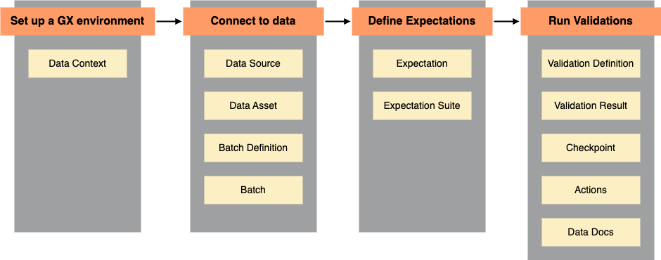

This overview is for new users of GX Core and those looking for an improved understanding of GX Core components and primary workflows. It is an ideal place to start before exploring more advanced topics found in the GX Core documentation.

## GX Core components and workflows

**Great Expectations (GX)** is a framework for describing data using expressive tests and then validating that the data meets test criteria. **GX Core** is a Python library that provides a programmatic interface to building and running data validation workflows using GX.

GX Core is versatile and supports a variety of workflows. It can be used for interactive, exploratory data validation as well as data validation within production deployments.

**GX components** are Python classes that represent your data and data validation entities.

**GX workflows** are programmatically defined data validation processes. GX workflows are built using GX components.

## The pattern of a GX workflow

All GX workflows share a common pattern:

1. Set up a GX environment
2. Connect to data
3. Define Expectations
4. Run Validations

At each workflow step, different GX components are defined and used. This section introduces the key GX Core components required to create a data validation workflow.

### Set up a GX environment

A **Data Context** manages the settings and metadata for a GX workflow. In GX Core, the Data Context is a Python object that serves as the entrypoint for the [GX Python API](/reference/index.md). You use the Data Context to define and run a GX workflow; the Data Context provides access to the configurations, metadata, and actions of your GX workflow components and the results of data validations.

All GX workflows start with the creation of a Data Context.

For more information on the types of Data Context, see [Create a Data Context](/core/set_up_a_gx_environment/create_a_data_context.md).

### Connect to data

A **Data Source** is the GX representation of a data store. The Data Source tells GX how to connect to your data, and supports connection to different types of data stores, including databases, schemas, and data files in cloud object storage.

A **Data Asset** is a collection of records within a Data Source. A useful analogy is: if a Data Source is a relational database, then a Data Asset is a table within that database, or the results of a select query on a table within that database.

A **Batch Definition** tells GX how to organize the records within a Data Asset. The Batch Definition Python object enables you to retrieve a **Batch**, or collection of records from a Data Asset, for validation at runtime. A Data Asset can be validated as a single Batch, or partitioned into multiple Batches for separate validations.

For more information on connecting to data, see [Connect to data](/core/connect_to_data/connect_to_data.md).

### Define Expectations

An **Expectation** is a verifiable assertion about data. Similar to assertions in traditional Python unit tests, Expectations provide a flexible, declarative language for describing expected data qualities. An Expectation can be used to validate a Batch of data.

For a full list of available Expectations, see [the Expectation Gallery](https://greatexpectations.io/expectations/).

An **Expectation Suite** is a collection of Expectations. Expectation Suites can be used to validate a Batch of data using multiple Expectations, streamlining the validation process. You can define multiple Expectation Suites for the same data to cover different use cases, and you can apply the same Expectation Suite to different Batches.

For more information about defining Expectations and creating Expectation Suites, see [Define Expectations](/core/define_expectations/define_expectations.md).

### Run Validations

A **Validation Definition** explicitly associates a Batch Definition to an Expectation Suite, defining what data should be validated against which Expectations.

A **Validation Result** is returned by GX after data validation. The Validation Results tell you how your data corresponds to what you expected of it.

A **Checkpoint** is the primary means for validating data in a production deployment of GX. Checkpoints enable you to run a list of Validation Definitions with shared parameters. Checkpoints can be configured to run Actions, and can pass Validation Results to a list of predefined Actions for processing.

**Actions** provide a mechanism to integrate Checkpoints into your data pipeline infrastructure by automatically processing Validation Results. Typical use cases include sending email alerts, Slack messages, or custom notifications based on the result of data validation.

**Data Docs** are human-readable documentation generated by GX that host your Expectation Suite definitions and Validation Results. Using Checkpoints and Actions, you can configure your GX workflow to automatically write Validation Results to a chosen Data Docs site.

For more information on defining and running Validations, see [Run Validations](/core/run_validations/run_validations.md).

## Customize GX Core workflows

While all GX Core workflows follow a shared pattern, the outcome and operation of a workflow can be customized based on how you create Batches, define Expectations, and run Validations. GX Core components are building blocks that can be applied in a variety of ways to satisfy your data validation use case.

For instance, a GX Core workflow might:

* Create a Batch using data from a Spark DataFrame and allow you to interactively validate the Batch with Expectations and immediately review the Validation Results. This workflow could serve to inform your exploration of which Expectations you want to use in a production deployment of GX.

* Connect to data in a SQL table, define multiple Expectation Suites that each test for a desired data quality characteristic, and use a Checkpoint to run all Expectation Suites. This workflow, when integrated with and triggered by an orchestrator, could enable automated, scheduled data quality testing on an essential data table.

* Connect to a group of SQL tables and define a collection of Data Assets, each batched on a time-based column, and validate the data within each Data Asset using the same Expectation Suite. This workflow could provide a way to implement consistent data quality testing across a sharded data infrastructure.

Equipped with an understanding of the GX Core components, you can design data validation workflows that logically and effectively validate your data across a variety of data store types, environments, and business use cases.

## Next steps

Visit [Try GX Core](/core/introduction/try_gx.md) to see example workflows implemented using GX Core.