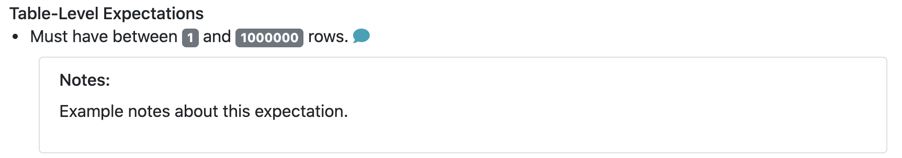

import Prerequisites from '../../connecting_to_your_data/components/prerequisites.jsx'
import TechnicalTag from '@site/docs/term_tags/_tag.mdx';

This guide will help you add descriptive comments (or notes, here used interchangeably) to <TechnicalTag tag="expectation" text="Expectations" /> and display those comments in <TechnicalTag tag="data_docs" text="Data Docs" />. In these comments you can add some clarification or motivation to the Expectation definition to help you communicate more clearly with your team about specific Expectations. Markdown is supported in these comments.

## Prerequisites

<Prerequisites>

- [A working Great Expectations deployment](/docs/guides/setup/setup_overview)
- [A Data Context](/docs/guides/setup/configuring_data_contexts/instantiating_data_contexts/how_to_quickly_instantiate_a_data_context)
- [An Expectations Suite](/docs/guides/expectations/how_to_create_and_edit_expectations_with_instant_feedback_from_a_sample_batch_of_data)

</Prerequisites>

## Steps

### 1. First, edit your Expectation Suite

```bash
great_expectations suite edit <your_suite_name>
```

### 2. Next, add comments to specific Expectations

For each Expectation you wish to add notes to, add a dictionary to the ``meta`` field with the key ``notes`` and your comment as the value. Here is an example.

```python
validator.expect_table_row_count_to_be_between(
  max_value=1000000, min_value=1,
  meta={"notes": "Example notes about this expectation."}
)
```

Leads to the following representation in the <TechnicalTag tag="data_docs" text="Data Docs" /> (For <TechnicalTag tag="expectation_suite" text="Expectation Suite" /> pages, click on the speech bubble to view the comment).



### 3. Add styling to your comments (optional)

To add styling to your comments, you can add a format tag. Here are a few examples.

A single line of markdown is rendered in red, with any Markdown formatting applied.

```python
validator.expect_column_values_to_not_be_null(
  column="column_name",
  meta={
      "notes": {
          "format": "markdown",
          "content": "Example notes about this expectation. **Markdown** `Supported`."
      }
  }
)
```


Multiple lines can be rendered by using a list for ``content``; these lines are rendered in black text with any Markdown formatting applied.

```python
validator.expect_column_values_to_not_be_null(
  column="column_name",
  meta={
      "notes": {
          "format": "markdown",
          "content": [
              "Example notes about this expectation. **Markdown** `Supported`.",
              "Second example note **with** *Markdown*",
          ]
      }
  }
)
```


You can also change the ``format`` to ``string`` and single or multiple lines will be formatted similar to the above, but the Markdown formatting will not be applied.

```python
validator.expect_column_values_to_not_be_null(
  column="column_name",
  meta={
      "notes": {
          "format": "string",
          "content": [
              "Example notes about this expectation. **Markdown** `Not Supported`.",
              "Second example note **without** *Markdown*",
          ]
      }
  }
)
```


### 4. Review your comments in the Expectation Suite overview of your Data Docs

You can open your Data Docs by using the `.open_data_docs()` method of your Data Context, which should be present in the last cell of the Jupyter Notebook you did your editing in.