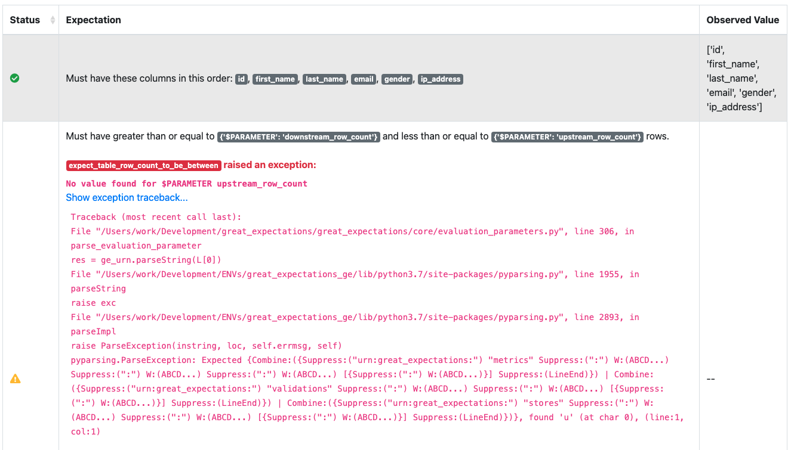

import Prerequisites from '../../../guides/connecting_to_your_data/components/prerequisites.jsx';
import TechnicalTag from '@site/docs/term_tags/_tag.mdx';

This guide will help you create <TechnicalTag tag="expectation" text="Expectations" /> that span multiple <TechnicalTag tag="batch" text="Batches" /> of data using <TechnicalTag tag="evaluation_parameter" text="Evaluation Parameters" /> (see also <TechnicalTag tag="evaluation_parameter_store" text="Evaluation Parameter Stores" />). This pattern is useful for things like verifying that row counts between tables stay consistent.

## Prerequisites

<Prerequisites>

- A configured <TechnicalTag tag="data_context" text="Data Context" />.
- A configured <TechnicalTag tag="datasource" text="Datasource" /> (or several Datasources) with a minimum of two <TechnicalTag tag="data_asset" text="Data Assets" /> and an understanding of the basics of <TechnicalTag tag="batch_request" text="Batch Requests" />.
- A <TechnicalTag tag="expectation_suite" text="Expectations Suites" /> for the Data Assets.
- A working Evaluation Parameter store. The default in-memory <TechnicalTag tag="store" text="Store" /> from ``great_expectations init`` can work for this.
- A working <TechnicalTag tag="checkpoint" text="Checkpoint" />

</Prerequisites>

## Import great_expectations and instantiate your Data Context

Run the following Python code in a notebook:

```python name="tests/integration/docusaurus/expectations/advanced/how_to_create_expectations_that_span_multiple_batches_using_evaluation_parameters.py get_context"
```

## Instantiate two Validators, one for each Data Asset

We'll call one of these <TechnicalTag tag="validator" text="Validators" /> the *upstream* Validator and the other the *downstream* Validator. Evaluation Parameters will allow us to use <TechnicalTag tag="validation_result" text="Validation Results" /> from the upstream Validator as parameters passed into Expectations on the downstream.


 ```python name="tests/integration/docusaurus/expectations/advanced/how_to_create_expectations_that_span_multiple_batches_using_evaluation_parameters.py get validators"
```

## Create the Expectation Suite for the upstream Validator

```python name="tests/integration/docusaurus/expectations/advanced/how_to_create_expectations_that_span_multiple_batches_using_evaluation_parameters.py create upstream_expectation_suite"
```

This suite will be used on the upstream batch. The observed value for number of rows will be used as a parameter in the Expectation Suite for the downstream batch.

## Disable interactive evaluation for the downstream Validator

```python name="tests/integration/docusaurus/expectations/advanced/how_to_create_expectations_that_span_multiple_batches_using_evaluation_parameters.py disable interactive_evaluation"
```

Disabling interactive evaluation allows you to declare an Expectation even when it cannot be evaluated immediately.

## Define an Expectation using an Evaluation Parameter on the downstream Validator

```python name="tests/integration/docusaurus/expectations/advanced/how_to_create_expectations_that_span_multiple_batches_using_evaluation_parameters.py add expectation with evaluation parameter"
```

The core of this is a ``$PARAMETER : URN`` pair. When Great Expectations encounters a ``$PARAMETER`` flag during <TechnicalTag tag="validation" text="Validation" />, it will replace the ``URN`` with a value retrieved from an Evaluation Parameter Store or <TechnicalTag tag="metric_store" text="Metrics Store" /> (see also [How to configure a MetricsStore](../../../guides/setup/configuring_metadata_stores/how_to_configure_a_metricsstore.md)).

When executed in the notebook, this Expectation will generate a Validation Result. Most values will be missing, since interactive evaluation was disabled.

```python name="tests/integration/docusaurus/expectations/advanced/how_to_create_expectations_that_span_multiple_batches_using_evaluation_parameters.py expected_validation_result"
 ```

:::warning

Your URN must be exactly correct in order to work in production. Unfortunately, successful execution at this stage does not guarantee that the URN is specified correctly and that the intended parameters will be available when executed later.

:::

## Save your Expectation Suite

 ```python name="tests/integration/docusaurus/expectations/advanced/how_to_create_expectations_that_span_multiple_batches_using_evaluation_parameters.py save downstream_expectation_suite"
 ```

This step is necessary because your ``$PARAMETER`` will only function properly when invoked within a Validation operation with multiple Validators. The simplest way to execute such an operation is through a :ref:`Validation Operator <reference__core_concepts__validation__validation_operator>`, and Validation Operators are configured to load Expectation Suites from <TechnicalTag tag="expectation_store" text="Expectation Stores" />, not memory.

## Execute a Checkpoint

This will execute both validations and pass the evaluation parameter from the upstream validation to the downstream.

```python name="tests/integration/docusaurus/expectations/advanced/how_to_create_expectations_that_span_multiple_batches_using_evaluation_parameters.py run checkpoint"
```

## Rebuild Data Docs and review results in docs

You can do this within your notebook by running:

```python name="tests/integration/docusaurus/expectations/advanced/how_to_create_expectations_that_span_multiple_batches_using_evaluation_parameters.py build data docs"
```

Once your <TechnicalTag tag="data_docs" text="Data Docs" /> rebuild, open them in a browser and navigate to the page for the new Validation Result.

If your Evaluation Parameter was executed successfully, you'll see something like this:


If it encountered an error, you'll see something like this. The most common problem is a mis-specified URN name.



