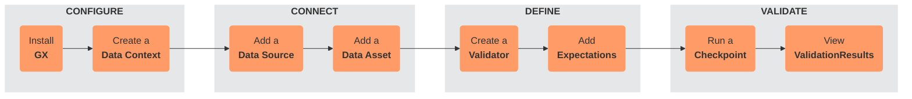

Here is a Hello World workflow diagram rendered from Mermaid markdown:

```mermaid
flowchart LR

    subgraph 1["<b>CONFIGURE</b>"]
        1A(Install\n<b>GX</b>):::gxWorkflowStep --> 1B("Create a\n<b>Data Context</b>"):::gxWorkflowStep
    end

    1B --> 2A

    subgraph 2["<b>CONNECT</b>"]
        2A("Add a\n<b>Data Source</b>"):::gxWorkflowStep --> 2B("Add a\n<b>Data Asset</b>"):::gxWorkflowStep
    end

    2B --> 3A

    subgraph 3["<b>DEFINE</b>"]
        3A("Create a\n<b>Validator</b>"):::gxWorkflowStep --> 3B("Add\n<b>Expectations</b>"):::gxWorkflowStep
    end

    3B --> 4A

    subgraph 4["<b>VALIDATE</b>"]
        4A("Run a\n<b>Checkpoint</b>"):::gxWorkflowStep --> 4B("View\n<b>ValidationResults</b>"):::gxWorkflowStep
    end

style 1 fill:#E6E7E8,stroke-width:0px
style 2 fill:#E6E7E8,stroke-width:0px
style 3 fill:#E6E7E8,stroke-width:0px
style 4 fill:#E6E7E8,stroke-width:0px

classDef gxWorkflowStep fill:#FF9B67,stroke-width:0px
classDef gxWorkflowContainer fill:#E6E7E8,stroke-width:0px

click 1A "https://docs.greatexpectations.io/docs/guides/setup/installation/install_gx"
click 1B "https://docs.greatexpectations.io/docs/guides/setup/configuring_data_contexts/instantiating_data_contexts/instantiate_data_context/"
click 2A "https://docs.greatexpectations.io/docs/guides/connecting_to_your_data/connect_to_data_lp"
click 2B "https://docs.greatexpectations.io/docs/guides/connecting_to_your_data/connect_to_data_lp"
click 3A "https://docs.greatexpectations.io/docs/terms/validator"
click 3B "https://docs.greatexpectations.io/docs/guides/expectations/expectations_lp"
click 4A "https://docs.greatexpectations.io/docs/guides/validation/checkpoints/checkpoint_lp"
click 4B "https://docs.greatexpectations.io/docs/terms/data_docs"
```