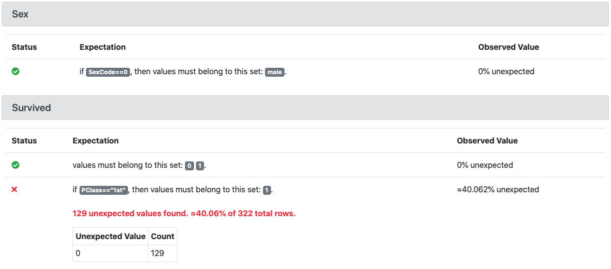

:::note
Conditional Expectations are **experimental**, and they are available for Pandas, Spark, and SQLAlchemy backends.
:::

You can create an Expectation for an entire dataset, or for a subset of the dataset. Some variables are dependent on the values of other variables. For example, a column that specifies that the country of origin must not be null for people of foreign descent.

Great Expectations lets you express Conditional Expectations with a `row_condition` argument that can be passed to all Dataset Expectations. The `row_condition` argument should be a boolean expression string. In addition, you must provide the `condition_parser` argument which defines the syntax of conditions. When implementing conditional Expectations with Pandas, this argument must be set to `"pandas"`. When implementing conditional Expectations with Spark or SQLAlchemy, this argument must be set to `"great_expectations__experimental__"`. 

:::note
In Pandas the `row_condition` value is passed to `pandas.DataFrame.query()` before Expectation Validation. See [pandas.DataFrame.query](https://pandas.pydata.org/pandas-docs/stable/reference/api/pandas.DataFrame.query.html).

In Spark and SQLAlchemy, the `row_condition` value is parsed as a data filter or a query before Expectation Validation.
:::

## Examples

To test if different encodings of identical pieces of information are consistent with each other, run a command similar to this example:

<!--A snippet is required for this code block.-->

```python
validator.expect_column_values_to_be_in_set(
    column='Sex',
    value_set=['male'],
    condition_parser='pandas',
    row_condition='SexCode==0'
)
```

This returns:

```python
{
    "success": true,
    "result": {
        "element_count": 851,
        "missing_count": 0,
        "missing_percent": 0.0,
        "unexpected_count": 0,
        "unexpected_percent": 0.0,
        "unexpected_percent_nonmissing": 0.0,
        "partial_unexpected_list": []
    }
}
```

:::note
To get a Validator object, see [How to create Expectations interactively in Python](../../guides/expectations/how_to_create_and_edit_expectations_with_instant_feedback_from_a_sample_batch_of_data.md).
:::

It is possible to add multiple Expectations of the same type to the Expectation Suite for a single column. One Expectation can be unconditional while an arbitrary number of Expectations (each with a different condition) can be conditional. For example:

```python
validator.expect_column_values_to_be_in_set(
        column='Survived',
        value_set=[0, 1]
    )
validator.expect_column_values_to_be_in_set(
        column='Survived',
        value_set=[1],
        condition_parser='pandas',
        row_condition='PClass=="1st"'
    )
# The second Expectation fails, but we want to include it in the output:
validator.get_expectation_suite(
  discard_failed_expectations=False
)  
```

This results in the following Expectation Suite:

```python
{
    "expectation_suite_name": "default",
    "expectations": [
        {
            "meta": {},
            "kwargs": {
                "column": "Survived",
                "value_set": [0, 1]
            },
            "expectation_type": "expect_column_values_to_be_in_set"
        },
        {
            "meta": {},
            "kwargs": {
                "column": "Survived",
                "value_set": [1],
                "row_condition": "PClass==\"1st\"",
                "condition_parser": "pandas"
            },
            "expectation_type": "expect_column_values_to_be_in_set"
        }
    ],
    "data_asset_type": "Dataset"
}
```

## Format of row_conditions values


Do not use single quotes or `\n` inside the specified `row_condition` as shown in the following examples:

```python 
row_condition="PClass=='1st'"  # never use simple quotes inside !!!
```

```python 
row_condition="""
PClass=="1st"
"""  # never use \n inside !!!
```

## Data Docs and Conditional Expectations

Conditional Expectations are displayed differently from standard Expectations in the Data Docs. Each Conditional Expectation is qualified with *if 'row_condition_string', then values must be...* as shown in the following image:



If *'row_condition_string'* is a complex expression, it is split into several components to improve readability.

## Scope and limitations

While conditions can be attached to most Expectations, the following Expectations cannot be conditioned and do not take the `row_condition` argument:

* ```expect_column_to_exist```
* ```expect_table_columns_to_match_ordered_list```
* ```expect_table_column_count_to_be_between```
* ```expect_table_column_count_to_equal```

For more information, see the [Data Docs](../../terms/data_docs.md).
