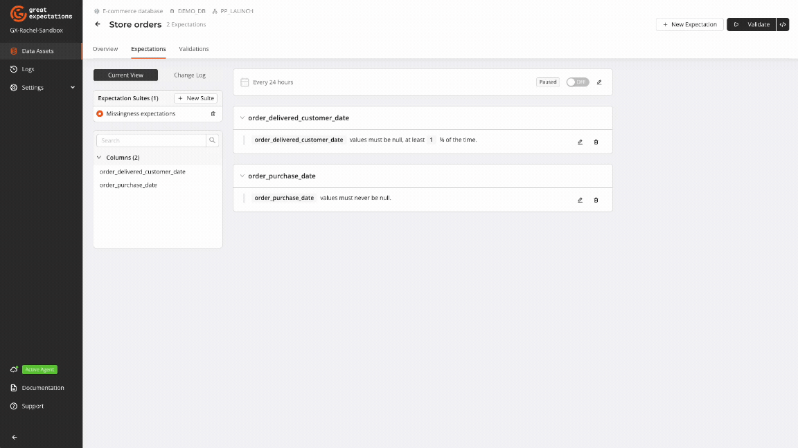

Missing data, also known as missingness, poses a significant challenge in data quality management. Missing data occurs when expected information is absent from a dataset, often appearing as `NULL` values in databases or manifesting differently across various systems. Effectively managing this issue is crucial for maintaining data integrity and reliability since unaddressed missing data can lead to disrupted calculations, skewed analyses, and compromised data analytics tasks.

Great Expectations (GX) offers a robust solution for addressing missing data through a comprehensive suite of Expectations that allow users to define and enforce data quality rules. By integrating GX into your data pipelines, you can establish robust validation processes that catch issues early, ensuring your dataset remains clean, consistent, and ready for accurate reporting, predictive modeling, and other advanced analytics applications.

In this guide, you will learn how to leverage GX to effectively handle missing data. This includes applying Expectations and making informed decisions about managing various types of missingness. By following these steps, you can ensure your datasets maintain high quality, thus enabling more accurate and reliable data-driven insights.

## Prerequisite knowledge

This article assumes basic familiarity with GX components and workflows. If you're new to GX, start with the [GX Overview](https://docs.greatexpectations.io/docs/cloud/overview/gx_cloud_overview/) to familiarize yourself with key concepts and setup procedures.

## Data preview

The examples in this guide use a sample transaction dataset, available as a [CSV file on GitHub](https://raw.githubusercontent.com/great-expectations/great_expectations/develop/tests/test_sets/learn_data_quality_use_cases/missingness.csv).

| type     | sender_account_number  | recipient_fullname | transfer_amount | transfer_date       | errors |
|----------|------------------------|--------------------|-----------------|---------------------|--------|
| domestic | 244084670977           | Jaxson Duke        | 9143.40         | 2024-05-01 01:12    | NULL   |
| NULL     | 123456789012           | Jane Smith         | 5000.00         | NULL                | NULL   |

In this dataset, you'll notice missing data in the `type` and `transfer_date` columns. The `errors` column, populated by a separate monitoring system, indicates issues found during data processing. A `NULL` value in the `errors` column means no errors were detected for that record.

## Key missingness Expectations

GX provides a suite of missingness-focused Expectations to manage missing data in your datasets. These Expectations can be created using the GX Cloud UI or the GX Core Python library.



### Expect Column Values To Be Null

Ensures that values within a column are `NULL`.

**Use Case**: Handle columns where values might be left null due to specific conditions.

```python title="" name="docs/docusaurus/docs/reference/learn/data_quality_use_cases/missingness_resources/missingness_expectations.py ExpectColumnValuesToBeNull"
```

<small>View `ExpectColumnValuesToBeNull` in the [Expectation Gallery](https://greatexpectations.io/expectations/expect_column_values_to_be_null).</small>

### Expect Column Values To Not Be Null

Ensures that values within a specific column are not `NULL`.

**Use Case**: Ensure critical columns are consistently populated.

```python title="Python" name="docs/docusaurus/docs/reference/learn/data_quality_use_cases/missingness_resources/missing_expectations.py ExpectColumnValuesToNotBeNull"
```

<small>View `ExpectColumnValuesToNotBeNull` in the [Expectation Gallery](https://greatexpectations.io/expectations/expect_column_values_to_not_be_null).</small>

<br/>
<br/>

:::tip[GX tips for missingness Expectations]
- Use the `mostly` argument in `ExpectColumnValuesToBeNull` and `ExpectColumnValuesToNotBeNull` to set different tolerance levels for null and non-null values. This allows you to tailor your data quality checks to different columns. For example, you might allow more null values in a `customer_feedback` column than in an `errors` column. Adjust these levels based on your data patterns and business needs to create more flexible and appropriate checks.
- Use these Expectations to track data as it progresses through your pipeline. Apply `ExpectColumnValuesToBeNull` to fields expected to be empty in early stages, and `ExpectColumnValuesToNotBeNull` to those same fields in later stages.
:::

## Examples and scenarios

The examples given in this section provide insight into how and when to apply missingness Expectations to identify different varieties of missing data. The focus of this guidance is on the specifics of the Expectations, rather than the overall workflow, which can be implemented using either GX Cloud or GX Core.

[GX Cloud](/cloud/overview/gx_cloud_overview.md) provides a visual interface to create and run workflows for managing missing data. The GX Cloud workflow to handle data missingness is intuitive and straightforward: create a Data Asset, define Expectations for missing values, run a Validation, and review Validation Results.


[GX Core](/core/introduction/gx_overview.md) can be used to complement and extend the capabilities of GX Cloud to programmatically implement custom workflows for handling missing data.

### Missing critical data

**Context**: Missing values can occur in critical fields due to failure in upstream data pipeline operations or errors in data entry. Proactively ensuring that critical fields are always populated prevents errors and failures in downstream uses.

**GX solution**: Ensure critical fields are completely populated with `ExpectColumnValuesToNotBeNull`.

```python title="" name="docs/docusaurus/docs/reference/learn/data_quality_use_cases/missingness_resources/missingness_expectations.py missing_critical_data"
```

### Intermittent missing values

**Context**: Intermittent missing values can be introduced by different causes in the data pipeline, such as data provider outages or incorrect data entry. When some degree of intermittent missing values are expected, checking that column values are fully populated a certain percentage of the time can help maintain the reliability of data analyses.

**GX solution**: Ensure values are populated a certain percentage of of the time by using `ExpectColumnValuesToNotBeNull` with the `mostly` parameter.

```python title="" name="docs/docusaurus/docs/reference/learn/data_quality_use_cases/missingness_resources/missingness_expectations.py intermittent_missing_values"
```

### Incorrectly defaulted values

**Context**: During data transformation processes, `NULL` values may be incorrectly replaced with default values such as zeroes or empty strings. This can occur when moving data from a source format to a different destination format. Depending on the field, this erroneous transformation can change the business meaning of the data. For instance, a `NULL` account number would indicate missing information and carry different significance to an account number of `0`, which would indicate an actual account number of zero.

**GX solution**: When `NULL` values are expected in a column, use GX to check for the presence of a small percentage of missing values following data transformation. This approach helps identify if `NULL` values have been inappropriately replaced.

```python title="" name="docs/docusaurus/docs/reference/learn/data_quality_use_cases/missingness_resources/missingness_expectations.py incorrectly_defaulted"
```

Setting a low percentage for the `mostly` parameter allows for the presence of valid `NULL` values while still catching cases where `NULL`s might have been incorrectly defaulted.

### System anomalies

**Context**: This use case differs significantly from the previously discussed cases, as it reflects an expectation about the system being monitored rather than just data quality. Here, GX can serve a dual role: ensuring data quality and performing a more classical alerting & observability function. For example, an increase in error rates might lead to an error field being unexpectedly populated.

**GX solution**: Ensure fields that should typically be `NULL`, such as those that denote errors, remain unpopulated under normal circumstances.

```python title="" name="docs/docusaurus/docs/reference/learn/data_quality_use_cases/missingness_resources/missingness_expectations.py system_anomalies"
```

`ExpectColumnValuesToBeNull` can serve as an early warning system for potential issues in a monitored environment. If alerting is triggered when an error field is unexpectedly populated, it allows for prompt investigation and resolution of underlying system problems, going beyond traditional data quality checks.

## Avoid common missingness pitfalls

- **Overlooking edge cases**: Rare scenarios of missing data can go unnoticed, leading to incomplete data quality checks. Regularly broaden your [`ExpectColumnValuesToNotBeNull`](#expect-column-values-to-not-be-null) coverage to cover such cases.
- **Inconsistent definitions**: Differing definitions of 'missing' data across teams can lead to inconsistent handling. Standardize definitions and document them clearly across teams.
- **False positives/negatives**: Rigid thresholds can cause false positives or negatives. Use historical data for setting thresholds and consider the `mostly` attribute available for both [`ExpectColumnValuesToNotBeNull`](#expect-column-values-to-not-be-null) and [`ExpectColumnValuesToBeNull`](#expect-column-values-to-be-null).
- **Manual handling**: Manually addressing missing data can introduce errors and is unsustainable for large datasets. Automate data quality checks and remediation.
- **Ignoring root causes**: Addressing symptoms without understanding the root causes can lead to recurring problems. Conduct root cause analyses and implement relevant Expectations early in your data stream.

## The path forward

Managing missing data is a critical component of ensuring data quality and reliability. By implementing the strategies explored in this guide, you can significantly enhance your data's integrity and trustworthiness. Here's how you can build upon these practices:

1. Incorporate the discussed Expectations into your existing data pipelines and projects.
2. Explore the [Expectation Gallery](https://greatexpectations.io/expectations/) to discover more detailed Expectations that can be tailored to your specific needs.
3. Expand your validation approach to cover [other aspects of data quality](/reference/learn/data_quality_use_cases/dq_use_cases_lp.md), such as data integrity, volume, and distribution.
4. Regularly review and iterate on your validation processes to maintain high data quality standards.

Remember that managing missing data is just one facet of a comprehensive data quality strategy. To build robust and reliable data pipelines, consider integrating various Expectations that address [multiple aspects of data quality](/reference/learn/data_quality_use_cases/dq_use_cases_lp.md). This holistic approach will help you proactively identify and address potential issues, reducing downstream errors and fostering a culture of data confidence within your organization.

By consistently applying these methodologies and expanding your validation practices, you can create a strong foundation for trustworthy data analysis and decision-making processes. Continue exploring our data quality series to learn more about other crucial aspects of maintaining high-quality data in your pipelines.
