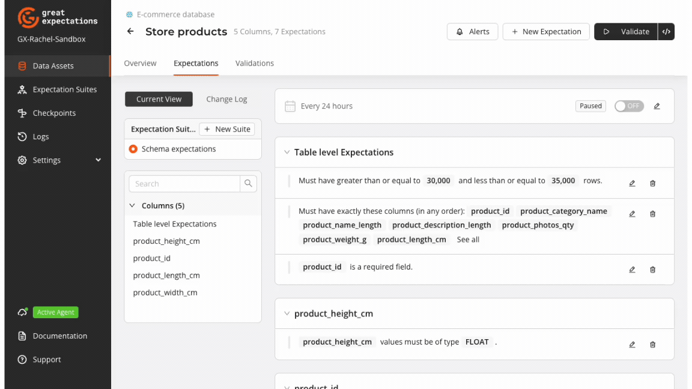

import TabItem from '@theme/TabItem';
import Tabs from '@theme/Tabs';

Data schema refers to the structural blueprint of a dataset, encompassing elements such as column
names, data types, and the overall organization of information. When working with data, ensuring
that it adheres to its predefined schema is a critical aspect of data quality management. This
process, known as schema validation, is among the top priority use cases for data quality platforms.

Validating your data's schema is crucial for maintaining data reliability and usability in
downstream tasks. This process involves checking that the structure of your dataset conforms to
established rules, such as verifying column names, data types, and the presence of required fields.
Schema changes, whether planned or unexpected, can significantly impact data integrity and the
performance of data-dependent systems.

Great Expectations (GX) provides a powerful suite of schema-focused Expectations that allow you
to define and enforce the structural integrity of your datasets. These tools enable you to establish
robust schema validation within your data pipelines, helping to catch and address schema-related
issues before they propagate through your data ecosystem. This guide will walk you through
leveraging these Expectations to implement effective schema validation in your data workflows.

## Prerequisite knowledge
This article assumes basic familiarity with GX components and workflows. See the [GX Overview](/core/introduction/gx_overview.md) for additional content on GX fundamentals.

## Data preview

Below is a sample of the dataset that is referenced by examples and explanations within this article.

| type     | sender_account_number  | recipient_fullname | transfer_amount | transfer_date       |
|----------|------------------------|--------------------|-----------------|---------------------|
| domestic | 244084670977           | Jaxson Duke        | 9143.40         | 2024-05-01 01:12    |
| domestic | 954005011218           | Nelson O’Connell   | 3285.21         | 2024-05-01 05:08    |

This dataset is representative of financial transfers recorded by banking institutions. Its fields include account type, sender account, sender name, transfer amount, and transfer date.

You can [access this dataset](https://raw.githubusercontent.com/great-expectations/great_expectations/develop/tests/test_sets/learn_data_quality_use_cases/schema_financial_transfers.csv) from the `great_expectations` GitHub repo in order to reproduce the code recipes provided in this article.

## Key schema Expectations

GX offers a collection of Expectations for schema validation, all of which can be added to an Expectation Suite directly from the GX Cloud UI or using the GX Core Python library.


The schema Expectations provide straightforward, practical solutions for common validation scenarios and can also be used to satisfy more nuanced validation needs.

### Column-level Expectations

Column-level schema Expectations ensure that the individual columns within your dataset adhere to specific criteria. These Expectations are designed to validate various aspects such as data type and permissible value ranges within columns.

#### Expect Column Values To Be Of Type

Validates that the values within a column are of a specific data type. This is more stringent
compared to the previous Expectation, suitable for scenarios needing strict type adherence.

**Use Case:** Handling data transferred using formats that do not embed schema
(e.g., CSV), where apparent type changes can occur when new values appear.

```python title="Python" name="docs/docusaurus/docs/reference/learn/data_quality_use_cases/schema_resources/schema_expectations.py ExpectColumnValuesToBeOfType"
```

<small>View `ExpectColumnValuesToBeOfType` in the [Expectation
Gallery](https://greatexpectations.io/expectations/expect_column_values_to_be_of_type).</small>


#### Expect Column Values To Be In Type List

Ensures that the values in a specified column are within a specified type list. This Expectation is useful for columns with varied permissible types, such as mixed-type fields often found in legacy databases.

**Use Case:** Suitable for datasets transitioning from older systems where type consistency might
not be strictly enforced, aiding smooth data migration and validation.

```python title="Python" name="docs/docusaurus/docs/reference/learn/data_quality_use_cases/schema_resources/schema_expectations.py ExpectColumnValuesToBeInTypeList"
```

<small>View `ExpectColumnValuesToBeInTypeList` in the [Expectation
Gallery](https://greatexpectations.io/expectations/expect_column_values_to_be_in_type_list).</small>

<br/>
<br/>

:::tip[GX tip for column-level Expectations]
Combine `ExpectColumnValuesToBeInTypeList` with detailed logging to track which types are most
frequently encountered, aiding in eventual standardization efforts.
:::

### Table-level Expectations

Table-level schema Expectations focus on the overall structure of your dataset. These Expectations are aimed at ensuring the dataset conforms to predefined schema constraints like the presence of necessary columns, column count, and column order.

#### Expect Column To Exist

Ensures the presence of a specified column in your dataset. This Expectation is foundational for
schema validation, verifying that critical columns are included, thus preventing data processing
errors due to missing fields.

**Use Case:** Ideal during data ingestion or integration of multiple data sources to ensure that
essential fields are present before proceeding with downstream processing.

```python title="Python" name="docs/docusaurus/docs/reference/learn/data_quality_use_cases/schema_resources/schema_expectations.py ExpectColumnToExist"
```

<small>View `ExpectColumnToExist` in the [Expectation Gallery](https://greatexpectations.io/expectations/expect_column_to_exist).</small>


#### Expect Table Column Count To Equal

Ensures the dataset has an exact number of columns. This precise Expectation is for datasets with a
fixed schema structure, providing a strong safeguard against unexpected changes.

**Use Case:** Perfect for regulatory reporting scenarios where the schema is strictly defined, and any deviation can lead to compliance violations.

```python title="Python" name="docs/docusaurus/docs/reference/learn/data_quality_use_cases/schema_resources/schema_expectations.py ExpectTableColumnCountToEqual"
```

<small>View `ExpectTableColumnCountToEqual` in the [Expectation
Gallery](https://greatexpectations.io/expectations/expect_table_column_count_to_equal).</small>


#### Expect Table Columns To Match Ordered List

Validates the exact order of columns. This is crucial when processing pipelines depend on a specific
column order, ensuring consistency and reliability.

**Use Case:** Particularly relevant when handling scenarios such as changes in the order in which
columns are computed during serialization.

```python title="Python" name="docs/docusaurus/docs/reference/learn/data_quality_use_cases/schema_resources/schema_expectations.py ExpectTableColumnsToMatchOrderedList"
```

<small>View `ExpectTableColumnsToMatchOrderedList` in the [Expectation
Gallery](https://greatexpectations.io/expectations/expect_table_columns_to_match_ordered_list).</small>


#### Expect Table Columns To Match Set

Checks that the dataset contains specific columns, without regard to order. This Expectation offers
flexibility where column presence is more critical than their sequence.

**Use Case:** Useful for datasets that might undergo reordering during preprocessing; key for data warehousing operations where column integrity is crucial, but order might vary.

```python title="Python" name="docs/docusaurus/docs/reference/learn/data_quality_use_cases/schema_resources/schema_expectations.py ExpectTableColumnsToMatchSet"
```

<small>View `ExpectTableColumnsToMatchSet` in the [Expectation
Gallery](https://greatexpectations.io/expectations/expect_table_columns_to_match_set).</small>


#### Expect Table Column Count To Be Between

Validates that the number of columns falls within a specific range, offering flexibility for
datasets that can expand or contract within a known boundary.

**Use Case:**  Beneficial for evolving datasets where additional columns could be added over time, but the general structure remains bounded within a predictable range.

```python title="Python" name="docs/docusaurus/docs/reference/learn/data_quality_use_cases/schema_resources/schema_expectations.py ExpectTableColumnCountToBeBetween"
```

<small>View `ExpectTableColumnCountToBeBetween` in the [Expectation
Gallery](https://greatexpectations.io/expectations/expect_table_column_count_to_be_between).</small>

<br/>
<br/>

:::tip[GX tips for table-level Expectations]
- Implement `ExpectColumnToExist` early in your data pipeline to catch missing columns as soon as possible, minimizing downstream errors and rework.
- Periodically review and update `ExpectTableColumnCountToEqual` Expectation alongside any schema changes, especially when new regulatory requirements emerge.
- Use `ExpectTableColumnsToMatchOrderedList` over `ExpectTableColumnsToMatchSet` when order matters, such as in scripts directly referencing column positions.
- Opt for `ExpectTableColumnsToMatchSet` when integrating datasets from various sources where column order might differ, but consistency in available data is required.
- Regularly review the allowed range in `ExpectTableColumnCountToBeBetween` as your dataset evolves, ensuring it aligns with business requirements and anticipates potential future expansion.
:::


## Examples

**GX Cloud** provides a visual interface to create and run schema validation workflows. The GX Cloud workflow to validate data schema is intuitive and straightforward: create a Data Asset, define an Expectation Suite, run a Checkpoint, and review Validation Results.



**GX Core** can be used to complement and extend the capabilities of GX Cloud to programmatically implement custom validation workflows. The examples provided in this section feature use cases that leverage GX Core to achieve schema validation.

### Schema consistency over time

**Context**: Upstream changes to data can have disruptive downstream effects if not managed correctly and explicitly. Data consumers need to have confidence that changes to upstream data sources do not violate the assumptions that govern the intent and actuality of how the data is used downstream. Proactively monitoring adherence to schema Expectations over time enables data users to proactively catch changes that might introduce breaking - or subtle, non-breaking - changes that affect their use of the data.

**Goal**: Validate a table's schema over time with a defined Expectation Suite of schema Expectations, and use Checkpoint results and Validation history to determine when breaking changes were made to a table.

```python title="Python" name="docs/docusaurus/docs/reference/learn/data_quality_use_cases/schema_resources/schema_validation_over_time.py full example code"
```

**Result**:

| timestamp | success | evaluated expectations | successful expectations | unsuccessful expectations |
| :- | :- | :- | :- | :- |
| timestamp of first Validation | True | 2 | 2 | 0 |
| timestamp of second Validation | False | 2 | 1 | 1 |


**Insight**: A subsequent run of a Checkpoint after table schema is modified highlights when the upstream schema change was caught and the affected Expectations. Checkpoint results can be accessed programmatically using GX Core, and the Validation Result history can also be viewed visually in the GX Cloud UI.

### Strict vs. relaxed schema validation

**Context**: Requirements for column names, types, and ordering vary depending on the context. For instance, when application code references columns by ordinal position instead of name, it is essential to retain a defined column ordering. In other cases, it may be sufficient to only check for the presence of a column in a dataset. Using different Expectation Suites to enforce these aspects can help maintain schema consistency.

**Goal**: Validate the same dataset using two separate Expectation Suites to demonstrate the difference in approach of strict schema requirements vs. relaxed schema requirements.

```python title="Python" name="docs/docusaurus/docs/reference/learn/data_quality_use_cases/schema_resources/schema_strict_and_relaxed.py full sample code"
```

**Result**:
```
Strict validation passes: True
Relaxed validation passes: True
```

**Insight**: Both Validations pass. The strict Expectation Suite ensures that columns appear in the specified order and are of the required data type, crucial in contexts where order matters for processing logic. The relaxed Expectation Suite allows flexibility of column order and typing but ensures all required columns are present.

## Avoid common schema validation pitfalls

- **Inconsistent Data Types**: Inconsistencies in data types can arise when data is ingested from diverse sources or when schema definitions are updated without comprehensive checks. These inconsistencies often lead to processing errors, making analyses unreliable. Regular monitoring of data ingestion points and strict enforcement of type consistency through your data validation framework (see [`ExpectColumnValuesToBeOfType`](#expect-column-values-to-be-of-type) and [`ExpectColumnValuesToBeInTypeList`](#expect-column-values-to-be-in-type-list)) can mitigate these issues.

- **Schema Evolution**: Evolving business requirements often necessitate changes in data schemas, which if not managed correctly, can lead to significant disruptions. Schema changes can break data pipelines and lead to data compatibility issues. Implementing a structured process for schema versioning and maintaining backward compatibility can help ensure that these changes are less disruptive. Periodically review and update schema Expectations like [`ExpectTableColumnCountToEqual`](#expect-table-column-count-to-equal) and [`ExpectTableColumnsToMatchOrderedList`](#expect-table-columns-to-match-ordered-list).

- **Relying Solely on Schema Validation**: One common pitfall is the over-reliance on schema validation as the sole mechanism for data quality assurance. While schema validation ensures structural integrity, it does not account for semantic correctness. To achieve comprehensive data quality, combine schema validation with semantic checks at the field level, such as validating value ranges, patterns, and relationships between fields. Start by implementing [column-level Expectations](#column-level-expectations) and [table-level Expectations](#table-level-expectations).

- **Logging and Monitoring**: Even the best validation setup can fail without proper logging and monitoring. Undetected schema validation failures can propagate through the data pipeline unnoticed, leading to broader issues. Detailed logging and real-time monitoring are essential to create an audit trail and enable quick detection and resolution of schema validation problems, maintaining the integrity of your data pipelines. Regularly review and adjust schema Expectations like [`ExpectTableColumnCountToBeBetween`](#expect-table-column-count-to-be-between) to align with current business requirements and ensure effective oversight.

## The path forward

Robust schema validation is fundamental to trustworthy data pipelines. Great Expectations empowers you to proactively define and enforce the structural integrity of your data, ensuring its reliability for critical analyses and decision-making processes. By consistently incorporating schema validation practices, you enhance data quality, reduce downstream errors, and foster a strong culture of data confidence within your organization.

However, schema validation is just one aspect of a comprehensive data quality strategy. Achieving high-quality data requires a multifaceted approach requiring validation across [multiple aspects of data quality](/reference/learn/data_quality_use_cases/dq_use_cases_lp.md), including data integrity, missingness, volume, and distribution. To effectively handle these dimensions, consider integrating various Expectations to cover these broader data quality aspects. Regular validation, monitoring, and iterations are key to maintaining high standards.
