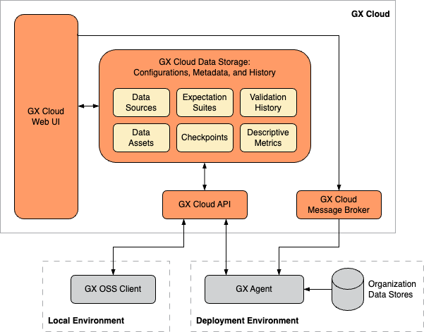
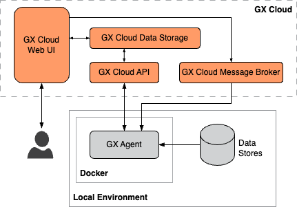
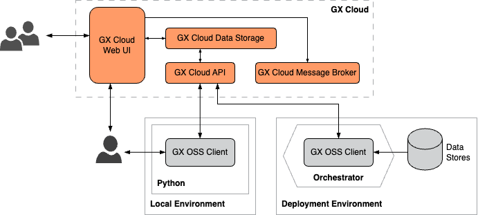

GX Cloud simplifies data quality management and monitoring. Its easy-to-use web interface lets you quickly validate your data without provisioning and maintaining complex infrastructure. With GX Cloud, you can work collaboratively with your teammates to define and test reusable data queries that alert you to changes in your data.

GX Cloud includes the following features and functionality:

- An intuitive web-based interface makes it easier and faster to set up your Expectations and run your Validations.

- Data Asset metrics give you a head-start on understanding your data and creating Expectations.

- Validation run history shows you how your data has changed over time, and makes troubleshooting failed Expectations simple.

- Scheduling your Validations in GX Cloud helps you get set up with production data quailty checks within minutes.

- As a fully managed solution, GX Cloud makes connecting to your data straightforward and secure.

## GX Cloud architecture

The following diagram provides an overview of the key GX Cloud architecture components:

### GX Cloud components

- **GX Cloud data storage** - Stores your organization's Data Source, Data Asset, Expectation Suite, and Checkpoint configurations and your organization's Validation run histories and Data Asset descriptive metrics.

- **GX Cloud web UI** - A web interface that allows you to manage and validate your organization's data quality without running Python code and enables shared visibility into your organization's Validation Results and Checkpoint run history. It's browser- and platform-independent.

- **GX Cloud API** - Provides a REST API to programmatically access and manage GX Cloud data and configurations. Both the GX open source software (OSS) client and the GX Agent use the GX Cloud API to query data from and send data to GX Cloud.

## GX Cloud deployment options

GX Cloud deployments can be tailored to meet your specific business requirements. How your data is accessed and how you want your users to interact with GX Cloud determine which deployment pattern and GX architectural components are suitable for your organization.

| Deployment pattern               | Description                                                                                                                                                                                                                                                                                      | When to use                    |
|----------------------------------|--------------------------------------------------------------------------------------------------------------------------------------------------------------------------------------------------------------------------------------------------------------------------------------------------|--------------------------------|
| [Fully hosted](#fully-hosted) | You connect your data to GX Cloud entirely through its web interface, in a fully hosted GX-managed environment. Connections to your data are read-only, using secure, encrypted methods.                                                                                                         | You want to get started quickly and securely with GX Cloud using direct cloud-to-cloud Data Source connection. |
| [Org-hosted GX Agent](#org-hosted-gx-agent) | You connect your data to GX Cloud using a utility that runs in your organization's deployment environment. While running, the GX Agent can receive tasks generated from the GX Cloud web UI, such as running a Validation or fetching Metrics, and execute these tasks against your Data Assets. | You want to connect to Data Sources using your organization's cloud infrastructure, for enhanced control and security. |
| [Self-hosted GX Agent](#self-hosted-gx-agent) | You connect your data to GX Cloud using a utility that runs on your local machine. While running, the GX Agent can receive tasks generated from the GX Cloud web UI, such as running a Validation or fetching Metrics, and execute these tasks against your Data Assets.                         |  You want to test the Agent setup on your own machine, before moving to a shared production Agent deployment. |
| [API-only](#api-only)  | You integrate with GX Cloud using Python scripts, the GX OSS client, and an orchestrator. The GX Cloud web UI is used primarily to view results; all tasks are executed in your own environment.                                                                                                 | You want to use GX Cloud as a data store for Expectations and Validation results only. |

### Fully hosted
In a fully hosted deployment, you get started with GX Cloud by connecting directly to your organization's cloud data stores via the GX Cloud UI. This is the fastest path to setup.

### Org-hosted GX Agent

In an org-hosted deployment, you run the GX Agent in your organization's deployment environment. The GX Agent is an intermediary between GX Cloud and your organization's deployment environment data stores. Organization users can interact with GX Cloud using the web UI, the GX OSS client, or both.

### Self-hosted GX Agent

In a self-hosted deployment, you use Docker to run the GX Agent in your local environment. The GX Agent is an intermediary between GX Cloud and your local data stores. You can interact with GX Cloud using the web UI, the GX OSS client, or both.

### API-only

Use Python scripts and an orchestrator to integrate GX Cloud into your existing data pipeline. The GX OSS client can be used to access your organization's data stores and to store job results in GX Cloud. Users can interact with GX Cloud using the web UI, the GX OSS client, or both.

### Custom deployment patterns

The deployment patterns described previously are not an exhaustive collection of the ways you can deploy GX Cloud. Instead, these patterns are meant to illustrate the building blocks of a GX Cloud deployment and how your organization can configure and connect those blocks to form a functioning data quality ecosystem.

For example, you might opt to run and interact with the GX OSS client locally to define your Data Sources, Data Assets, Expectation Suites, and Checkpoints, run the GX OSS client in your Airflow pipeline to execute Checkpoints on a regular schedule, run the GX Agent in your production environment to fetch Data Asset metrics from the GX Cloud web UI, and access the GX Cloud web UI to view Validation and Checkpoint run histories.

GX provides flexible, robust products that allow your organization to quickly deploy GX Cloud or GX OSS to fit your unique requirements.

## GX Cloud workflow

The GX Cloud workflow is a sequence of tasks you complete to perform Data Validations. 

You connect GX Cloud to a Data Asset stored on your Data Source, you define and create an Expectation, and then you run a Validation on the data defined in the Expectation. Knowing that your data meets your Expectations helps you ensure your data is accurate and reliable and alerts you to issues before they become problematic.

The following table lists the sequence of tasks that you complete in a typical GX Cloud workflow. A brief description of the task and links to the relevant topics are provided.

| Task                                     | Description                                                        |
|------------------------------------------|--------------------------------------------------------------------|
| [Create a Data Asset](./data_assets/manage_data_assets.md#create-a-data-asset) | The Data Asset contains the data you want to examine and validate, and the Data Source is where the Data Asset is located. | 
| [Invite users](./users/manage_users.md#invite-a-user)    | Invite users to your GX Cloud organization.                       |
| [Create an Expectation](./expectations/manage_expectations.md)    | Define verifiable assertions about your data.                       |  
| [Run Validations](./validations/manage_validations.md)                          | Run a Validation to determine if your data meets the assertions in the Expectation.                       |

## Roles and responsibilities

How you interact with GX Cloud is dependent on the role you're assigned by your Admin. The following table lists GX Cloud roles and responsibilities. 

| Role          | Responsibilities                                  |
|---------------|---------------------------------------------------|
| Viewer        | View Validation Results           | 
| Editor        | Create Data Assets Create and edit Expectations Create access tokens |
| Admin         | Full access Perform all GX Cloud administrative functions including user and role assignment |

## Supported browsers

The following browsers are supported by GX Cloud:

- [Google Chrome](https://www.google.com/chrome/) — the latest version is fully supported

- [Mozilla Firefox](https://www.mozilla.org/en-US/firefox/) — the latest version is fully supported

- [Apple Safari](https://www.apple.com/safari/) — the latest version is fully supported

- [Microsoft Edge](https://www.microsoft.com/en-us/edge?ep=82&form=MA13KI&es=24) — the latest version is fully supported

### Browser session duration

A session is the period of time that you’re signed in to your GX Cloud account from a browser. If you close the browser, your session ends, and you're signed out. You'll need to sign in again to access GX Cloud.
