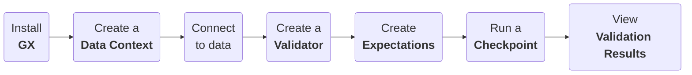

import Prerequisites from '../../components/_prerequisites.jsx'
import PrereqPython from '../../components/prerequisites/_python_version.md'
import SetupAndInstallGx from '../../components/setup/link_lists/_setup_and_install_gx.md'
import DataContextInitializeInstantiateSave from '../../components/setup/link_lists/_data_context_initialize_instatiate_save.md'
import TechnicalTag from '../../reference/learn/term_tags/_tag.mdx';

Use this quickstart to install GX OSS, connect to sample data, build your first Expectation, validate data, and review the validation results. This is a great place to start if you're new to GX OSS and aren't sure if it's the right solution for you or your organization. If you're using Databricks or SQL to store data, see [Get Started with GX and Databricks](/oss/get_started/get_started_with_gx_and_databricks.md) or [Get Started with GX and SQL](/oss/get_started/get_started_with_gx_and_sql.md).

:::info Windows Support

Windows support for the open source Python version of GX OSS is currently unavailable. If you’re using GX OSS in a Windows environment, you might experience errors or performance issues.

:::


## Data validation workflow

The following diagram illustrates the end-to-end GX OSS data validation workflow that you'll implement with this quickstart. Click a workflow step to view the related content.



## Prerequisites

- <PrereqPython />
- pip
- An internet browser


## Install GX OSS

1. Run the following command in an empty base directory inside a Python virtual environment:

    ```bash title="Terminal input"
    pip install great_expectations
    ```

    It can take several minutes for the installation to complete.

2. Run the following Python code to import the `great_expectations` module:

    ```python title="Python" name="tutorials/quickstart/quickstart.py import_gx"
    ```
## Create a Data Context

- Run the following command to create a <TechnicalTag tag="data_context" text="Data Context"/> object:

    ```python title="Python" name="tutorials/quickstart/quickstart.py get_context"
    ```
## Connect to data

- Run the following command to connect to existing `.csv` data stored in the `great_expectations` GitHub repository and create a <TechnicalTag tag="validator" text="Validator"/> object:

    ```python title="Python" name="tutorials/quickstart/quickstart.py connect_to_data"
    ```

    The code example uses the default <TechnicalTag tag="data_context" text="Data Context"/> <TechnicalTag tag="datasource" text="Data Source"/> for Pandas to access the `.csv` data from the file at the specified URL path.

## Create Expectations

- Run the following commands to create two <TechnicalTag tag="expectation" text="Expectations"/> and save them to the <TechnicalTag tag="expectation_suite" text="Expectation Suite"/>:

    ```python title="Python" name="tutorials/quickstart/quickstart.py create_expectation"
    ```

  The first <TechnicalTag tag="expectation" text="Expectation"/> uses domain knowledge (the `pickup_datetime` shouldn't be null).

  The second <TechnicalTag tag="expectation" text="Expectation"/> uses explicit kwargs along with the `passenger_count` column.

  The basic workflow when creating an Expectation Suite is to populate it with Expectations that accurately describe the state of the associated data.  Therefore, when an Expectation Suite is saved failed Expectations are not kept by default.  However, the `discard_failed_expectations` parameter of `save_expectation_suite(...)` can be used to override this behavior if you have created Expectations that describe the ideal state of your data rather than its current state.  

## Validate data

1. Run the following command to define a <TechnicalTag tag="checkpoint" text="Checkpoint"/> and examine the data to determine if it matches the defined <TechnicalTag tag="expectation" text="Expectations"/>:

    ```python title="Python" name="tutorials/quickstart/quickstart.py create_checkpoint"
    ```

2. Run the following command to return the <TechnicalTag tag="validation_result" text="Validation Results"/>:

    ```python title="Python" name="tutorials/quickstart/quickstart.py run_checkpoint"
    ```

3. Run the following command to view an HTML representation of the <TechnicalTag tag="validation_result" text="Validation Results"/> in the generated <TechnicalTag tag="data_docs" text="Data Docs"/>:

    ```python title="Python" name="tutorials/quickstart/quickstart.py view_results"
    ```

## Related documentation

- [Install GX in a specific environment with support for a specific Data Source](/oss/guides/setup/installation/install_gx.md).
- [Initialize, instantiate, and save a Data Context](/oss/guides/setup/configure_data_contexts_lp.md).
- [Connect to Data Sources](/oss/guides/connecting_to_your_data/connect_to_data_lp.md).
- [Create and manage Expectations and Expectation Suites](/oss/guides/expectations/expectations_lp.md).
- [Create, manage, and run Checkpoints](/oss/guides/validation/checkpoints/checkpoint_lp.md).