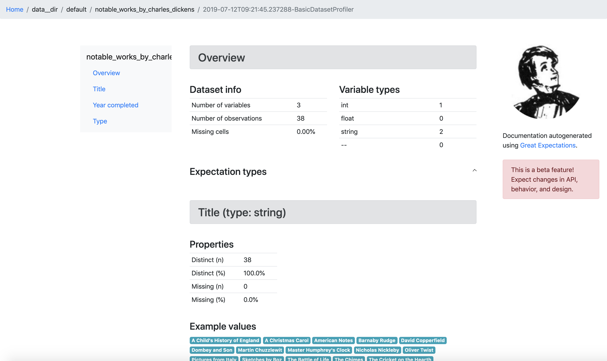

.. _tutorial_init:

Step 1: Run ``great_expectations init``
===============================================

Video
------

.. <<< NEEDS UTM>>>

Watch `the video on YouTube <https://youtu.be/TlTxVyyDunQ>`_.

Default Project Structure
----------------------------------------

Great Expectations provides a default project framework that simplifies operations such as connecting to data sources; fetching, profiling and validating batches of data; and compiling to human-readable documentation.

This tutorial uses a toy project called ``example_dickens_data_project``, but the same methods should work for most data projects. If you want to follow along with this exact example, start with:

.. code-block:: bash

    git clone https://github.com/superconductive/example-dickens-data-project.git
    cd example-dickens-data-project

By default, everything in the Great Expectations deployment framework will be expressed in a directory structure within a ``great_expectations/`` folder within your version control system. To create this folder, navigate to the root of your project directory in a terminal and run:

.. code-block:: bash

    great_expectations init

The command line interface (CLI) will scaffold and populate the configuration
and other artifacts necessary to get started with Great Expectations. This can
be run to start a new project and to onboard a teammate to an existing project.

If you inspect the ``great_expectations/`` directory after the init command has run, it should contain:

.. code-block:: bash

    great_expectations
    ├── .gitignore
    ├── datasources
    ├── expectations
    ├── fixtures
    ├── great_expectations.yml
    ├── notebooks
    │   ├── create_expectations.ipynb
    │   └── integrate_validation_into_pipeline.ipynb
    ├── plugins
    └── uncommitted
        ├── config_variables.yml
        ├── documentation
        │   └── local_site
        ├── samples
        └── validations

Adding Datasources
----------------------------------------

Next, the CLI will ask you if you want to configure a Datasource.

Datasources allow you to configure connections to data to evaluate Expectations. Great Expectations currently supports native evaluation of Expectations in three compute environments:

1. Pandas DataFrames
2. Relational databases via SQL Alchemy
3. Spark DataFrames

Therefore, a Datasource could be a local pandas environment with some configuration to parse CSV files from a directory; a connection to postgresql instance; a Spark cluster connected to an S3 bucket; etc. In the future, we plan to add support for other compute environments, such as dask. (If you'd like to use or contribute to those environments, please chime in on `GitHub issues <https://github.com/great-expectations/great_expectations/issues>`_.)

Our example project has a ``data/`` folder containing several CSVs. Within the CLI, we can configure a Pandas DataFrame Datasource like so:

.. code-block:: bash

    ========== Datasources ==========

    See https://docs.greatexpectations.io/en/latest/features/datasource.html?utm_source=cli&utm_medium=init&utm_campaign=0_7_0__develop for more information about datasources.

    Configure a datasource:
        1. Pandas DataFrame
        2. Relational database (SQL)
        3. Spark DataFrame
        4. Skip datasource configuration
    : 1
    1

    Enter the path of the root directory where the data files are stored.
    (The path may be either absolute or relative to current directory.)
    : data

    Give your new data source a short name.
    [data__dir]: 

This step adds a new block for Datasource configuration to ``great_expectations/great_expectations.yml``. Don't worry about these details yet. For now, it's enough to know that we've configured a Datasource and the configuration information is stored in this file.

.. code-block:: bash

    datasources:
      data-538__dir:
        module_name: great_expectations.datasource
        class_name: PandasDatasource
        data_asset_type:
          class_name: PandasDataset
        generators:
          default:
            class_name: SubdirReaderGenerator
            base_directory: ../data
            reader_options:
              sep:
              engine: python

For a SQL data source, configuration would look like this instead:

.. code-block:: bash

    ========== Datasources ==========

    See https://docs.greatexpectations.io/en/latest/features/datasource.html?utm_source=cli&utm_medium=init&utm_campaign=0_7_0__develop for more information about datasources.

    Configure a datasource:
        1. Pandas DataFrame
        2. Relational database (SQL)
        3. Spark DataFrame
        4. Skip datasource configuration
    : 2
    2

    Give your new data source a short name.
    [mydb]: my_db

    Great Expectations relies on sqlalchemy to connect to relational databases.
    Please make sure that you have it installed.

    Next, we will configure database credentials and store them in the "my_db" section
    of this config file: great_expectations/uncommitted/credentials/profiles.yml:

    What is the driver for the sqlalchemy connection? [postgres]: postgres
    What is the host for the sqlalchemy connection? [localhost]: my_db_host.internal.priv
    What is the port for the sqlalchemy connection? [5432]:  
    What is the username for the sqlalchemy connection? [postgres]: user
    What is the password for the sqlalchemy connection?: 
    What is the database name for the sqlalchemy connection? [postgres]: 
    Creating new profiles store at /home/user/my_project/great_expectations/uncommitted/credentials/profiles.yml

The corresponding config would be:

.. code-block:: bash

    datasources:
      my_db:
        module_name: great_expectations.datasource
        class_name: SqlAlchemyDatasource
        credentials: ${my_db}
        data_asset_type:
          class_name: SqlAlchemyDataset
        generators:
          default:
            class_name: TableGenerator

Note: the SQL credentials you entered are stored in ``uncommitted/config_variables.yml`` file. Note that this file goes in the ``uncommitted/`` directory, which should *NOT* be committed to source control. The ${my_db} variable is substituted with the credentials in runtime.

Strictly speaking, a Great Expectations Datasource is not the data itself, but part of a *pointer* to a data compute environment where Expectations can be evaluated, called a `DataAsset.` Fully describing the pointer requires a 3-ple:

1. ``datasource_name`` (`my_postgresql_db`)
2. ``generator_name`` (`queries`)
3. ``generator_asset`` (`user_events_table`)

In addition, for some operations you will need to specify:

* ``batch_id`` (`SELECT * FROM user_events_table WHERE created_at>2018-01-01`), and/or
* ``expectation_suite_name`` (`BasicDatasetProfiler`).

Together, these five elements completely allot you to reference all of the main entities within the DataContext.

You can get started in Great Expectations without learning all the details of the DataContext. To start, you'll mainly use elements 1 and 3: ``datasource_names``, like `my_postgresql_db` and ``generator_assets``, like `user_events_table`. For most users, these names are already familiar and intuitive. From there, Great Expectations' defaults can usually fill in the gaps.

Profiling data
----------------------------------------

Now that we've configured a DataSource, the next step is to profile it. Profiling will generate a first set of candidate Expectations for your data. By default, they will cover a wide range of statistics and other characteristics of the Dataset that could be useful for future validation.

Profiling will also evaluate these candidate Expectations against your actual data, producing a set of Expectation Validation Results (EVRs), which will contain observed values and other context derived from the data itself.

Together, profiled Expectations and EVRs provide a lot of useful information for creating the Expectations you will use in production. They also provide the raw materials for first-pass data documentation. For more details on profiling, please see :ref:`profiling`.

Within the CLI, it's easy to profile our data.

Warning: For large data sets, the current default profiler may run slowly and impose significant I/O and compute load. Be cautious when executing against shared databases.

.. code-block:: bash

    ========== Profiling ==========

    Would you like to profile 'data__dir' to create candidate expectations and documentation?

    Please note: Profiling is still a beta feature in Great Expectations.  The current profiler will evaluate the entire 
    data source (without sampling), which may be very time consuming. 
    As a rule of thumb, we recommend starting with data smaller than 100MB.

    To learn more about profiling, visit https://docs.greatexpectations.io/en/latest/reference/profiling.html?utm_source=cli&utm_medium=init&utm_campaign=0_7_0.
            
    Proceed? [Y/n]: Y
    Profiling 'data__dir' with 'BasicDatasetProfiler'
    Found 1 data assets using generator 'default'
    Profiling all 1.
        Profiling 'notable_works_by_charles_dickens'...
        Profiled 3 columns using 38 rows from notable_works_by_charles_dickens (0.132 sec)

    Profiled 1 of 1 named data assets, with 38 total rows and 3 columns in 0.13 seconds.
    Generated, evaluated, and stored 27 candidate Expectations.
    Note: You will need to review and revise Expectations before using them in production.

    Done.

    Profiling results are saved here:
    /home/user/example-dickens-data-project/great_expectations/uncommitted/validations/2019-07-12T085507.080557Z/data__dir/default/notable_works_by_charles_dickens/BasicDatasetProfiler.json

The default profiler (``BasicDatasetProfiler``) will add two JSON files in your ``great_expectations/`` directory. They will be placed in subdirectories that following our namespacing conventions. Great Expectations' DataContexts can fetch these objects by name, so you won't usually need to access these files directly. Still, it's useful to see how they're stored, to get a sense for how namespaces work.

.. code-block:: bash

    great_expectations
    ├── .gitignore
    ├── datasources
    ├── expectations
    │   └── data__dir
    │       └── default
    │           └── notable_works_by_charles_dickens
    │               └── BasicDatasetProfiler.json
    ├── fixtures
    ├── great_expectations.yml
    ├── notebooks
    │   ├── create_expectations.ipynb
    │   └── integrate_validation_into_pipeline.ipynb
    ├── plugins
    └── uncommitted
        ├── config_variables.yml
        ├── documentation
        │   ├── local_site
        │   └── team_site
        ├── samples
        └── validations
            └── 2019-07-12T090442.066278Z
                └── data__dir
                    └── default
                        └── notable_works_by_charles_dickens
                            └── BasicDatasetProfiler.json

We won't go into full detail on the contents of Expectation and EVR objects here. But as a quick illustration, Expectation Suite JSON objects consist mainly of Expectations like:

.. code-block:: json

    {
      "expectation_type": "expect_column_values_to_be_in_set",
      "kwargs": {
        "column": "Type",
        "value_set": [],
        "result_format": "SUMMARY"
      },
      "meta": {
        "BasicDatasetProfiler": {
          "confidence": "very low"
        }
      }
    }

Expectation Suites created by the BasicDatasetProfiler are very loose and unopinionated. (Hence, the empty ``value_set`` parameter.) They are more like placeholders for Expectations than actual Expectations. (A tighter Expectation might include something like ``value_set=["Novel", "Short Story", "Novella"]``.) That said, even these loose Expectations can be evaluated against data to produce EVRs.

EVRs contain Expectations, *plus* validation results from a evaluation against a specific batch of data.

.. code-block:: bash

    {
      "success": false,
      "result": {
        "element_count": 38,
        "missing_count": 0,
        "missing_percent": 0.0,
        "unexpected_count": 38,
        "unexpected_percent": 1.0,
        "unexpected_percent_nonmissing": 1.0,
        "partial_unexpected_list": [
          "Short Stories",
          "Novel",
          "Short Stories",
          ...
        ],
        "partial_unexpected_index_list": [
          0,
          1,
          ...
          19
        ],
        "partial_unexpected_counts": [
          {
            "value": "Novel",
            "count": 14
          },
          {
            "value": "Short Story",
            "count": 9
          },
          {
            "value": "Novella",
            "count": 5
          },
          ...
        ]
      },
      "exception_info": {
        "raised_exception": false,
        "exception_message": null,
        "exception_traceback": null
      },
      "expectation_config": {
        "expectation_type": "expect_column_values_to_be_in_set",
        "kwargs": {
          "column": "Type",
          "value_set": [],
          "result_format": "SUMMARY"
        },
        "meta": {
          "BasicDatasetProfiler": {
            "confidence": "very low"
          }
        }
      }
    }

The full Expectation Suite and EVR are JSON objects that also contain additional metadata, which we won't go into here. For more information about these objects please see :ref:`validation_result`.

Data Docs
----------------------------------------------------------

Expectation Suites and EVR's contain a huge amount of useful information about your data, but they aren't very easy to consume as JSON objects. To make them more accessible, Great Expectations provides tools to render Expectation Suites and EVRs to documentation.

We call this feature "Compile to Docs."  This approach to documentation has two significant advantages.

First, for engineers, Compile to Docs makes it possible to automatically keep your documentation in sync with your tests. This prevents documentation rot and can save a huge amount of time on otherwise unrewarding document maintenance.

Second, the ability to translate Expectations back and forth betwen human- and machine-readable formats opens up many opportunities for domain experts and stakeholders who aren't engineers to collaborate more closely with engineers on data applications.

Within the CLI, we compile to documentation as follows:

.. code-block:: bash

    ========== Data Docs ==========

    Great Expectations can create data documentation from the data you just profiled.

    To learn more: https://docs.greatexpectations.io/en/latest/guides/data_docs.html?utm_source=cli&utm_medium=init&utm_campaign=0_8_0a1

    Build HTML documentation? [Y/n]:

    Building Data Docs...
        ...

    The following data documentation HTML sites were generated:

    local_site:
       great_expectations/uncommitted/data_docs/local_site/index.html

    team_site:
       great_expectations/uncommitted/data_docs/team_site/index.html

Opening `great_expectations/uncommitted/data_docs/local_site/index.html` in a browser will give you a page like:

.. image:: ../images/index_render.png

Clicking through to the first link will show you prescriptive data documentation. This renders the Expectation Suite itself.

.. image:: ../images/prescriptive_render.png

Clicking through to the second link will show you descriptive data documentation. This renders the full content of validation results, not just the Expectations themselves.

Note also that the default ``great_expectations/`` setup does NOT commit compiled docs themselves within version control. Instead, they live in ``uncommitted/data_docs/``, with a subdirectory structure that mirrors the project namespace.

After the init command completes, you should see the following directory structure :

.. code-block:: bash

    great_expectations
    ├── .gitignore
    ├── datasources
    ├── expectations
    │   └── data__dir
    │       └── default
    │           └── notable_works_by_charles_dickens
    │               └── BasicDatasetProfiler.json
    ├── fixtures
    ├── great_expectations.yml
    ├── notebooks
    │   ├── create_expectations.ipynb
    │   └── integrate_validation_into_pipeline.ipynb
    ├── plugins
    └── uncommitted
        ├── config_variables.yml
        ├── documentation
        │   ├── local_site
        │   │   ├── expectations
        │   │   │   └── data__dir
        │   │   │       └── default
        │   │   │           ├── notable_works_by_charles_dickens
        │   │   │           │   └── BasicDatasetProfiler.html
        │   │   ├── index.html
        │   │   └── validations
        │   │       └── profiling
        │   │           └── data__dir
        │   │               └── default
        │   │                   └── notable_works_by_charles_dickens
        │   │                       └── BasicDatasetProfiler.html
        │   └── team_site
        ├── samples
        └── validations
            └── 2019-07-12T090442.066278Z
                └── data__dir
                    └── default
                        └── notable_works_by_charles_dickens
                            └── BasicDatasetProfiler.json

Configuring Slack Notifications
----------------------------------------

Great Expectations can post messages to a Slack channel each time a dataset is validated. This helps teams to monitor data quality in their pipeline in real time. Here is what these messages look like:

.. image:: ../images/validation_result_slack_message_example.jpg
    :width: 400px

The `great_expectations init` command prompts you to enter a Slack webhook URL to enable this functionality.

Obtaining this URL is easy. This article walks you through the steps: `Incoming Webhooks For Slack <https://slack.com/help/articles/115005265063-incoming-webhooks-for-slack>`_

Since Slack webhook URLs are security credentials, we store them in the `uncommitted/config_variables.yml` file that will not be checked in into your source control. The config property name is `validation_notification_slack_webhook`

If you don't have a Slack webhook URL right now, you can decline the `init` command's prompt and configure this feature later.

Next Steps
-----------

Before exiting, the init command points you to the notebooks that you can use to create expectations:

::

    To create expectations for your data, start Jupyter and open a tutorial notebook:

    To launch with jupyter notebooks:
        jupyter notebook great_expectations/notebooks/create_expectations.ipynb

    To launch with jupyter lab:
        jupyter lab great_expectations/notebooks/create_expectations.ipynb
