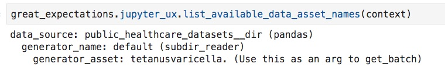
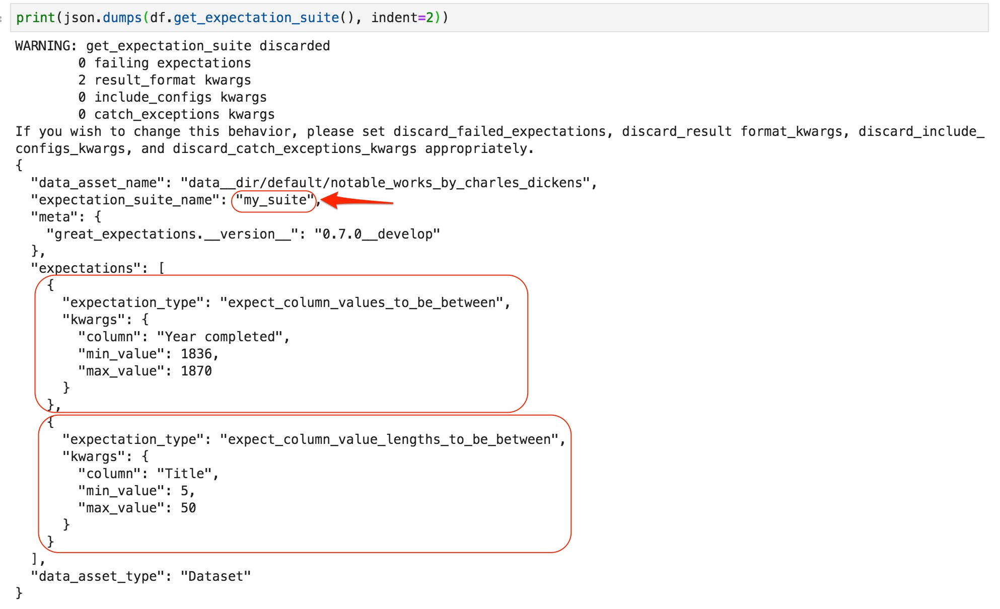
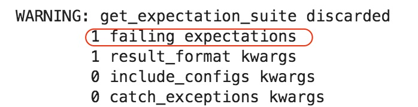

.. _tutorial_create_expectations:

Step 2: Create Expectations
==============================

This tutorial covers creating expectations for a data asset in the Jupyter notebook ``great_expectations/notebooks/create_expectations.ipynb`` that ``great_expectations init`` created in your project.

We will continue the example we used in the previous section - CSV files containing the data on notable works of Charles Dickens that look like this:

.. image:: ../images/dickens_titles_data_sample.jpg

Creating expectations is an opportunity to blend contextual knowledge from subject-matter experts and insights from profiling and performing exploratory analysis on your dataset.

Video
------

Watch `the video on YouTube <https://youtu.be/9qD-su38sYo>`_.

Get DataContext Object
-----------------------

A DataContext represents a Great Expectations project. It organizes storage and access for
expectation suites, datasources, notification settings, and data fixtures.
The DataContext is configured via a yml file stored in a directory called great_expectations;
the configuration file as well as managed expectation suites should be stored in version control.

Obtaining a DataContext object gets us access to these resources after the object reads its
configuration file.

::

    context = ge.data_context.DataContext()

To read more about DataContext, see: :ref:`data_context`

Data Assets
-------------

A Great Expectations DataContext describes data assets using a three-part namespace consisting of
**datasource_name**, **generator_name**, and **generator_asset**.

To run validation for a data_asset, we need two additional elements:

* a **batch** to validate; in our case it is a file loaded into a Pandas DataFrame
* an **expectation_suite** to validate against

.. image:: ../images/data_asset_namespace.png

Here are the data assets that DataContext is aware of in our example project:

Get Batch
----------

Datasources and generators work together closely with your pipeline infrastructure to provide Great Expectations
batches of data to validate. The generator is responsible for identifying the ``batch_kwargs`` that a datasource will
use to load a batch of data. For example the :class:`~great_expectations.datasource.generator.\
subdir_reader_generator.SubdirReaderGenerator`
generator will create batches of data based on individual files and group those batches into a single data_asset based
on the subdirectory in which they are located. By contrast, the :class:`~great_expectations.datasource.generator.\
glob_reader_generator.GlobReaderGenerator`
will also create batches of data based on individual files, but uses defined glob-style match patterns to group those
batches into named data assets.

``batch_kwargs`` from one of those filesystem reader generators might look like the following:

.. code-block:: json

  {
    "path": "/data/staging/user_actions/20190710T034323_user_actions.csv",
    "timestamp": 1562770986.6800103,
    "sep": null,
    "engine": "python"
  }

The easiest way to create an expectation suite for a data asset in Python is to load a sample batch of that data asset and then call ``expect*`` methods on it.

The following call loads one of the batches of the ``notable_works_by_charles_dickens`` data asset (one of the files).

The argument ``expectation_suite_name`` specifies the name of the expectation suite you want to create. At first this suite contains no expectations. We will add expectations to it in the next steps.

.. image:: ../images/get_batch.jpg

If you want to validate data in Pandas Dataframes or in Spark Dataframes:
~~~~~~~~~~~~~~~~~~~~~~~~~~~~~~~~~~~~~~~~~~~~~~~~~~~~~~~~~~~~~~~~~~~~~~~~~

* If GE listed and profiled your files correctly:

.. code-block:: python

    data_asset_name = CHOOSE FROM THE LIST ABOVE IN THE NOTEBOOK
    batch = context.get_batch(data_asset_name,
                              expectation_suite_name)

* Otherwise (you want to control the logic of reading the data):

.. code-block:: python

    df = load the data into a dataframe, e.g., df = SparkDFDataset(spark.read.csv... or pd.read_csv(...
    data_asset_name = COME UP WITH A NAME - THIS WILL CREATE A NEW DATA ASSET
    batch = context.get_batch(data_asset_name,
                              expectation_suite_name,
                              df)

If you want to validate data in a database:
~~~~~~~~~~~~~~~~~~~~~~~~~~~~~~~~~~~~~~~~~~~~~~~~~~~~~~~~~~~~~~~~~~~~~~~~~

* To validate an existing table:

.. code-block:: python

    data_asset_name = CHOOSE THE NAME OF YOUR TABLE FROM THE LIST OF DATA ASSETS ABOVE IN THE NOTEBOOK
    df = context.get_batch(data_asset_name,
                            expectation_suite_name='my_suite')

* To validate a query result set:

.. code-block:: python

    data_asset_name = NAME YOUR QUERY (E.G., daily_users_query) - THIS WILL CREATE A NEW DATA ASSET
    df = context.get_batch(data_asset_name,
                            expectation_suite_name='my_suite',
                            query='SQL FOR YOUR QUERY')

Reader Options
---------------

To instruct ``get_batch`` to read CSV files with specific options (e.g., not to interpret the first line as the header or to use a specific separator), either specify these options in the generator configuration or pass them as additional kwargs to the method. Those reader options will become components in the ``batch_kwargs``.

If the datasource is of type ``pandas``, see the complete list of options for `Pandas read_csv <https://pandas.pydata.org/pandas-docs/stable/reference/api/pandas.read_csv.html>`__.

If the datasource is of type ``spark``, see the complete list of options for `Spark DataFrameReader <https://spark.apache.org/docs/latest/api/python/pyspark.sql.html#pyspark.sql.DataFrameReader>`__.

Create Expectations
--------------------------------

Now that we have one of the data batches loaded, we can call ``expect*`` methods on the data asset in order to check
whether this expectation is true for this batch of data.

For example, to check if we can expect values in column "order_date" to never be empty, call: ``df.expect_column_values_to_not_be_null('order_date')``

Some expectations can be created from your domain expertise. As everybody knows, Charles Dickens began his literary career with the publication of The Pickwick Papers in 1836 and kept writing until his death in 1870.

Here is how we can add an expectation that expresses this knowledge:

.. image:: ../images/expect_column_values_to_be_between_success.jpg

Other expectations can be created by examining the data in the batch. For example, we want to protect our pipeline against values of unreasonable length in the "Title" column. We don't know exactly what the limits of the "reasonable" are, but we can try some values and check if the data in the batch meets this expectation:

.. image:: ../images/expect_column_value_lengths_to_be_between_failure.jpg

Validating the expectation againt the batch resulted in failure - there are some values in the column that do not meet the expectation. The "partial_unexpected_list" key in the result dictionary contains examples of non-conforming values. Examining these examples shows that some titles are longer than 30 characters. We adjust the ``max_value`` and rerun the expectation method:

.. image:: ../images/expect_column_value_lengths_to_be_between_success.jpg

This time validation was successful - all values in the column meet our expectation.

Although we called ``expect_column_value_lengths_to_be_between`` twice (with different argument values), only one expectation of type ``column_value_lengths_to_be_between`` will be created for the column 'Title' - the latest call overrides all the earlier ones. By default, only expectations that were true on their last run are saved.

How do I know which types of expectations I can add?
~~~~~~~~~~~~~~~~~~~~~~~~~~~~~~~~~~~~~~~~~~~~~~~~~~~~

* *Tab-complete* the partially typed ``expect*`` method name to see available expectations.
* In Jupyter, we can also use *shift-tab* to see the docstring for each expectation, including the parameters it takes and to get more information about the expectation.
* Visit the `glossary of expectations <https://docs.greatexpectations.io/en/latest/glossary.html>`__ for a complete list of expectations that are currently part of the great expectations vocabulary.

Review and Save Expectation Suite
---------------------------------

.. code-block:: python

    df.save_expectation_suite()

Because this data asset is connected to the DataContext, GE determines the location to save the expectation suite:

.. image:: ../images/saved_expectation_suite_file.jpg
    :width: 450px

When we call ``get_expectation_suite``, we might see this warning in the output:

When we save an expectation suite, by default, GE will drop any expectation that was not successful on its last run.

Sometimes we want to save an expectation even though it did not validate successfully on the current batch (e.g., we have a reason to believe that our expectation is correct and the current batch has bad entries). In this case we pass and additional argument to ``save_expectation_suite`` method:

.. code-block:: python

    df.save_expectation_suite(discard_failed_expectations=False)

