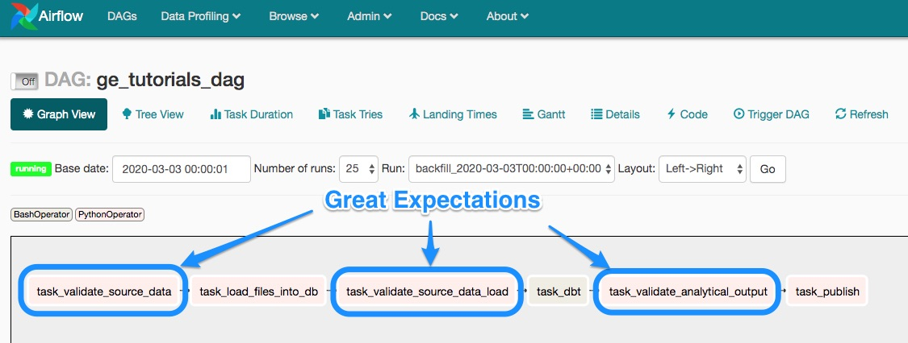

Tutorial - Integrate Great Expectations into a Data Pipeline
============================================================

This article goes over an example of a data pipeline that uses Great Expectations to validate and document the data that it processes.

First, we will explain what the pipeline does. Then we will show how GE is integrated in it. Lastly, we will present a tutorial you can follow to go from a pipeline without GE to GE being fully integrated in it.

Before starting the tutorial, we suggest you run :ref:`great_expectations init <tutorial_init>` to get an initial hands-on experience with GE.

It is useful to read about the :ref:`Typical Workflow <Typical Workflow>` - this way the concepts will sound familiar to you as you read this article and go through the tutorial.

This pipeline was built with Airflow, Pandas, Postgres and dbt. Even if your pipeline uses different technologies, you will still benefit from this example, since the patterns of integrating GE will apply.

The example's code is in this repo: `<https://github.com/superconductive/ge_tutorials>`__

Let's begin...

Meet the pipeline
----------------------------------------

The pipeline will look familiar to lots of data teams working with ELT pattern.

It loads data from CSV files into a database and then transforms it to produce some analytical result.

The example uses Airflow to orchestrate the pipeline and dbt to perform the SQL transform.

The purpose of this example is simply to show how the individual components work together. Therefore, both the dbt and the Great Expectations components are kept fairly trivial, but hopefully realistic.

Watch this walkthrough of the pipeline (the videos in this article are best viewed in full screen mode):

.. raw:: html

    

        <iframe src="https://www.youtube.com/embed/J4howjeVwkw" frameborder="0" allowfullscreen style="position: absolute; top: 0; left: 0; width: 100%; height: 100%;"></iframe>
    

|

The basic setup steps for running the example are here: `<https://github.com/superconductive/ge_tutorials>`__

How Great Expectations protects this pipeline
---------------------------------------------

The example uses Great Expectations at 3 points of the pipeline. Each demonstrates a distinct use case:

1. Validate the input CSV files before loading them into the database
2. Validate the data loaded into the database
3. Validate the analytical result that dbt produced in the database

This video provides the overview:

.. raw:: html

    

        <iframe src="https://www.youtube.com/embed/Pg7dIBCUykg" frameborder="0" allowfullscreen style="position: absolute; top: 0; left: 0; width: 100%; height: 100%;"></iframe>
    

|
How Great Expectations validates the pipeline's input files
------------------------------------------------------------------------

This video covers the first step in the pipeline where Great Expectations protects the pipeline from processing invalid input data:

.. raw:: html

    

        <iframe src="https://www.youtube.com/embed/FOQ8WGA9INk" frameborder="0" allowfullscreen style="position: absolute; top: 0; left: 0; width: 100%; height: 100%;"></iframe>
    

|
Prepare the repo for the tutorial
------------------------------------------------------------------------

So far, we described the "end state" of the pipeline with Great Expectations integrated at 3 points.

In this step we will help you bring the pipeline back in time to the point before GE was added to it.

This means removing the nodes marked in blue from the Airflow DAG:

After that this tutorial we will take you step by step through adding GE back.

This video walks you through the steps:

.. raw:: html

    

        <iframe src="https://www.youtube.com/embed/tYjO6y9zueQ" frameborder="0" allowfullscreen style="position: absolute; top: 0; left: 0; width: 100%; height: 100%;"></iframe>
    

|
Tutorial: Use Great Expectations to validate the pipeline's input files
------------------------------------------------------------------------

Our pipeline is back in the state it was in before Great Expectations was added to it to manage the quality of data flowing through it.

This video is a tutorial for adding GE at the very beginning of the pipeline to validate the input CSV files before they are
loaded into the database. You can follow along.

.. raw:: html

    

        <iframe src="https://www.youtube.com/embed/Wqn-eEfJjGo" frameborder="0" allowfullscreen style="position: absolute; top: 0; left: 0; width: 100%; height: 100%;"></iframe>
    

|
Tutorial: Use Great Expectations to validate the result of loading data from CSV into the database
--------------------------------------------------------------------------------------------------

Coming soon...

|
Tutorial: Use Great Expectations to validate the analytical result of the pipeline in the database
--------------------------------------------------------------------------------------------------

Coming soon...

