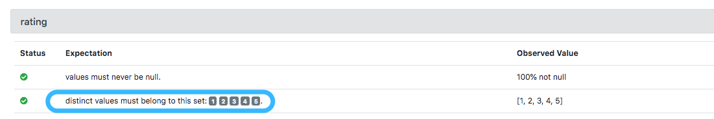
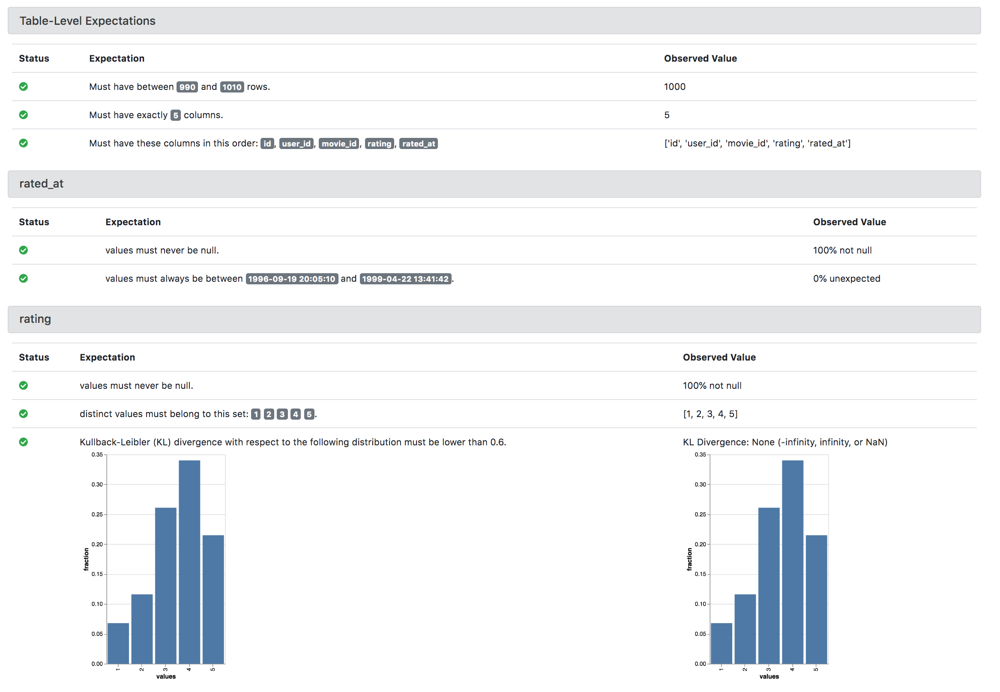
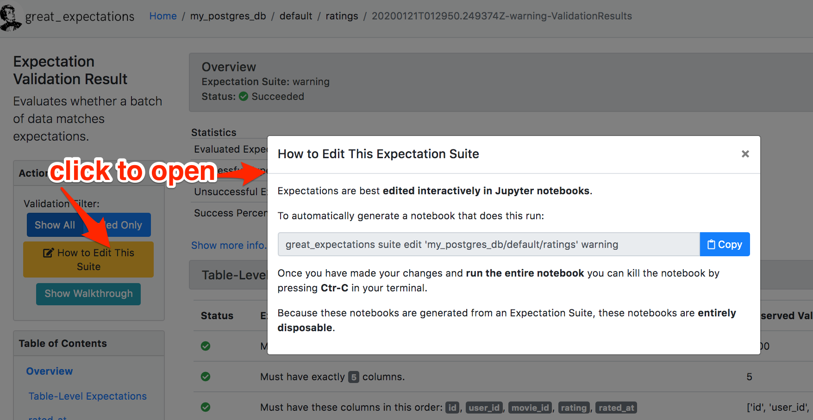

Typical Workflow
===============================================

This article describes how data teams typically use Great Expectations.

The objective of this workflow is to gain control and confidence in your data pipeline and to address the challenges of validating and monitoring the quality and accuracy of your data.

Once the setup is complete, the workflow looks like a loop over the following steps:

1. Data team members capture and document their shared understanding of their data as expectations.
2. As new data arrives in the pipeline, Great Expectations evaluates it against these expectations.
3. If the observed properties of the data are found to be different from the expected ones, the team responds by rejecting (or fixing) the data, updating the expectations, or both.

The article focuses on the "What" and the "Why" of each step in this workflow, and touches on the "How" only briefly. The exact details of configuring and executing these steps are intentionally left out - they can be found in the tutorials and reference linked from each section.

If you have not installed Great Expectations and executed the :ref:`command line interface (CLI) <command_line>` init command, as described in this :ref:`tutorial <tutorial_init>`, we recommend you do so before reading the rest of the article. This will make a lot of concepts mentioned below more familiar to you.

Setting Up a Project
----------------------------------------

To use Great Expectations in a new data project, a :ref:`Data Context<data_context>` needs to be initialized.
You will see references to the Data Context throughout the documentation.
A Data Context provides the core services used in a Great Expectations project.

The :ref:`CLI <command_line>` command ``init`` does the initialization. Run this command in the terminal in the root of your project's repo:

.. code-block:: bash

    great_expectations init

This command has to be run only once per project.

The command creates ``great_expectations`` subdirectory in the current directory. The team member who runs it, commits the generated directory into the version control. The contents of ``great_expectations`` look like this:

.. code-block:: bash

    great_expectations
    ...
    ├── expectations
    ...
    ├── great_expectations.yml
    ├── notebooks
    ...
    ├── .gitignore
    └── uncommitted
        ├── config_variables.yml
        ├── documentation
        │   └── local_site
        └── validations

* The ``great_expectations/great_expectations.yml`` configuration file defines how to access the project's data, expectations, validation results, etc.
* The ``expectations`` directory is where the expectations are stored as JSON files.
* The ``uncommitted`` directory is the home for files that should not make it into the version control - it is configured to be excluded in the ``.gitignore`` file. Each team member will have their own content of this directory. In Great Expectations, files should not go into the version control for two main reasons:

  * They contain sensitive information. For example, to allow the ``great_expectations/great_expectations.yml`` configuration file, it must not contain any database credentials and other secrets. These secrets are stored in the ``uncommitted/config_variables.yml`` that is not checked in.

  * They are not a "primary source of truth" and can be regenerated. For example, ``uncommitted/documentation`` contains generated data documentation (this article will cover data documentation in a later section).

Adding Datasources
----------------------------------------

Evaluating an expectation against a batch of data is the fundamental operation in Great Expectations.

For example, imagine that we have a movie ratings table in the database. This expectation says that we expect that column "rating" takes only 1, 2, 3, 4 and 5:

.. code-block:: json

    {
      "kwargs": {
        "column": "rating",
        "value_set": [1, 2, 3, 4, 5]
      },
      "expectation_type": "expect_column_distinct_values_to_be_in_set"
    }

When Great Expectations evaluates this expectation against a dataset that has a column named "rating", it returns a validation result saying whether the data meets the expectation.

A :ref:`Datasource<datasource>` is a connection to a compute environment (a backend such as Pandas, Spark, or a SQL-compatible database) and one or more storage environments.

You can have multiple Datasources in a project (Data Context). For example, this is useful if the team’s pipeline consists of both a Spark cluster and a Redshift database.

All the Datasources that your project uses are configured in the project's configuration file ``great_expectations/great_expectations.yml``:

.. code-block:: yaml

    datasources:

      our_product_postgres_database:
        class_name: SqlAlchemyDatasource
        data_asset_type:
          class_name: SqlAlchemyDataset
        credentials: ${prod_db_credentials}

      our_redshift_warehouse:
        class_name: SqlAlchemyDatasource
        data_asset_type:
          class_name: SqlAlchemyDataset
        credentials: ${warehouse_credentials}

The easiest way to add a datasource to the project is to use the :ref:`CLI <command_line>` convenience command:

.. code-block:: bash

    great_expectations datasource new

This command asks for the required connection attributes and tests the connection to the new Datasource.

The intrepid can add Datasources by editing the configuration file, however there are less guardrails around this approach.

A Datasource knows how to load data into the computation environment.
For example, you can use a PySpark Datasource object to load data into a DataFrame from a directory on AWS S3.
This is beyond the scope of this article.

After a team member adds a new Datasource to the Data Context, they commit the updated configuration file into the version control in order to make the change available to the rest of the team.

Because ``great_expectations/great_expectations.yml`` is committed into version control, the :ref:`CLI <command_line>` command **does not store the credentials in this file**.
Instead it saves them in a separate file: ``uncommitted/config_variables.yml`` which is not committed into version control.

This means that that when another team member checks out the updated configuration file with the newly added Datasource, they must add their own credentials to their ``uncommitted/config_variables.yml`` or in environment variables.

Setting Up Data Docs
----------------------------------------------------------

:ref:`Data Docs<data_docs>` is a feature of Great Expectations that creates data documentation by compiling expectations and validation results into HTML.

Data Docs produces a visual data quality report of what you expect from your data, and how the observed properties of your data differ from your expectations.
It helps to keep your entire team on the same page as data evolves.

Here is what the ``expect_column_distinct_values_to_be_in_set`` expectation about the `rating` column of the movie ratings table from the earlier example looks like in Data Docs:

This approach to data documentation has two significant advantages.

1. **Your docs are your tests** and **your tests are your docs.**
For engineers, Data Docs makes it possible to **automatically keep your data documentation in sync with your tests**.
This prevents documentation rot and can save a huge amount of time and pain maintaining documentation.

2. The ability to translate expectations back and forth between human and machine-readable formats opens up
many opportunities for domain experts and stakeholders who aren't engineers to collaborate more closely with
engineers on data applications.

Multiple sites can be configured inside a project, each suitable for a particular use case.
For example, some data teams use one site that has expectations and validation results from all the runs of their data pipeline for monitoring the pipeline's health,
and another site that has only the expectations for communicating with their downstream clients.
This is analogous to API documentation in software development.

To set up Data Docs for a project, an entry ``data_docs_sites`` must be defined in the project's configuration file.
By default Data Docs site files are published to the local filesystem here: ``great_expectations/uncommitted/data_docs/``.
You can see this by running:

.. code-block:: bash

    great_expectations docs build

To make a site available more broadly, a team member could configure Great Expectations to publish the site to a shared location,
such as a :ref:`AWS S3<publishing_data_docs_to_s3>`, GCS.

The site's configuration defines what to compile and where to store results.
Data Docs is very customizable - see the :ref:`Data Docs Reference<data_docs_reference>` for more information.

Authoring Expectation Suites
----------------------------------------------------------

Earlier in this article we said that capturing and documenting the team's shared understanding of its data as expectations is the core part of this typical workflow.

Expectation Suites combine multiple expectations into an overall description of a dataset. For example, a team can group all the expectations about its ``rating`` table in the movie ratings database from our previous example into an Expectation Suite and call it ``movieratings.ratings``. Note these names are completely flexible and the only constraint on the name of a suite is that it must be unique to a given project.

Each Expectation Suite is saved as a JSON file in the ``great_expectations/expectations`` subdirectory of the Data Context. Users check these files into the version control each time they are updated, same way they treat their source files. This discipline allows data quality to be an integral part of versioned pipeline releases.

The lifecycle of an Expectation Suite starts with creating it. Then it goes through an iterative loop of Review and Edit as the team's understanding of the data described by the suite evolves.

Create
********************************************

While you could hand-author an Expectation Suite by writing a JSON file, just like with other features it is easier to let :ref:`CLI <command_line>` save you time and typos.
Run this command in the root directory of your project (where the init command created the ``great_expectations`` subdirectory:

.. code-block:: bash

    great_expectations suite new

This command prompts you to name your new Expectation Suite and to select a sample batch of data the suite will describe.
Then it uses a sample of the selected data to add some initial expectations to the suite.
The purpose of these is expectations is to provide examples of data assertions, and not to be meaningful.
They are intended only a starting point for you to build upon.

The command concludes by saving the newly generated Expectation Suite as a JSON file and rendering the expectation suite into an HTML page in Data Docs.

Review
********************************************

Reviewing expectations is best done visually in Data Docs. Here's an example of what that might look like:

Note that many of these expectations might have meaningless ranges.
Also note that all expectations will have passed, since this is an example suite only.
When you interactively edit your suite you will likely see failures as you iterate.

Edit
********************************************

Editing an Expectation Suite means adding, removing, and modifying the arguments of existing expectations.

Similar to writing SQL queries, Expectations are best edited interactively against your data.
The best interface for this is in a Jupyter notebook where you can get instant feedback as you iterate.

For every expectation type there is a Python method that sets its arguments, evaluates this expectation against a sample batch of data and adds it to the Expectation Suite.

The screenshot below shows the Python method and the Data Docs view for the same expectation (``expect_column_distinct_values_to_be_in_set``):

.. image:: ../images/exp_html_python_side_by_side.png

The Great Expectations :ref:`CLI <command_line>` command ``suite edit`` generates a Jupyter notebook to edit a suite.
This command saves you time by generating boilerplate that loads a batch of data and builds a cell for every expectation in the suite.
This makes editing suites a breeze.

For example, to edit a suite called ``movieratings.ratings`` you would run:

.. code-block:: bash

    great_expectations suite edit movieratings.ratings

These generated Jupyter notebooks can be discarded and should not be kept in source control since they are auto-generated at will, and may contain snippets of actual data.

To make this easier still, the Data Docs page for each Expectation Suite has the :ref:`CLI <command_line>` command syntax for you.
Simply press the "How to Edit This Suite" button, and copy/paste the :ref:`CLI <command_line>` command into your terminal.

Validating Data using Great Expectations
----------------------------------------

So far, your team members used Great Expectations to capture and document their expectations about your data.

It is time for your team to benefit from Great Expectations' automated testing that systematically surfaces errors, discrepancies and surprises lurking in your data, allowing you and your team to be more proactive when data changes.

We typically see two main deployment patterns that we will explore in depth below.

1. Great Expectations is **deployed adjacent to your existing data pipeline**.
2. Great Expectations is **embedded into your existing data pipeline**.

Deploying automated testing adjacent to a data pipeline
*******************************************************

You might find yourself in a situation where you do not have the engineering resources, skills, desire, or permissions to embed Great Expectations into your pipeline.
As long as your data is accessible you can still reap the benefits of automated data testing.

.. note:: This is a fast and convenient way to get the benefits of automated data testing without requiring engineering efforts to build Great Expectations into your pipelines.

A checkpoint is an executable python file that runs validates a batch of data against an expectation suite.
Taps are a convenient way to generate a data validation script that can be run manually or via a scheduler.

Let's make a new checkpoint using the ``checkpoint new`` command.

To do this we\'ll specify the name of the suite and the name of the new python file we want to create.
For this example, let\'s say we want to validate a batch of data against the ``movieratings.ratings`` expectation suite, and we want to make a new file called ``movieratings.ratings_tap.py``

.. code-block:: bash

    $ great_expectations checkpoint new movieratings.ratings movieratings.ratings_tap.py
    This is a BETA feature which may change.

    Which table would you like to use? (Choose one)
        1. ratings (table)
        Don\'t see the table in the list above? Just type the SQL query
    : 1
    A new checkpoint has been generated!
    To run this checkpoint, run: python movieratings.ratings_tap.py
    You can edit this script or place this code snippet in your pipeline.

If you open the generated checkpoint file you'll see it's only a few lines of code to get validations running!
It will look like this:

.. code-block:: python

    """
    A basic generated Great Expectations checkpoint that validates a single batch of data.

    Data that is validated is controlled by BatchKwargs, which can be adjusted in
    this script.

    Data are validated by use of the `ActionListValidationOperator` which is
    configured by default. The default configuration of this Validation Operator
    saves validation results to your results store and then updates Data Docs.

    This makes viewing validation results easy for you and your team.

    Usage:
    - Run this file: `python movieratings.ratings_tap.py`.
    - This can be run manually or via a scheduler such as cron.
    - If your pipeline runner supports python snippets you can paste this into your
    pipeline.
    """
    import sys
    import great_expectations as ge

    # checkpoint configuration
    context = ge.DataContext()
    suite = context.get_expectation_suite("movieratings.ratings_tap")
    # You can modify your BatchKwargs to select different data
    batch_kwargs = {
        "table": "ratings",
        "schema": "movieratings",
        "datasource": "movieratings",
    }

    # checkpoint validation process
    batch = context.get_batch(batch_kwargs, suite)
    results = context.run_validation_operator("action_list_operator", [batch])

    if not results["success"]:
        print("Validation Failed!")
        sys.exit(1)

    print("Validation Succeeded!")
    sys.exit(0)

To run this and validate a batch of data, run:

.. code-block:: bash

    $ python movieratings.ratings_tap.py
    Validation Succeeded!

This can easily be run manually anytime you want to check your data.
It can also easily be run on a schedule basis with a scheduler such as cron.

You'll want to view the detailed data quality reports in Data Docs by running ``great_expectations docs build``.

For example, if you wanted to run this script nightly at 04:00, you'd add something like this to your crontab.

.. code-block:: bash

    $ crontab -e
    0 4 * * * /full/path/to/python /full/path/to/movieratings.ratings_tap.py

If you don't have access to a scheduler, you can always make checking your data part of your daily routine.
Once you experience how much time and pain this saves you, we recommend geting engineering resources to embed Great Expectations validations into your pipeline.

Embedding automated testing into a data pipeline
************************************************

.. note:: This is an ideal way to deploy automated data testing if you want to take automated interventions based on the results of data validation.
  For example, you may want your pipeline to quarantine data that does not meet your expectations.

A data engineer can add a :ref:`Validation Operator<validation_operators_and_actions>` to your pipeline and configure it.
These :ref:`Validation Operators<validation_operators_and_actions>` evaluate the new batches of data that flow through your pipeline against the expectations your team defined in the previous sections.

While data pipelines can be implemented with various technologies, at their core they are all DAGs (directed acyclic graphs) of computations and transformations over data.

This drawing shows an example of a node in a pipeline that loads data from a CSV file into a database table.

- Two expectation suites are deployed to monitor data quality in this pipeline.
- The first suite validates the pipeline's input - the CSV file - before the pipeline executes.
- The second suite validates the pipeline's output - the data loaded into the table.

.. image:: ../images/pipeline_diagram_two_nodes.png

To implement this validation logic, a data engineer inserts a Python code snippet into the pipeline - before and after the node. The code snippet prepares the data for the GE Validation Operator and calls the operator to perform the validation.

The exact mechanism of deploying this code snippet depends on the technology used for the pipeline.

If Airflow drives the pipeline, the engineer adds a new node in the Airflow DAG. This node will run a PythonOperator that executes this snippet. If the data is invalid, the Airflow PythonOperator will raise an error which will stop the rest of the execution.

If the pipeline uses something other than Airflow for orchestration, as long as it is possible to add a Python code snippet before and/or after a node, this will work.

Below is an example of this code snippet, with comments that explain what each line does.

.. code-block:: python

    # Data Context is a GE object that represents your project.
    # Your project's great_expectations.yml contains all the config
    # options for the project's GE Data Context.
    context = ge.data_context.DataContext()

    datasource_name = "my_production_postgres" # a datasource configured in your great_expectations.yml

    # Tell GE how to fetch the batch of data that should be validated...

    # ... from the result set of a SQL query:
    batch_kwargs = {"query": "your SQL query", "datasource": datasource_name}

    # ... or from a database table:
    # batch_kwargs = {"table": "name of your db table", "datasource": datasource_name}

    # ... or from a file:
    # batch_kwargs = {"path": "path to your data file", "datasource": datasource_name}

    # ... or from a Pandas or PySpark DataFrame
    # batch_kwargs = {"dataset": "your Pandas or PySpark DataFrame", "datasource": datasource_name}

    # Get the batch of data you want to validate.
    # Specify the name of the expectation suite that holds the expectations.
    expectation_suite_name = "movieratings.ratings" # this is an example of
                                                        # a suite that you created
    batch = context.get_batch(batch_kwargs, expectation_suite_name)

    # Call a validation operator to validate the batch.
    # The operator will evaluate the data against the expectations
    # and perform a list of actions, such as saving the validation
    # result, updating Data Docs, and firing a notification (e.g., Slack).
    results = context.run_validation_operator(
        "action_list_operator",
        assets_to_validate=[batch],
        run_id={
          "run_name": "some_string_that_uniquely_identifies_this_run",  # e.g., Airflow run id or some run identifier that your pipeline uses.
          "run_time": "2020-04-30T00:50:02.222372+00:00"  # optional, defaults to current UTC datetime
        })

    if not results["success"]:
        # Decide what your pipeline should do in case the data does not
        # meet your expectations.

Responding to Validation Results
----------------------------------------

A :ref:`Validation Operator<validation_operators_and_actions>` is deployed at a particular point in your data pipeline.

A new batch of data arrives and the operator validates it against an expectation suite (see the previous step).

The :ref:`actions<actions>` of the operator store the validation result, add an HTML view of the result to the Data Docs website, and fire a configurable notification (by default, Slack).

If the data meets all the expectations in the suite, no action is required. This is the beauty of automated testing. No team members have to be interrupted.

In case the data violates some expectations, team members must get involved.

In the world of software testing, if a program does not pass a test, it usually means that the program is wrong and must be fixed.

In pipeline and data testing, if data does not meet expectations, the response to a failing test is triaged into 3 categories:

1. **The data is fine, and the validation result revealed a characteristic that the team was not aware of.**
  The team's data scientists or domain experts update the expectations to reflect this new discovery.
  They use the process described above in the Review and Edit sections to update the expectations while testing them against the data batch that failed validation.
2. **The data is "broken"**, and **can be recovered.**
  For example, the users table could have dates in an incorrect format.
  Data engineers update the pipeline code to deal with this brokenness and fix it on the fly.
3. **The data is "broken beyond repair".**
  The owners of the pipeline go upstream to the team (or external partner) who produced the data and address it with them.
  For example, columns in the users table could be missing entirely.
  The validation results in Data Docs makes it easy to communicate exactly what is broken, since it shows the expectation that was not met and observed examples of non-conforming data.
