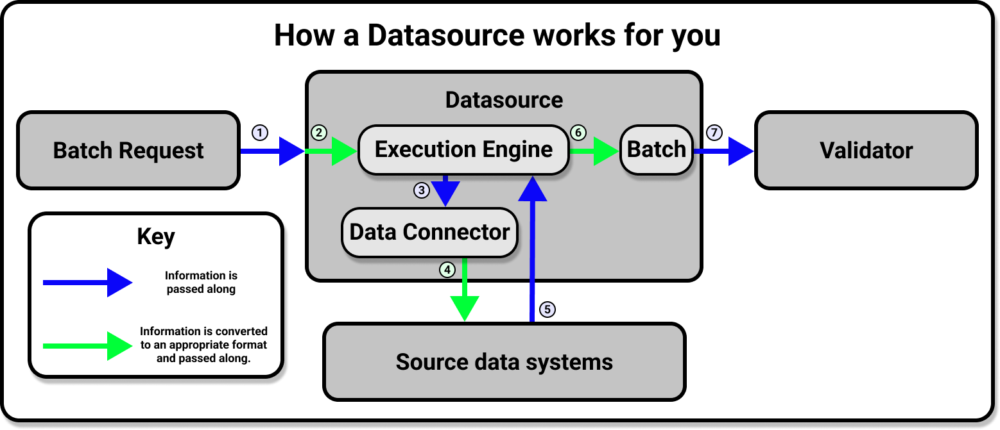

# [](./connect_to_data_overview.md) Connect to data: Overview 

import UniversalMap from '/docs/images/universal_map/_universal_map.mdx';
import Tabs from '@theme/Tabs';
import TabItem from '@theme/TabItem';

<!--Use 'inactive' or 'active' to indicate which Universal Map steps this term has a use case within.-->

<UniversalMap setup='inactive' connect='active' create='inactive' validate='inactive'/>

<!-- Only keep one of the 'To best understand this document' lines.  For processes like the Universal Map steps, use the first one.  For processes like the Architecture Reviews, use the second one. -->

:::note Prerequisites
- Completing [Step 2: Connect to data](../../tutorials/getting_started/tutorial_connect_to_data.md) of the Getting Started tutorial is recommended.
:::
	
Connecting to your data in Great Expectations is designed to be a painless process.  Once you have performed this step, you will have a consistent API for accessing and validating data on all kinds of source data systems: SQL-type data sources, local and remote file stores, in-memory data frames, and more.

## The connect to data process

<!-- Brief outline of what the process entails.  -->

Connecting to your data is built around the Datasource object.  A Datasource provides a standard API for accessing and interacting with data from a wide variety of source systems. This makes working with Datasources very convenient!


  
Behind the scenes, however, the Datasource is doing a lot of work for you.  The Datasource provides an interface for a Data Connector and an Execution Engine to work together, and handles all the heavy lifting involved in communication between Great Expectations and your source data systems.



The majority of the work involved in connecting to data is a simple matter of configuring a new Datasource according to the requirements of your underlying data system.  Once your Datasource is configured and saved to your Data Context you will only need to use the Datasource API to access and interact with your data, regardless of the original source system (or systems) that your data is stored in.

<!-- The following subsections should be repeated as necessary.  They should give a high level map of the things that need to be done or optionally can be done in this process, preferably in the order that they should be addressed (assuming there is one). If the process crosses multiple steps of the Universal Map, use the <SetupHeader> <ConnectHeader> <CreateHeader> and <ValidateHeader> tags to indicate which Universal Map step the subsections fall under. -->

### 1. Prepare scaffolding

If you use the Great Expectations CLI, you can run this command to automatically generate a pre-configured Jupyter Notebook:

```console
great_expectations datasource new
```

From there, you will be able to follow along a YAML based workflow for configuring and saving your Datasource.  Whether you prefer to work with the Jupyter Notebook's boilerplate for creating a datasource, or would rather dive in from scratch with a Python script, however, most of the work will take place in the configuring of the Datasource in question.


### 2. Configure your Datasource

Because the underlying data systems are different, configuration for each type of Datasource is slightly different.  We have step by step how-to guides that cover many common cases, and core concepts documentation to help you with more exotic kinds of configuration.  It is strongly advised that you find the guide that pertains to your use case and follow it.  If you are simply interested in learning about the process, however, the following will give you a broad overview of what you will be doing regardless of what your underlying data systems are.

Datasource configurations can be written as YAML files or Python dictionaries.  Regardless of variations due to the underlying data systems, your Datasource's configuration will look roughly like this:

<Tabs
  groupId="yaml-or-python"
  defaultValue='yaml'
  values={[
  {label: 'YAML', value:'yaml'},
  {label: 'Python', value:'python'},
  ]}>
  <TabItem value="yaml">

```python
datasource_yaml = fr"""
name: <name_of_your_datasource>
class_name: Datasource
execution_engine:
    class_name: <class_of_execution_engine>
data_connectors:
    <name_of_your_data_connector>:
        class_name: <class_of_data_connector>
        <additional_keys_based_on_source_data_system>: <corresponding_values>
"""
```

</TabItem>
<TabItem value="python">

```python
datasource_config = {
    "name": "<name_of_your_datasource>",
    "class_name": "Datasource",
    "execution_engine": {"class_name": "<class_of_execution_engine>"},
    "data_connectors": {
        "<name_of_your_data_connector>": {
            "class_name": "<class_of_data_connector>",
            "<additional_keys_based_on_source_data_system>": "<corresponding_values>"
        }
    }
}

```

</TabItem>
</Tabs>

Please note that this is just a broad outline of the configuration you will be making.  You will find much more detailed examples in our documentation on how to connect to specific source data systems.

The `name` and `class_name` top level keys will be the first you need to define.  The `name` key can be anything you want, but it is best to use a descriptive name as you will use this to reference your Datasource in the future. Unless you are extending Great Expectations and using a subclass of Datasource, you will almost never need to use a `class_name` other than `Datasource` for the top level `class_name` value.

#### Configuring your Datasource's Execution Engine

After your Datasource's configuration has a `name` and `class_name` defined, you will need to define a single `execution_engine`.  In your configuration the value of your `execution_engine` will at the very least contain the `class_name` of your Execution Engine, and may also include a `connection_string` if your source data system requires one.

Great Expectations supports Pandas, Spark, and SqlAlchemy as execution engines.

#### Configuring your Datasource's Data Connectors

Great Expectations provides three types of `DataConnector` classes, which are useful in various situations.  Which Data Connector you will want to use will depend on the format of your source data systems.
- In filesystems, an `InferredAssetDataConnector` infers the `data_asset_name` by using a regex that takes advantage of patterns that exist in the filename or folder structure.  If your source data system is designed so that it can easily be parsed by regex, this will allow new data to be included by the Datasource automatically.  The `InferredAssetSqlDataConnector` provides similar functionality for SQL based source data systems.
- A `ConfiguredAssetDataConnector`, which allows you to have the most fine-tuning by requiring an explicit listing of each Data Asset you want to connect to.
- A `RuntimeDataConnector` which enables you to use a `RuntimeBatchRequest` to wrap either an in-memory dataframe, filepath, or SQL query.

In the `data_connectors` dictionary you may define multiple Data Connectors, including different types of Data Connectors, so long as they all have unique values in the place of the `<name_of_your_data_connector>` key.  We provide detailed guidance to help you decide on which Data Connectors to use in our guide: [How to choose which DataConnector to use](/docs/guides/connecting_to_your_data/how_to_choose_which_dataconnector_to_use).

The `<additional_keys_based_on_source_data_system>` will be things like `batch_identifiers`, `base_directory`, and `default_regex` for filesystems, or  `batch_identifiers` for SQL based data systems. For specifics on the additional keys that you can use in your Data Connectors' configurations, please see the corresponding guide for connecting to a specific source data system (since the keys you will need to define will depend on the source data system you are connecting to).

### 3. Test your configuration

Because the configurations for Datasources can vary depending on the underlying data system they are connecting to, Great Expectations provides a convenience function that will help you determine if there are errors in your configuration.  This function is `test_yaml_config()`.  Using `test_yaml_config` in a Jupyter Notebook is our recommended method for testing Datasource configuration.  Of course, you can always edit and test YAML configs manually, and instantiate Datasources through code.  When executed, `test_yaml_config()` will instantiate the component and run through a self check procedure to verify the component works as expected.

In the case of a Datasource, this means:
- confirming that the connection works.
- gathering a list of available DataAssets (e.g. tables in SQL; files or folders in a filesystem)
- verifying that it can successfully fetch at least one Batch from the source.

If something about your configuration wasn't set up correctly, `test_yaml_config()` will raise an error.  Whenever possible, `test_yaml_config()` provides helpful warnings and error messages.  It can't solve every problem, but it can solve many.

You can call `test_yaml_config()` from your Data Context, like so:

<Tabs
  groupId="yaml-or-python"
  defaultValue='yaml'
  values={[
  {label: 'YAML', value:'yaml'},
  {label: 'Python', value:'python'},
  ]}>
  <TabItem value="yaml">

```python
import great_expectations as ge

datasource_yaml = ""  # Replace this with the yaml string you want to check for errors.

context = ge.get_context()
context.test_yaml_config(datasource_yaml)
```

</TabItem>
<TabItem value="python">

```python
import great_expectations as ge
from ruamel import yaml

datasource_config = {}  # Replace this with the Python dictionary you want to check for errors.

context = ge.get_context()
context.test_yaml_config(yaml.dump(datasource_config))
```

</TabItem>
</Tabs>

From here, iterate by editing your config to add config blocks for additional introspection,Data Assets, sampling, etc. After each addition re-run `test_yaml_config()` to verify the addition is functional, then move on to the next iteration of editing your config.

### 4. Save the Datasource configuration to your Data Context.

What is the point of configuring a Datasource if you can't easily use it in the future?  At this point you will want to save your Datasource configuration to your Data Context.  This can be done easily by using the `add_datasource()` function, which is conveniently accessible from your Data Context.  

<Tabs
  groupId="yaml-or-python"
  defaultValue='yaml'
  values={[
  {label: 'YAML', value:'yaml'},
  {label: 'Python', value:'python'},
  ]}>
  <TabItem value="yaml">

The function `add_datasource()` takes in a series of named arguments corresponding to the keys in your `datasource_yaml` string.  Fortunately, python and the `yaml` module provide a convenient way to unpack yaml strings into named arguements so you don't have to. 

First, you will want to import the yaml module with the command:

```python
from ruamel import yaml
```

After that, the following code snippet will unpack your yaml string and save your Datasource configuration to the Data Context:

```python file=../../../tests/integration/docusaurus/connecting_to_your_data/database/mysql_yaml_example.py#L44
```

</TabItem>
<TabItem value="python">

The function `add_datasource()` takes in a series of named arguments corresponding to the keys in your `datasource_config` dictionary.  Fortunately, python provides a convenient way to unpack dictionaries into named arguements, so you don't have to. The following code snippet will unpack the dictionary and save your Datasource configuration to the Data Context.

```python file=../../../tests/integration/docusaurus/connecting_to_your_data/database/mysql_python_example.py#L44
```

</TabItem>
</Tabs>


### 5. Test your new Datasource.

To test your Datasource you will load data from it into a Validator using a Batch Request.  All of our guides on how to configure a Datasource conclude with an example of how to do this for that guide's particular source data system.  This is also a core part of using Profilers and Checkpoints, so we will discuss it in more depth in the Create Expectations and Validate Data steps.

## Accessing your Datasource from your Data Context

If you need to directly access your Datasource in the future, the `get_datasource()` method of your Data Context will provide a convenient way to do so.  You can also use the `list_datasources()` method of your Data Context to retrieve a list containing your datasource configurations.

## Retrieving Batches of data with your Datasource

This is primarily done when running Profilers in the Create Expectation step, or when running Checkpoints in the Validate Data step, and will be covered in more detail in those sections of the documentation.

## Wrapping up

<!-- This section is essentially a victory lap.  It should reiterate what they have accomplished/are now capable of doing.  If there is a next process (such as the universal map steps) this should state that the reader is now ready to move on to it. -->

With your datasources defined, you will now have access to the data in your source systems from a single, consistent API.  From here you will move on to the next step of working with Great Expectations: Create Expectations.