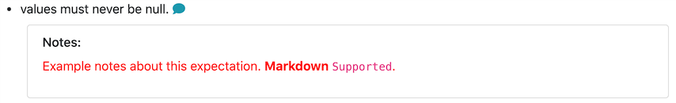
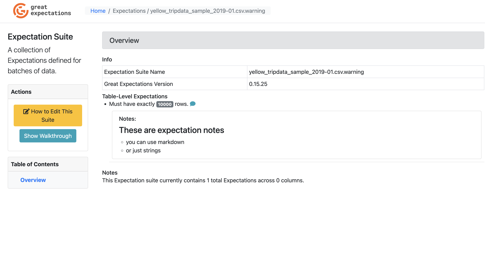

import Prerequisites from '../../connecting_to_your_data/components/prerequisites.jsx'

This guide will help you add descriptive comments (or notes, here used interchangeably) to Expectations and display those comments in Data Docs. In these comments you can add some clarification or motivation to the expectation definition to help you communicate more clearly with your team about specific expectations. Markdown is supported in these comments.

<Prerequisites>

- [Set up a working deployment of Great Expectations](../../../tutorials/getting_started/intro.md)
- Configured a [Data Context](../../../tutorials/getting_started/initialize_a_data_context.md).
- Configured an [Expectations Suite](../../../tutorials/getting_started/create_your_first_expectations.md).

</Prerequisites>

Steps
-----

1. **First, edit your Expectation Suite.**

    ```bash
    great_expectations suite edit <your_suite_name>
    ```

2. **Next, add comments to specific Expectations.**

    For each Expectation you wish to add notes to, add a dictionary to the ``meta`` field with the key ``notes`` and your comment as the value. Here is an example.

    ```python
    validator.expect_table_row_count_to_be_between(
        max_value=1000000, min_value=1,
        meta={"notes": "Example notes about this expectation."}
    )
    ```

    Leads to the following representation in the Data Docs (For Expectation Suite pages, click on the speech bubble to view the comment).

    

3. **Add styling to your comments (optional).**

    To add styling to your comments, you can add a format tag. Here are a few examples.

    A single line of markdown is rendered in red, with any Markdown formatting applied.

    ```python
    validator.expect_column_values_to_not_be_null(
        column="column_name",
        meta={
            "notes": {
                "format": "markdown",
                "content": "Example notes about this expectation. **Markdown** `Supported`."
            }
        }
    )
    ```

    

    Multiple lines can be rendered by using a list for ``content``; these lines are rendered in black text with any Markdown formatting applied.

    ```python
    validator.expect_column_values_to_not_be_null(
        column="column_name",
        meta={
            "notes": {
                "format": "markdown",
                "content": [
                    "Example notes about this expectation. **Markdown** `Supported`.",
                    "Second example note **with** *Markdown*",
                ]
            }
        }
    )
    ```

    

    You can also change the ``format`` to ``string`` and single or multiple lines will be formatted similar to the above, but the Markdown formatting will not be applied.

    ```python
    validator.expect_column_values_to_not_be_null(
        column="column_name",
        meta={
            "notes": {
                "format": "string",
                "content": [
                    "Example notes about this expectation. **Markdown** `Not Supported`.",
                    "Second example note **without** *Markdown*",
                ]
            }
        }
    )
    ```

    


4. **Review your comments in the Expectation Suite overview of your Data Docs.**
