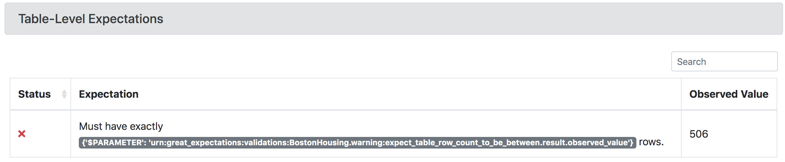
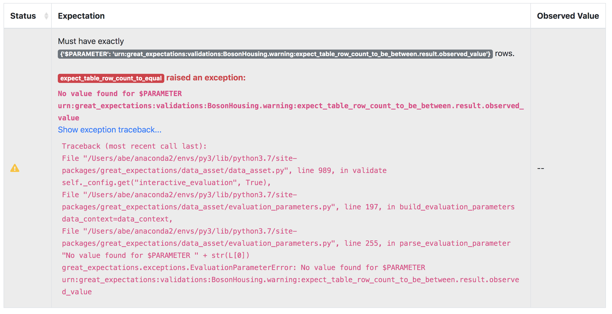

import Prerequisites from '../../../guides/connecting_to_your_data/components/prerequisites.jsx';

This guide will help you create [Expectations](../../../reference/expectations/expectations.md) that span multiple [Batches](../../../reference/dividing_data_assets_into_batches.md) of data using [Evaluation Parameters](../../../reference/evaluation_parameters.md) (see also [Evaluation Parameter stores](../../../reference/data_context.md#evaluation-parameter-stores)). This pattern is useful for things like verifying that row counts between tables stay consistent.

<Prerequisites>

- Configured a [Data Context](../../../tutorials/getting_started/initialize_a_data_context.md).
- Configured a [Datasource](../../../reference/datasources.md) (or several Datasources) with at least two **Data Assets** and understand the basics of **Batch Requests**.
- Also created [Expectations Suites](../../../tutorials/getting_started/create_your_first_expectations.md) for those Data Assets.
- Have a working [Evaluation Parameter store](../../../reference/data_context.md#evaluation-parameter-stores). (The default in-memory store from ``great_expectations init`` can work for this.)
- Have a working [Checkpoint](../../../guides/validation/how_to_validate_data_by_running_a_checkpoint.md)

</Prerequisites>

Steps
-----

In a notebook,

1. **Import great_expectations and instantiate your Data Context**
   ```python
   import great_expectations as ge
   context = ge.DataContext()
   ```

2. **Instantiate two Validators, one for each Data Asset**

    We'll call one of these Validators the *upstream* Validator and the other the *downstream* Validator. Evaluation Parameters will allow us to use Validation Results from the upstream Validator as parameters passed into Expectations on the downstream.

    It's common (but not required) for both Batch Requests to have the same [Datasource and Data Connector](../../../reference/datasources.md).

    ```python
    batch_request_1 = BatchRequest(
        datasource_name="my_datasource",
        data_connector_name="my_data_connector",
        data_asset_name="my_data_asset_1"
    )
    upstream_validator = context.get_validator(batch_request=batch_request_1, expectation_suite_name="my_expectation_suite_1")

    batch_request_2 = BatchRequest(
        datasource_name="my_datasource",
        data_connector_name="my_data_connector",
        data_asset_name="my_data_asset_2"
    )
    downstream_validator = context.get_validator(batch_request=batch_request_2, expectation_suite_name="my_expectation_suite_2")
    ```

3. **Disable interactive evaluation for the downstream Validator.**

    ```python
    downstream_validator.interactive_evaluation = False
    ```
    Disabling interactive evaluation allows you to declare an Expectation even when it cannot be evaluated immediately.

4. **Define an Expectation using an Evaluation Parameter on the downstream Validator.**

   ```python
   eval_param_urn = 'urn:great_expectations:validations:my_expectation_suite_1:expect_table_row_count_to_be_between.result.observed_value'
   downstream_validator.expect_table_row_count_to_equal(
      value={
         '$PARAMETER': eval_param_urn, # this is the actual parameter we're going to use in the validation
      }
   )
   ```

   The core of this is a ``$PARAMETER : URN`` pair. When Great Expectations encounters a ``$PARAMETER`` flag during validation, it will replace the ``URN`` with a value retrieved from an [Evaluation Parameter stores](../../../reference/data_context.md#evaluation-parameter-stores) or [Metrics Store](../../../reference/metrics.md) (see also [How to configure a MetricsStore](../../../guides/setup/configuring_metadata_stores/how_to_configure_a_metricsstore.md)).

   This declaration above includes two ``$PARAMETERS``. The first is the real parameter that will be used after the Expectation Suite is stored and deployed in a Validation Operator. The second parameter supports immediate evaluation in the notebook.

   When executed in the notebook, this Expectation will generate an [Expectation Validation Result](../../../reference/validation.md). Most values will be missing, since interactive evaluation was disabled.

   ```python
   {
      "result": {},
      "success": null,
      "meta": {},
      "exception_info": {
         "raised_exception": false,
         "exception_traceback": null,
         "exception_message": null
      }
   }
    ```

   :::warning

   Your URN must be exactly correct in order to work in production. Unfortunately, successful execution at this stage does not guarantee that the URN is specified correctly and that the intended parameters will be available when executed later.

   :::

5. **Save your Expectation Suite**

    ```python
    downstream_validator.save_expectation_suite(discard_failed_expectations=False)
    ```

    This step is necessary because your ``$PARAMETER`` will only function properly when invoked within a Validation operation with multiple Validators. The simplest way to execute such an operation is through a :ref:`Validation Operator <reference__core_concepts__validation__validation_operator>`, and Validation Operators are configured to load Expectation Suites from Expectation Stores, not memory.

6. **Execute an existing Checkpoint.**

    You can do this within your notebook by running ``context.run_checkpoint``.

    ```python
    results = context.run_checkpoint(
        checkpoint_name="my_checkpoint"
    )
    ```

7. **Rebuild Data Docs and review results in docs.**

    You can do this within your notebook by running:

    ```python
    context.build_data_docs()
    ```

    You can also execute from the command line with:

    ```bash
    great_expectations docs build
    ```

    Once your Docs rebuild, open them in a browser and navigate to the page for the new Validation Result.

    If your Evaluation Parameter was executed successfully, you'll see something like this:

    

    If it encountered an error, you'll see something like this. The most common problem is a mis-specified URN name.

    

Comments
--------
