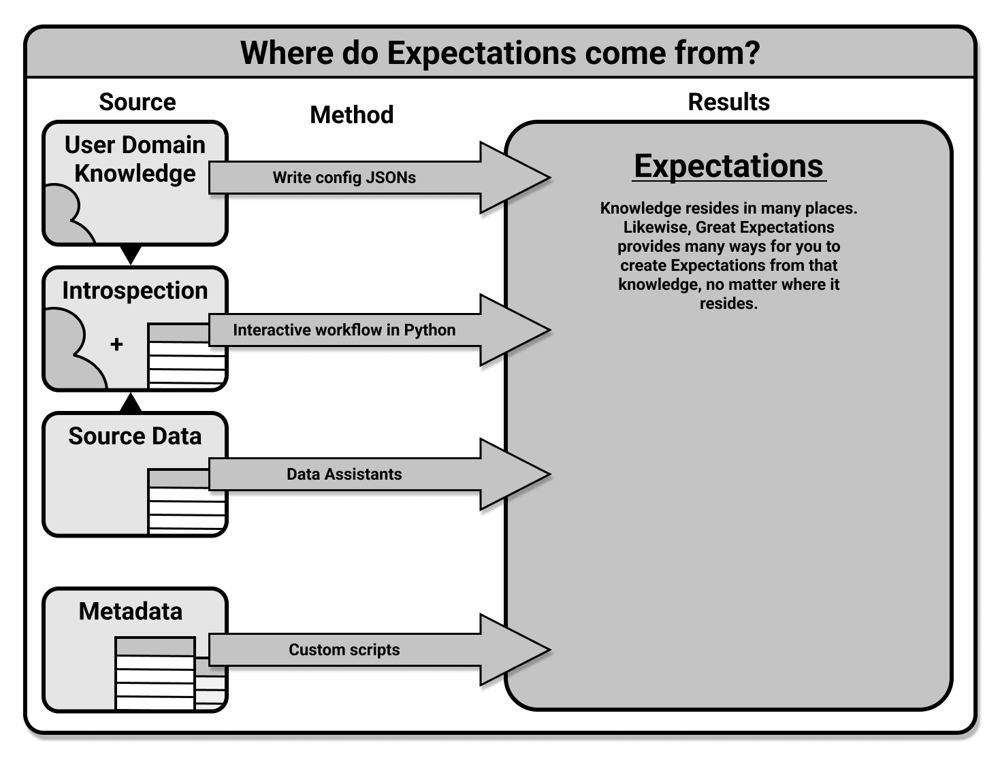

# [](./create_expectations_overview.md) Create Expectations: Overview

import UniversalMap from '/docs/images/universal_map/_universal_map.mdx';

<!--Use 'inactive' or 'active' to indicate which Universal Map steps this term has a use case within.-->

<UniversalMap setup='inactive' connect='inactive' create='active' validate='inactive'/>

:::note Prerequisites
- Completing [Step 3: Create Expectations](/docs/tutorials/getting_started/create_your_first_expectations) of the Getting Started tutorial is recommended.
:::

Creating Expectations is an integral part of Great Expectations.  By the end of this step, you will have created an Expectation Suite containing one or more Expectations which you will use when you Validate data.

## The Create Expectations process

There are a few workflows you can potentially follow when creating Expectations.  These workflows represent various ways of creating Expectations, although they converge in the end when you will save and test those Expectations.



Of the four potential ways to create Expectations illustrated above, two are recommended in particular.

The first recommended workflow of those illustrated above is the **interactive workflow.**  In this workflow, you will be working in a Python interpreter or Jupyter notebook.  You will use a Validator and call expectations as methods on it to define Expectations in an Expectation Suite, and when you have finished you will save that Expectation Suite into your Expectation Store.  A more thorough overview of this workflow, and a link to an in-depth guide on it, can be found in this document's section on [creating Expectations interactively](#creating-expectations-interactively).

The second recommended workflow is the **Profiler workflow.**  In this workflow, you will use a Profiler to generate Expectations based on some input data.  The Validator will then save those Expectations as an Expectation Suite in an Expectation Store.  You will also have the option of viewing them in your Data Docs.  A more thorough overview of this workflow, and a link to an in-depth guide on it, can be found in this document's section on [creating Expectations with Profilers](#creating-expectations-with-profilers).

The third workflow, which is for advanced users, is to **manually define your Expectations** by writing their configurations.  This workflow does not require source data to work against, but does require a deep understanding of the configurations available for Expectations.  We will forgo discussion of it in this document, and focus on the two recommended workflows.  If for some reason you must use this workflow, we do provide an in-depth guide to it in our documentation on [how to create and edit expectations based on domain knowledge without inspecting data directly](./how_to_create_and_edit_expectations_based_on_domain_knowledge_without_inspecting_data_directly.md).

Some advanced users have also taken advantage of the fourth workflow, and have **written custom methods** that allow them to generate Expectations based on the metadata associated with their source data systems.  This process for creating Expectations is outside the scope of this overview, and will not be discussed in depth here.  However, if it is something you are interested in pursuing, you are encouraged to [reach out to us on Slack](https://greatexpectations.io/slack).

When following one of the first two workflows, once you have saved your Expectation Suite it is advised that you test it by validating your Expectations against the batch or batches of data against which you created them.  This process is the same in either workflow, since at this point you will be using a saved Expectation Suite and each of the prior workflows ends with the saving of your Expectation Suite.  Instructions for this will be detailed in this document's section on [testing your Expectation Suite](#testing-your-expectation-suite).

### Creating Expectations interactively

When using the interactive method of creating Expectations, you will start as you always do with your Data Context.  In this case, you will want to navigate to your Data Context's root directory in your terminal, where you will use the CLI to launch a Jupyter Notebook which will contain scaffolding to assist you in the process.  You can even provide flags such as `--profile` which will allow you to enter into the interactive workflow after using a Profiler to generate and prepopulate your Expectation Suite.

We provide an in-depth guide to using the CLI (and what flags are available to you) for interactively creating Expectations in our guide on [how to create and edit Expectations with instant feedback from a sample batch of data](./how_to_create_and_edit_expectations_with_instant_feedback_from_a_sample_batch_of_data.md).

### Creating Expectations with Profilers

As with creating Expectations interactively, you will start with your Data Context.  However, in this case you will be working in a Python environment, so you will need to loading or create your Data Context as an instantiated object.  Next, you will create a Batch Request to specify the data you would like to profile in order to create your Expectation Suite.  Once you have a Batch Request configured you will use it and the name for your Expectation Suite to instantiate a Validator.  The Validator will be used to instantiate a Profiler, and you will then use the `build_suite()` method of the profiler to create your Expectation Suite. 

The Profiler we recommend using for this workflow is the `UserConfigurableProfiler`.  We provide an in-depth guide to this in our documentation on [how to create and edit expectations with a profiler](./how_to_create_and_edit_expectations_with_a_profiler.md).

We also provide in-depth guides on [how to create a new Expectation Suite using rule based Profilers](./advanced/how_to_create_a_new_expectation_suite_using_rule_based_profilers.md) and [how to create a new Expectation Suite by profiling from a json schema file](./advanced/how_to_create_a_new_expectation_suite_by_profiling_from_a_jsonschema_file.md) in our advanced how to guides for Expectations.

### Testing your Expectation Suite

Once you have created your Expectation Suite and saved it, you may wish to test it.  The simplest way to do this is to Validate some data against it.  You can do this using a SimpleCheckpoint as demonstrated in the [optional step on running validation, saving your suite, and building Data Docs](./how_to_create_and_edit_expectations_with_a_profiler.md#6-optional-running-validation-saving-your-suite-and-building-data-docs) of our [how to create and edit Expectations with a Profiler](./how_to_create_and_edit_expectations_with_a_profiler.md) documentation.  Or you can just move on to [Step 4: Validate Data.](../validation/validate_data_overview.md)

### Editing a saved Expectation Suite

It may be that you have saved an Expectation Suite that you wish to go back to and edit.  The simplest way to do this is to use the CLI.  You can use the command:

```markdown title="Terminal command"
great_expectations suite edit NAME_OF_YOUR_SUITE_HERE
```

This will open a Jupyter Notebook that contains the configurations for each of that Expectation Suite's Expectations in their own cells.  You can edit these cells and then run them to generate Expectations in a new Expectation Suite.  Once your edited version of the Expectations have been created in their own Expectation Suite, you can save that Expectation Suite over the pre-existing one, or save it as a new suite altogether.

## Wrapping up

At this point you have created an Expectation Suite, saved it to your Expectation Store, and are ready to use it in a Checkpoint in the Validate Data step!  If you wish, you can check your Expectation Store where you will see a json file that contains your Expectation Suite.  You won't ever have to manually edit it, but you can view its contents if you are curious about how the Expectations are configured or if you simply want to verify that it is there.  You can also see the Expectation Suites that you have saved by using the CLI command:

```markdown title="Terminal command"
great_expectations suite list
```

This command will list all the saved Expectation Suites in your Data Context.

As long as you have a saved Expectation Suite with which to work, you'll be all set to move on to [Step 4: Validate Data.](../validation/validate_data_overview.md)

