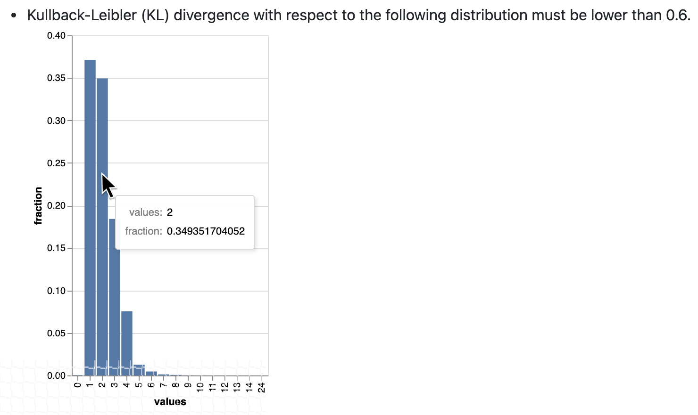

import Prerequisites from '../../connecting_to_your_data/components/prerequisites.jsx'
import Tabs from '@theme/Tabs';
import TabItem from '@theme/TabItem';
import TechnicalTag from '@site/docs/term_tags/_tag.mdx';

:::warning
This guide only applies to Great Expectations versions 0.13 and above, which make use of the new modular <TechnicalTag tag="expectation" text="Expectation" /> architecture. If you have implemented a <TechnicalTag tag="custom_expectation" text="Custom Expectation" /> but have not yet migrated it using the new modular patterns, you can still use this guide to implement custom <TechnicalTag tag="renderer" text="Renderers" /> for your Expectation.
:::

This guide will help you add data visualization <TechnicalTag tag="renderer" text="Renderers" /> to a <TechnicalTag tag="custom_expectation" text="Custom Expectation" />. 

<Prerequisites>

- [Set up a working deployment of Great Expectations](../../../tutorials/getting_started/tutorial_setup.md#install-great-expectations-and-dependencies)
- [Configured a Data Context](../../../tutorials/getting_started/tutorial_setup.md#create-a-data-context).
- [Implemented a Custom Expectation](../../../guides/expectations/creating_custom_expectations/how_to_create_custom_column_aggregate_expectations.md).
- [Set up a Data Docs](../../../tutorials/getting_started/tutorial_create_expectations.md#viewing-your-expectations-in-data-docs) site.
- [Configured an Expectations Suite](../../../tutorials/getting_started/tutorial_create_expectations.md#title-tutorial-step-3-create-expectations) containing your Custom Expectation.
- Have installed and are familiarized with [Altair](https://altair-viz.github.io/)
 
</Prerequisites>

See also this [complete custom expectation with renderer example](https://github.com/superconductive/ge_tutorials/blob/main/getting_started_tutorial_final_v3_api/great_expectations/plugins/column_custom_max_expectation.py).

## Steps

### 1. Input

Enter the following in a Jupyter Notebook:

```python
example_expectation_config = ExpectationConfiguration(**{
    "expectation_type": "expect_column_kl_divergence_to_be_less_than",
    "kwargs": {
        "column": "BATHRM",
        "partition_object": {
            "values": [0.0, 1.0, 2.0, 3.0, 4.0, 5.0, 6.0, 7.0, 8.0, 9.0, 10.0, 11.0, 12.0, 13.0, 14.0, 24.0],
            "weights": [
                0.000429396884072176,
                0.37112959384655597,
                0.34935170405219973,
                0.18408057725876764,
                0.07543383087363596,
                0.01257386093141785,
                0.004658022720695996,
                0.0012135129332474538,
                0.0006627647558505326,
                0.000214698442036088,
                0.00013068600819587966,
                6.534300409793983e-05,
                2.8004144613402784e-05,
                9.33471487113426e-06,
                9.33471487113426e-06,
                9.33471487113426e-06
            ]
        },
        "threshold": 0.6,
        "result_format": "COMPLETE"
    }
})
```

### 2. Rendered Output



### 3. Implementation

```python
import altair as alt

class ExpectColumnKlDivergenceToBeLessThan(TableExpectation):
    ...

    @classmethod
    @renderer(renderer_type="renderer.prescriptive")
    @render_evaluation_parameter_string
    def _prescriptive_renderer(
        cls,
        configuration=None,
        result=None,
        language=None,
        runtime_configuration=None,
        **kwargs
    ):
        runtime_configuration = runtime_configuration or {}
        include_column_name = runtime_configuration.get("include_column_name", True)
        include_column_name = (
            include_column_name if include_column_name is not None else True
        )
            styling = runtime_configuration.get("styling")
            # get params dict with all expected kwargs
            params = substitute_none_for_missing(
              configuration.kwargs,
                [
                    "column",
                    "partition_object",
                    "threshold",
                    "row_condition",
                    "condition_parser",
                ],
            )

            expected_distribution = None
            if not params.get("partition_object"):
                template_str = "can match any distribution."
            else:
                template_str = (
                    "Kullback-Leibler (KL) divergence with respect to the following distribution must be "
                    "lower than $threshold."
                )
                # use utility method to generate kl divergence graph
                expected_distribution = cls._get_kl_divergence_graph(
                    params.get("partition_object")
                )

            if include_column_name:
                template_str = "$column " + template_str

            if params["row_condition"] is not None:
                (
                    conditional_template_str,
                    conditional_params,
                ) = parse_row_condition_string_pandas_engine(params["row_condition"])
                template_str = conditional_template_str + ", then " + template_str
                params.update(conditional_params)

            expectation_string_obj = {
                "content_block_type": "string_template",
                "string_template": {"template": template_str, "params": params},
            }

            if expected_distribution:
                return [expectation_string_obj, expected_distribution]
            else:
                return [expectation_string_obj]

        @classmethod
        def _get_kl_divergence_graph(cls, partition_object, header=None):
            weights = partition_object["weights"]

            # determine and set proper graph width
            graph_pixel_width = (len(weights) / 60.0) * 500
            if graph_pixel_width < 250:
                graph_pixel_width = 250
            graph_container_col_width = round((len(weights) / 60.0) * 6)
            if graph_container_col_width < 4:
                graph_container_col_width = 4
            elif graph_container_col_width >= 5:
                graph_container_col_width = 6
            elif graph_container_col_width >= 4:
                graph_container_col_width = 5

            # if single bar, set size
            mark_bar_args = {}
            if len(weights) == 1:
                mark_bar_args["size"] = 20

            # generate graph for continuous distribution
            if partition_object.get("bins"):
                bins = partition_object["bins"]
                bins_x1 = [round(value, 1) for value in bins[:-1]]
                bins_x2 = [round(value, 1) for value in bins[1:]]

                df = pd.DataFrame(
                    {"bin_min": bins_x1, "bin_max": bins_x2, "fraction": weights,}
                )

                bars = (
                    alt.Chart(df)
                    .mark_bar()
                    .encode(
                        x="bin_min:O",
                        x2="bin_max:O",
                        y="fraction:Q",
                        tooltip=["bin_min", "bin_max", "fraction"],
                    )
                    .properties(width=graph_pixel_width, height=400, autosize="fit")
                )

                graph = bars.to_json()
            # generate graph for categorical distribution
            elif partition_object.get("values"):
                values = partition_object["values"]

                df = pd.DataFrame({"values": values, "fraction": weights})

                bars = (
                    alt.Chart(df)
                    .mark_bar()
                    .encode(
                        x="values:N", y="fraction:Q", tooltip=["values", "fraction"]
                    )
                    .properties(width=graph_pixel_width, height=400, autosize="fit")
                )
                graph = bars.to_json()

            # generate header if present
            if header:
                expected_distribution = RenderedGraphContent(
                    **{
                        "content_block_type": "graph",
                        "graph": graph,
                        "header": header,
                        "styling": {
                            "classes": [
                                "col-" + str(graph_container_col_width),
                                "mt-2",
                                "pl-1",
                                "pr-1",
                            ],
                            "parent": {"styles": {"list-style-type": "none"}},
                        },
                    }
                )
            else:
                expected_distribution = RenderedGraphContent(
                    **{
                        "content_block_type": "graph",
                        "graph": graph,
                        "styling": {
                            "classes": [
                                "col-" + str(graph_container_col_width),
                                "mt-2",
                                "pl-1",
                                "pr-1",
                            ],
                            "parent": {"styles": {"list-style-type": "none"}},
                        },
                    }
                )
            return expected_distribution
```

### 4. Test Renderers

Finally, test that your renderers are providing the desired output by building your <TechnicalTag tag="data_docs" text="Data Docs" /> site:

Use the following <TechnicalTag tag="cli" text="CLI" /> command: ``great_expectations docs build``.
