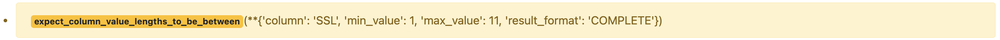

.. _how_to_guides__configuring_data_docs__how_to_create_renderers_for_custom_expectations:

How to Create Renderers for Custom Expectations
================================================

This guide will help you implement renderers for your custom Expectations, allowing you to control how your custom Expectations are displayed in Data Docs. Implementing renderers as part of your custom Expectations is not strictly required if you are okay with the default renderer Great Expectations provides:

.. admonition:: Prerequisites: This how-to guide assumes you have already:

    - :ref:`Set up a working deployment of Great Expectations <tutorials__getting_started>`
    - Configured a :ref:`Data Context <tutorials__getting_started__initialize_a_data_context>`.
    - Implemented a :ref:`custom Expectation <how_to_guides__creating_and_editing_expectations__how_to_create_modular_expectations>`.
    - Set up a :ref:`Data Docs <tutorials__getting_started__set_up_data_docs>` site.
    - Configured an :ref:`Expectations Suite <tutorials__getting_started__create_your_first_expectations>` containing your custom Expectation.
    - Generated one Validation Result (from running a :ref:`Checkpoint <how_to_guides__validation__how_to_create_a_new_checkpoint>` or :ref:`Validation Operator <how_to_guides__validation__how_to_add_a_validation_operator>`) containing your custom Expectation

Steps
-----

#. First, decide which renderer types you need to implement. You may use the following annotated Validation Result as a guide (most major renderer types represented):

    .. figure:: validation_result_example.png
        :width: 800
        :alt: Annotated Validation Result Example

    At minimum, you should implement a renderer with type ``renderer.prescriptive``, which is used to render the human-readable form of your expectation when displaying Expectation Suites and Validation Results. In many cases, this will be the only custom renderer you will have to implement - for the remaining renderer types used on the Validation Results page, Great Expectations provides default renderers that can handle many types of Expectations.

    **Renderer Types Overview**:
        * ``renderer.prescriptive``: renders human-readable form of Expectation from ExpectationConfiguration
        * ``renderer.diagnostic.unexpected_statement``: renders summary statistics of unexpected values if ExpectationValidationResult includes ``unexpected_count`` and ``element_count``
        * ``renderer.diagnostic.unexpected_table``: renders a sample of unexpected values (and in certain cases, counts) in table format, if ExpectationValidationResult includes ``partial_unexpected_list`` or ``partial_unexpected_counts``
        * ``renderer.diagnostic.observed_value``: renders the observed value if included in ExpectationValidationResult

#. Next, implement a renderer with type ``renderer.prescriptive``

    For each Expectation you wish to add notes to, add a dictionary to the ``meta`` field with the key ``notes`` and your comment as the value. Here is an example.

    .. code-block:: python

        batch.expect_table_row_count_to_be_between(
            max_value=1000000, min_value=1,
            meta={"notes": "Example notes about this expectation."}
        )

    Leads to the following representation in the Data Docs (click on the speech bubble to view the comment).

    .. image:: table_level_no_format.png
        :width: 800
        :alt: Expectation with simple comment, no formatting.

#. Add styling to your comments (optional).

    To add styling to your comments, you can add a format tag. Here are a few examples.

    A single line of markdown is rendered in red, with any Markdown formatting applied.

    .. code-block:: python

        batch.expect_column_values_to_not_be_null(
            column="column_name",
            meta={
                "notes": {
                    "format": "markdown",
                    "content": "Example notes about this expectation. **Markdown** `Supported`."
                }
            }
        )

    .. image:: single_line_markdown_red.png
        :width: 800
        :alt: Expectation with a single line of markdown comment is rendered in red with markdown formatting.

    Multiple lines can be rendered by using a list for ``content``, these lines are rendered in black text with any Markdown formatting applied.

    .. code-block:: python

        batch.expect_column_values_to_not_be_null(
            column="column_name",
            meta={
                "notes": {
                    "format": "markdown",
                    "content": [
                        "Example notes about this expectation. **Markdown** `Supported`.",
                        "Second example note **with** *Markdown*",
                    ]
                }
            }
        )

    .. image:: multiple_line_markdown.png
        :width: 800
        :alt: Multiple lines of markdown rendered with formatting.

    You can also change the ``format`` to ``string`` and single or multiple lines will be formatted similar to the above, but the Markdown formatting will not be applied.

    .. code-block:: python

        batch.expect_column_values_to_not_be_null(
            column="column_name",
            meta={
                "notes": {
                    "format": "string",
                    "content": [
                        "Example notes about this expectation. **Markdown** `Supported`.",
                        "Second example note **with** *Markdown*",
                    ]
                }
            }
        )

    .. image:: multiple_line_string.png
        :width: 800
        :alt: Multiple lines of string rendered without formatting.

#. Review your comments in the Expectation Suite overview of your Data Docs.

Comments
--------

.. discourse::
   :topic_identifier: 281
