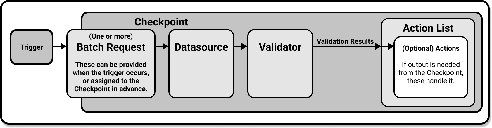

#  Validate Data: Overview

import UniversalMap from '/docs/images/universal_map/_universal_map.mdx';
import TechnicalTag from '@site/docs/term_tags/_tag.mdx';

<!--Use 'inactive' or 'active' to indicate which Universal Map steps this term has a use case within.-->

<UniversalMap setup='inactive' connect='inactive' create='inactive' validate='active'/>

:::note Prerequisites
- Completing [Step 4: Validate data](../../tutorials/getting_started/tutorial_validate_data.md) of the Getting Started tutorial is recommended.
:::

When you complete this step for the first time, you will have created and run a <TechnicalTag tag="checkpoint" text="Checkpoint" />.  This Checkpoint can then be reused to <TechnicalTag tag="validation" text="Validate" /> data in the future, and you can also create and configure additional Checkpoints to cover different use cases, should you have them.

## The Validate Data process

The recommended workflow for validating data is through **the use of Checkpoints.**  Checkpoints handle the rest of the Validation process for you: They will Validate data, save <TechnicalTag tag="validation_result" text="Validation Results" />, run any <TechnicalTag tag="action" text="Actions" /> you have specified, and finally create <TechnicalTag tag="data_docs" text="Data Docs" /> with their results.  

As you can imagine, Checkpoints will make validating data a very simple process, especially since they are reusable.  Once you have created your Checkpoint, configured it to your specifications, and specified any Actions you want it to take based on the Validation Results, all you will need to do in the future is tell the Checkpoint to run.

### Creating a Checkpoint

Checkpoints are simple to create.  While advanced users could write their configuration from scratch, we recommend using the <TechnicalTag tag="cli" text="CLI" />.  It will launch a Jupyter Notebook set up with boilerplate code to create your checkpoint.  All you will need to do is configure it!  For detailed instructions, please see our guide on [how to create a new Checkpoint](./checkpoints/how_to_create_a_new_checkpoint.md).

### Configuring your Checkpoint

There are three very important things you can do when configuring your Checkpoint.  You can add additional validation data, or set the Checkpoint so that validation data must be specified at run time.  You can add additional <TechnicalTag tag="expectation_suite" text="Expectation Suites" />, and you can add Actions which the Checkpoint will execute when it finishes Validating data.  For a more detailed overview of Checkpoint configuration, please see our documentation on [Checkpoints](../../terms/checkpoint.md) and [Actions](../../terms/action.md).

#### Checkpoints, Batch Requests, and Expectation Suites

<TechnicalTag tag="batch_request" text="Batch Requests" /> are used to specify the data that a Checkpoint will Validate.  You can add additional validation data to your Checkpoint by assigning it Batch Requests, or set up the Checkpoint so that it requires a Batch Request to be specified at run time.

Expectation Suites contain the <TechnicalTag tag="expectation" text="Expectations" /> that the Checkpoint will run against the validation data specified in its Batch Requests.  Checkpoints are assigned Expectation Suites and Batch Requests in pairs, and when the Checkpoint is run it will Validate each of its Expectation Suites against the data provided by its paired Batch Request.

For more detailed instructions on how to add Batch Requests and Expectation Suites to a Checkpoint, please see our guide on [how to add validations data or suites to a Checkpoint](./checkpoints/how_to_add_validations_data_or_suites_to_a_checkpoint.md).

#### Checkpoints and Actions

Actions are executed after a Checkpoint validates data.  They are an optional addition to Checkpoints: you do not need to include any in your Checkpoint if you have no use for them.  However, they are highly customizable and can be made to do anything you can program in Python, giving you exceptional control over what happens after a Checkpoint Validates.  

With that said, there are some Actions that are more common than others. Updating Data Docs, sending emails, posting slack notifications, or sending other custom notifications are all common use cases for Actions.  We provide detailed examples of how to set up these Actions in our [how to guides for validation Actions](./index.md#validation-actions).

### Running your Checkpoint

Running your Checkpoint once it is fully set up is very straight forward.  You can do this either from the CLI or with a Python script, and both of these methods are covered in depth in our guide on [how to validate data by running a Checkpoint](./how_to_validate_data_by_running_a_checkpoint.md).

### Validation Results and Data Docs

When a Checkpoint finishes Validation, its Validation Results are automatically compiled as Data Docs.  You can find these results in the Validation Results tab of your Data Docs, and clicking in to an individual Validation Result in the Data Docs will bring up a detailed list of all the Expectations that ran, as well as which (if any) Expectations passed and which (if any) failed.

For more information, see our [documentation for Data Docs](../../reference/data_docs.md). 

## Wrapping up

Once your Checkpoint is created and you have used it to validate data, you can continue to reuse it.  It will be easy for you to manually run it through the CLI or a Python script. And if you want your Checkpoint to run on a schedule, there are a few ways to do that as well.  

We provide a guide for [how to deploy a scheduled Checkpoint with cron](./advanced/how_to_deploy_a_scheduled_checkpoint_with_cron.md), and if your pipeline architecture supports python scripts you will be able to run your Checkpoints from there.  Even better: Regardless of how you choose to run your Checkpoint in the future, Actions will let you customize what is done with the Validation Results it generates. 

Congratulations! At this point in your Great Expectations journey you have established the ability to reliably, and repeatedly, Validate your source data systems with ease.