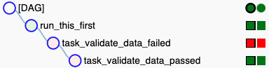

.. _deployment_google_cloud_composer:

Deploying Great Expectations with Google Cloud Composer (Hosted Airflow)
========================================================================

This guide will help you deploy Great Expectations within an Airflow pipeline running on Google Cloud Composer.

.. admonition:: Prerequisites: This how-to guide assumes you have already:

  - :ref:`Set up a working deployment of Great Expectations <tutorials__getting_started>`

Steps
-----

Note: These steps are basically following the :ref:`Deploying Great Expectations with Airflow <workflows_patterns__deployment_airflow>` documentation with some items specific to Google Cloud Composer.

1. Set up your Composer environment

    Create a Composer environment using the `instructions located in the Composer documentation <https://cloud.google.com/composer/docs/how-to/managing/creating>`_. Currently Airflow >=1.10.6 is supported by Great Expectations >=0.12.1.

2. Create Expectations

    Create :ref:`Expectations <reference__core_concepts__expectations>` using our guide to :ref:`Creating and Editing Expectations <how_to_guides__creating_and_editing_expectations>`.

    You can store your Expectations anywhere that is accessible to the Cloud Composer environment. One simple pattern is to use a folder in the bucket provided by the Composer environment. You can manually push updated expectation JSON files from your version controlled repository via ``gsutil`` (as in the code snippet below) or the GCS UI. Alternatively you can automate this using Google Cloud Build or any other automation tool.

    :ref:`Read more about setting up expectation stores in GCS here <how_to_guides__configuring_metadata_stores__how_to_configure_an_expectation_store_in_gcs>`.

    .. code-block:: bash

        # copy expectation suites to bucket
        # where COMPOSER_GCS_BUCKET is an environment variable with the name of your bucket
        gsutil cp -r expectations/ gs://${COMPOSER_GCS_BUCKET}/great_expectations/

3. Create your Data Context

    Since we'd prefer not to use the Airflow container filesystem to host a :ref:`Data Context <reference__core_concepts__data-context>` as a .yml file, another approach is to instantiate it in a Python file either as part of your DAG or imported by your DAG at runtime. :ref:`Follow this guide on How to instantiate a Data Context without a yml file <how_to_guides__configuring_data_contexts__how_to_instantiate_a_data_context_without_a_yml_file>` and see the example below.

    Note: You may want to reference our :ref:`Configuring metadata stores <how_to_guides__configuring_metadata_stores>` and :ref:`Configuring Data Docs <how_to_guides__configuring_data_docs>` how-to guides. All of the stores in the below example are configured to use GCS, however you can use whichever store is applicable to your infrastructure.
        
    Important: If your Composer workflow includes spinning up/tearing down Composer environments and deleting the associated GCS bucket, you need to configure a separate bucket to persist your Great Expectations assets.

    .. code-block:: python

        project_config = DataContextConfig(
            datasources={
                "my_pandas_datasource": { # This is an example for a Pandas Datasource
                    "data_asset_type": {
                        "class_name": "PandasDataset",
                        "module_name": "great_expectations.dataset",
                    },
                    "class_name": "PandasDatasource",
                    "module_name": "great_expectations.datasource",
                    "batch_kwargs_generators": {
                        # TODO: Enter these here or later in your validations
                    },
                },
                "my_bigquery_datasource": { # This is an example for a BigQuery Datasource with a credentials file
                    "data_asset_type": {
                        "module_name": "great_expectations.dataset",
                        "class_name": "SqlAlchemyDataset"
                    },
                    "class_name": "SqlAlchemyDatasource",
                    "module_name": "great_expectations.datasource",
                    "credentials": {
                        "url": "bigquery://REPLACE/ME/credentials.json" # TODO: replace with your value
                    },
                }
            },
            store_backend_defaults=GCSStoreBackendDefaults(
                default_bucket_name="my_bucket_name",  # TODO: replace with your value
                default_project_name="my_project_name",  # TODO: replace with your value
            )
        )

        context = BaseDataContext(project_config=project_config)

  **Note:** If you're using a default Composer setup, you will likely be using a specific storage location in the bucket for your metadata stores, e.g. ``my_composer_bucket/dags`` or ``my_composer_bucket/data``. You will need to specify those prefixes in the ``store_backend_defaults``, for example:
  
  .. code-block: python
      store_backend_defaults=GCSStoreBackendDefaults(
          default_bucket_name="my_composer_bucket",
          default_project_name="my_project",
          expectations_store_prefix="dags/expectations",
          validations_store_prefix = "dags/validations",
          data_docs_prefix = "dags/data_docs"
      )
  If you don't specify a prefix, the stores will be created in the base directory of your bucket.

4. Create a DAG with Validations

    To create a DAG to run Validations with Great Expectations, follow the instructions for :ref:`Deploying Great Expectations with Airflow <deployment_airflow>`.

    You can raise an ``AirflowException`` if your Validation fails (as in the example in the: :ref:`Running a Validation using a PythonOperator <deployment_airflow>` section) which will show in logs and the UI as in the image below:

5. Upload your Expectations and DAG

    Upload your Expectations to your Expectation Store (as configured in your Data Context). If your Expectation Store is in your GCS bucket you can use ``gsutil`` to upload the JSON files - just make sure to keep the same directory structure. Alternatively you can automate using something like Google Cloud Build or GitHub Actions or your favorite CI tool.

    Upload your DAG files to the GCS bucket ``dags/`` folder assigned to your Composer environment.

6. Monitor your deployment

    You can now monitor your deployment just like any other Airflow environment either via the Airflow UI (linked from your cloud platform environments page) or by submitting commands using `Google Cloud Shell <https://cloud.google.com/shell>`_. If you used AirflowExceptions to handle failing Validations as in step 4, these will show up in your logs and in the Airflow UI.

Additional resources
--------------------

- `Cloud Composer Overview <https://cloud.google.com/composer/docs/concepts/overview>`_

Comments
--------

.. discourse::
   :topic_identifier: 379
