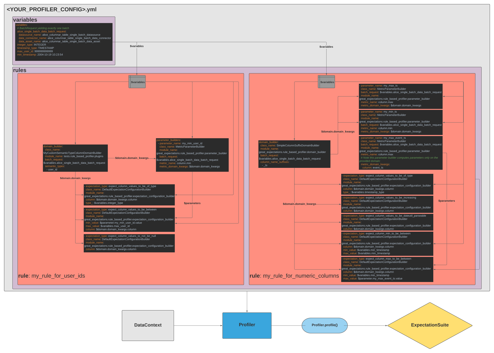

Great Expectations provides a mechanism to automatically generate Expectations, using a feature called a `Profiler`. A
Profiler builds an Expectation Suite from one or more Data Assets. It usually also validates the data against the
newly-generated Expectation Suite to return a Validation Result. There are several Profilers included with Great
Expectations.

A Profiler makes it possible to quickly create a starting point for generating Expectations about a dataset. For
example, during the `init` flow, Great Expectations uses the `UserConfigurableProfiler` to demonstrate important
features of Expectations by creating and validating an Expectation Suite that has several different kinds of
Expectations built from a small sample of data. A Profiler is also critical to generating the Expectation Suites used
during profiling.

You can also extend Profilers to capture organizational knowledge about your data. For example, a team might have a
convention that all columns **named** "id" are primary keys, whereas all columns ending with the
**suffix** "_id" are foreign keys. In that case, when the team using Great Expectations first encounters a new dataset
that followed the convention, a Profiler could use that knowledge to add an expect_column_values_to_be_unique
Expectation to the "id" column (but not, for example an "address_id" column).

## Rule-Based Profilers

**Rule-Based profilers** allow users to provide a highly configurable specification which is composed of **Rules** to use in order to build an **Expectation Suite** by profiling existing data.

Imagine you have a table of Sales that comes in every month. You could profile last month's data, inspecting it in order to automatically create a number of expectations that you can use to validate next month's data.  

A **Rule** in a rule-based profiler could say something like "Look at every column in my Sales table, and if that column is numeric, add an `expect_column_values_to_be_between` Expectation to my Expectation Suite, where the `min_value` for the Expectation is the minimum value for the column, and the `max_value` for the Expectation is the maximum value for the column."

Each rule in a rule-based profiler has three types of components:

1. **DomainBuilders**: A DomainBuilder will inspect some data that you provide to the Profiler, and compile a list of Domains for which you would like to build expectations
1. **ParameterBuilders**: A ParameterBuilder will inspect some data that you provide to the Profiler, and compile a dictionary of Parameters that you can use when constructing your ExpectationConfigurations
1. **ExpectationConfigurationBuilders**: An ExpectationConfigurationBuilder will take the Domains compiled by the DomainBuilder, and assemble ExpectationConfigurations using Parameters built by the ParameterBuilder

In the above example, imagine your table of Sales has twenty columns, of which five are numeric:
* Your **DomainBuilder** would inspect all twenty columns, and then yield a list of the five numeric columns
* You would specify two **ParameterBuilders**: one which gets the min of a column, and one which gets a max. Your Profiler would loop over the Domain (or column) list built by the **DomainBuilder** and use the two ParameterBuilders to get the min and max for each column.
* Then the Profiler loops over Domains built by the DomainBuilder and uses the **ExpectationConfigurationBuilders** to add a `expect_column_values_to_between` column for each of these Domains, where the `min_value` and `max_value` are the values that we got in the ParameterBuilders.

In addition to Rules, a rule-based profiler enables you to specify **Variables**, which are global and can be used in any of the Rules. For instance, you may want to reference the same BatchRequest or the same tolerance in multiple Rules, and declaring these as Variables will enable you to do so. 

#### Example Config:
```yaml
variables:
  my_last_month_sales_batch_request: # We will use this BatchRequest in our DomainBuilder and both of our ParameterBuilders so we can pinpoint the data to Profile
    datasource_name: my_sales_datasource
    data_connector_name: monthly_sales
    data_asset_name: sales_data
    data_connector_query:
      index: -1
  mostly_default: 0.95 # We can set a variable here that we can reference as the `mostly` value for our expectations below
rules:
  my_rule_for_numeric_columns: # This is the name of our Rule
    domain_builder:
      batch_request: $variables.my_last_month_sales_batch_request # We use the BatchRequest that we specified in Variables above using this $ syntax
      class_name: SemanticTypeColumnDomainBuilder # We use this class of DomainBuilder so we can specify the numeric type below
      semantic_types:
        - numeric
    parameter_builders:
      - parameter_name: my_column_min
        class_name: MetricParameterBuilder
        batch_request: $variables.my_last_month_sales_batch_request
        metric_name: column.min # This is the metric we want to get with this ParameterBuilder
        metric_domain_kwargs: $domain.domain_kwargs # This tells us to use the same Domain that is gotten by the DomainBuilder. We could also put a different column name in here to get a metric for that column instead.
      - parameter_name: my_column_max
        class_name: MetricParameterBuilder
        batch_request: $variables.my_last_month_sales_batch_request
        metric_name: column.max
        metric_domain_kwargs: $domain.domain_kwargs
    expectation_configuration_builders:
      - expectation_type: expect_column_values_to_be_between # This is the name of the expectation that we would like to add to our suite
        class_name: DefaultExpectationConfigurationBuilder
        column: $domain.domain_kwargs.column
        min_value: $parameter.my_column_min.value # We can reference the Parameters created by our ParameterBuilders using the same $ notation that we use to get Variables
        max_value: $parameter.my_column_max.value
        mostly: $variables.mostly_default
```

You can see another example config containing multiple rules here: [alice_user_workflow_verbose_profiler_config.yml](https://github.com/great-expectations/great_expectations/blob/develop/tests/test_fixtures/rule_based_profiler/alice_user_workflow_verbose_profiler_config.yml)

This config is used in the below diagram to provide a better sense of how the different parts of the Profiler config fit together. [You can see a larger version of this file here.](https://github.com/great-expectations/great_expectations/blob/develop/docs/guides/images/rule_based_profiler_public_interface_diagram.png)


### Next Steps
- You can try out a tutorial that walks you through the set-up of a Rule-Based Profiler here: [How to create a new Expectation Suite using Rule Based Profilers](../guides/expectations/advanced/how_to_create_a_new_expectation_suite_using_rule_based_profilers.md)
