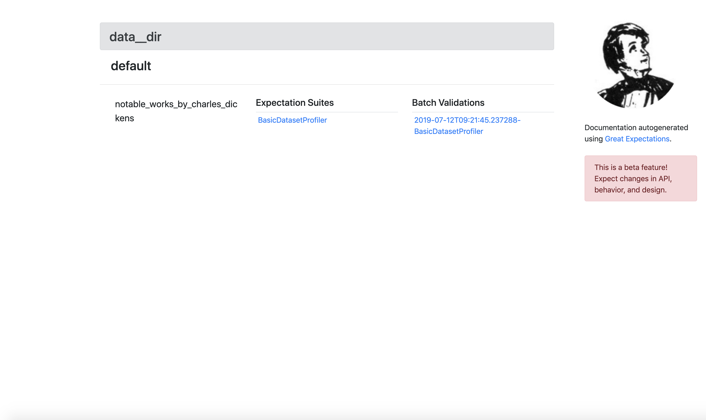
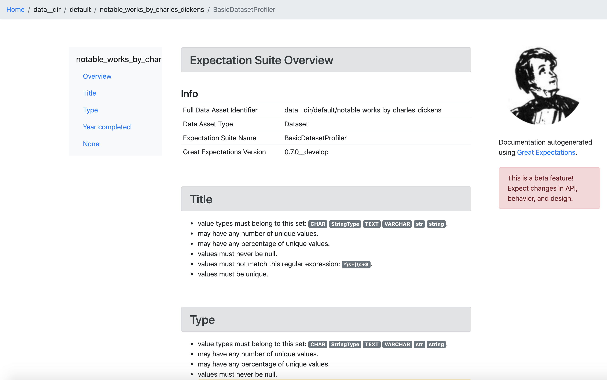

.. _tutorial_init:

Step 1: Running `great_expectations init`
===============================================

.. toctree::
   :maxdepth: 2

Video
------

<<< NEEDS UTM>>>

https://youtu.be/TlTxVyyDunQ

Mildly opinionated scaffolding
----------------------------------------

Great Expectations provides a mildly opinionated deployment framework that simplifies operations such as connecting to data sources; fetching, profiling and validating batches of data; and compiling to human-readable documentation.

This tutorial uses a toy project called `example_dickens_data_project`, but the same methods should work for most data projects. If you want to follow along with this exect example, start with:

.. code-block::

    git clone git@github.com:superconductive/example-dickens-data-project.git
    cd example-dickens-data-project

By default, everything in the Great Expectations deployment framework will be expressed in a directory structure within a `great_expectations/` folder within your version control system. To create this folder, navigate to the root of your project directory in a terminal and run `great_expectations init`. This command line interface (CLI) will scaffold and populate the configuration and other artifacts necessary to get started with Great Expectations.

.. code-block::

    $ great_expectations init
      _____                _   
     / ____|              | |  
    | |  __ _ __ ___  __ _| |_ 
    | | |_ | '__/ _ \/ _` | __|
    | |__| | | |  __/ (_| | |_ 
     \_____|_|  \___|\__,_|\__|
                               
                               
     ______                      _        _   _                 
    |  ____|                    | |      | | (_)                
    | |__  __  ___ __   ___  ___| |_ __ _| |_ _  ___  _ __  ___ 
    |  __| \ \/ / '_ \ / _ \/ __| __/ _` | __| |/ _ \| '_ \/ __|
    | |____ >  <| |_) |  __/ (__| || (_| | |_| | (_) | | | \__ \
    |______/_/\_\ .__/ \___|\___|\__\__,_|\__|_|\___/|_| |_|___/
                | |                                             
                |_|                                             
    

    Always know what to expect from your data.

    If you're new to Great Expectations, this tutorial is a good place to start:

        https://docs.greatexpectations.io/en/latest/tutorials/cli_init.html?utm_source=cli&utm_medium=init&utm_campaign=0_7_0__develop

    Let's add Great Expectations to your project, by scaffolding a new great_expectations directory:

        great_expectations
            ├── great_expectations.yml
            ├── datasources
            ├── expectations
            ├── fixtures
            ├── notebooks
            ├── plugins
            ├── uncommitted
            │   ├── validations
            │   ├── credentials
            │   ├── documentation
            │   └── samples
            └── .gitignore

    OK to proceed?
    [Y/n]: Y

    Done.

If you inspect the `great_expectations/` directory at this point, it should contain:

.. code-block::

    great_expectations/
    ├── datasources
    ├── expectations
    ├── fixtures
    ├── great_expectations.yml
    ├── notebooks
    │   ├── create_expectations.ipynb
    │   └── integrate_validation_into_pipeline.ipynb
    ├── plugins
    └── uncommitted
        ├── credentials
        ├── documentation
        ├── samples
        └── validations

    10 directories, 3 files

Adding DataSources
----------------------------------------

Next, the CLI will ask you if you want to configure a data source.

DataSources allow you to configure connections to data to evaluate Expectations. Great Expectations currently supports native evaluation of Expectations in three compute environments:

1. pandas dataframes
2. relational databases via SQL Alchemy
3. Spark dataframes

Therefore, a DataSource could be a directory containing CSVs with some configuration to parse those files in pandas; a connection to postgresql instance; an S3 bucket that is read and processed by Spark; etc. In the future, we plan to add support for other compute environments, such as dask and BigQuery.
.. (If you'd like to use or contribute to those environments, please chime in on GitHub issues.)

Our example project has a `data/` folder containing several CSVs. Within the CLI, we can configure a Pandas DataFrame DataSource like so:

.. code-block::

    ========== Datasources ==========

    See https://docs.greatexpectations.io/en/latest/core_concepts/datasource.html?utm_source=cli&utm_medium=init&utm_campaign=0_7_0__develop for more information about datasources.

    Configure a datasource:
        1. Pandas DataFrame
        2. Relational database (SQL)
        3. Spark DataFrame
        4. Skip datasource configuration
    : 1
    1

    Enter the path of the root directory where the data files are stored.
    (The path may be either absolute or relative to current directory.)
    : data

    Give your new data source a short name.
    [data__dir]: 

This step adds a new block DataSource configuration to `great_expectations/great_expectations.yml`. Don't worry about these details yet. For now, it's enough to know that we've configured a DataSource and the configuration information is stored in this file.

.. code-block::

    datasources:
        data__dir:
            type: pandas
            generators:
            default:
                type: subdir_reader
                base_directory: ../data
                reader_options:
                sep:
                engine: python

For a SQL data source, configuration would look like this instead:

.. code-block::

    <<<REPLACE THIS BLOCK!>>>

    ========== Datasources ==========

    See https://docs.greatexpectations.io/en/latest/core_concepts/datasource.html?utm_source=cli&utm_medium=init&utm_campaign=0_7_0__develop for more information about datasources.

    Configure a datasource:
        1. Pandas DataFrame
        2. Relational database (SQL)
        3. Spark DataFrame
        4. Skip datasource configuration
    : 1
    1

    Enter the path of the root directory where the data files are stored.
    (The path may be either absolute or relative to current directory.)
    : data

    Give your new data source a short name.
    [data__dir]: 

Strictly speaking, a Great Expectations DataSource is not the data itself, but part of a _pointer_ to a data compute environment where Expectations can be evaluated, called a `DataAsset.` Fully describing the pointer requires a 5-ple:

1. datasource_name (e.g. `my_postgresql_db`)
2. generator_name (`split_by_date`)
3. data_asset_name (`user_events_table`)
4. batch_id (`2018-01-01`)
5. expectation_suite_id (`BasicDatasetProfiler`).

Together, these elements define the DataAsset namespace <<<link>>>.

You can get started in Great Expectations without learning all the details of the namespace. To start, you'll mainly use elements 1 and 3: datasource_names, like "my_postgresql_db" and data_asset_names, like "user_events_table". For most users, these names are already familiar and intuitive. From there, Great Expectations' namespace defaults <<<link>>> can usually fill in the gaps.

Profiling data
----------------------------------------

Now that we've configured a DataSource, the next step is to _profile_ it. Profiling will generate a first set of candidate Expectations for your data. By default, they will cover a wide range of statistics and other characteristics of the Dataset that could be useful for future validation.

Profiling will also evaluate these candidate Expectations against your actual data, producing a set of ExpectationValidationResults (EVRs), which will contain observed values and other context derived from the data itself.

Together, profiled Expectations and EVRs provide a lot of useful information for creating the Expectations you will use in production. They also provide the raw materials for first-pass data documentation. For more details on profiling, please see <<<<LINK: https://docs.greatexpectations.io/en/latest/guides/profiling.html?utm_source=cli&utm_medium=init&utm_campaign=0_7_0__develop>>>>

Within the CLI, we can profile our data by answering a few questions.

Warning: for large data sets, the current default profiler may run slowly and impose significant I/O and compute load. Be cautious when executing against shared databases.

.. code-block::

    ========== Profiling ==========

    Would you like to profile 'data__dir' to create candidate expectations and documentation?

    Please note: Profiling is still a beta feature in Great Expectations.  The current profiler will evaluate the entire 
    data source (without sampling), which may be very time consuming. 
    As a rule of thumb, we recommend starting with data smaller than 100MB.

    To learn more about profiling, visit https://docs.greatexpectations.io/en/latest/guides/profiling.html?utm_source=cli&utm_medium=init&utm_campaign=0_7_0__develop.
            
    Proceed? [Y/n]: Y
    Profiling 'data__dir' with 'BasicDatasetProfiler'
    Found 1 data assets using generator 'default'
    Profiling all 1.
        Profiling 'notable_works_by_charles_dickens'...
        Profiled 3 columns using 38 rows from notable_works_by_charles_dickens (0.132 sec)

    Profiled 1 of 1 named data assets, with 38 total rows and 3 columns in 0.13 seconds.
    Generated, evaluated, and stored 27 candidate Expectations.
    Note: You will need to review and revise Expectations before using them in production.

    Done.

    Profiling results are saved here:
    /Users/abe/Desktop/example-dickens-data-project/great_expectations/uncommitted/validations/2019-07-12T085507.080557Z/data__dir/default/notable_works_by_charles_dickens/BasicDatasetProfiler.json

The default profiler (BasicDatasetProfiler) will add two JSON files in your great_expectations/ directory. They will be placed in subdirectories that following our namespacing conventions. Great Expectations' DataContexts can fetch these objectes by name, so you won't usually need to access these files directly. Still, it's useful to see how they're stored, to get a sense for how namespaces work.

.. code-block::

    great_expectations/
    ├── datasources
    ├── expectations
    │   └── data__dir
    │       └── default
    │           └── notable_works_by_charles_dickens
    │               └── BasicDatasetProfiler.json
    ├── fixtures
    ├── great_expectations.yml
    ├── notebooks
    │   ├── create_expectations.ipynb
    │   └── integrate_validation_into_pipeline.ipynb
    ├── plugins
    └── uncommitted
        ├── credentials
        ├── documentation
        ├── samples
        └── validations
            └── 2019-07-12T090442.066278Z
                └── data__dir
                    └── default
                        └── notable_works_by_charles_dickens
                            └── BasicDatasetProfiler.json

    17 directories, 5 files

We won't go into full detail on the contents of Expectation and EDR objects here. But as a quick illustration, Expectation JSON objects consist mainly of Expectations like:

.. code-block::

    {
      "expectation_type": "expect_column_values_to_be_in_set",
      "kwargs": {
        "column": "Type",
        "value_set": [],
        "result_format": "SUMMARY"
      },
      "meta": {
        "BasicDatasetProfiler": {
          "confidence": "very low"
        }
      }
    }

Expectations created by the BasicDatasetProfiler are very loose and unopinionated. (Hence, the empty `value_set` parameter.) They are more like placeholders for expectations the actual expectations. (A tighter Expectation might include something like `value_set=["Novel", "Short Story", "Novella"]`.) That said, even these loose expectations can be evaluated against data to produce EVRs.

EVRs contain expectations, _plus_ validation results from a evaluation against a specific batch of data.

.. code-block::

    {
      "success": false,
      "result": {
        "element_count": 38,
        "missing_count": 0,
        "missing_percent": 0.0,
        "unexpected_count": 38,
        "unexpected_percent": 1.0,
        "unexpected_percent_nonmissing": 1.0,
        "partial_unexpected_list": [
          "Short Stories",
          "Novel",
          "Short Stories",
          "Novel",
          "Novel",
          "Novel",
          "Novel",
          "Short Story",
          "Non-fiction Travelogue",
          "Novella",
          "Novel",
          "Novella",
          "Novella",
          "Non-fiction Travelogue",
          "Novella",
          "Novel",
          "Novella",
          "Religious History",
          "Novel",
          "Non-fiction History"
        ],
        "partial_unexpected_index_list": [
          0,
          1,
          2,
          3,
          4,
          5,
          6,
          7,
          8,
          9,
          10,
          11,
          12,
          13,
          14,
          15,
          16,
          17,
          18,
          19
        ],
        "partial_unexpected_counts": [
          {
            "value": "Novel",
            "count": 14
          },
          {
            "value": "Short Story",
            "count": 9
          },
          {
            "value": "Novella",
            "count": 5
          },
          {
            "value": "Short Stories",
            "count": 4
          },
          {
            "value": "Non-fiction Travelogue",
            "count": 2
          },
          {
            "value": "Non-fiction History",
            "count": 1
          },
          {
            "value": "Novel (unfinished)",
            "count": 1
          },
          {
            "value": "Religious History",
            "count": 1
          },
          {
            "value": "Short Stories and Reminiscences",
            "count": 1
          }
        ]
      },
      "exception_info": {
        "raised_exception": false,
        "exception_message": null,
        "exception_traceback": null
      },
      "expectation_config": {
        "expectation_type": "expect_column_values_to_be_in_set",
        "kwargs": {
          "column": "Type",
          "value_set": [],
          "result_format": "SUMMARY"
        },
        "meta": {
          "BasicDatasetProfiler": {
            "confidence": "very low"
          }
        }
      }
    }

The full Expectation and EVR and JSON objects also contain some additional metadata, which we won't go into here. For more information about these objects please see <<<Colin>>>.

Data documentation
----------------------------------------------------------

Expectations and EVR's contain a huge amount of useful information about your data, but they aren't very easy to consume as JSON objects. To make them more accessible, Great Expectations provides tools to render Expectations and EVRs to documentation.

We call this feature "Compile to Docs."  This approach to documentation has two significant advantages.

First, for engineers, compile to docs makes it possible to automatically keep your documentation in sync with your tests. This prevents documentation rot and can save a huge amount of time on otherwise unrewarding document maintenance.

Second, the ability to translate Expectations back and forth betwen human- and machine-readable formats, opens up many opportunities for domain experts and stakeholdres who aren't engineers to collaborate more closely with engineers on data-driven applications.

Within the CLI, we compile to documentation as follows:

.. code-block::

    ========== Data Documentation ==========

    To generate documentation from the data you just profiled, the profiling results should be moved from 
    great_expectations/uncommitted (ignored by git) to great_expectations/fixtures.

    Before committing, please make sure that this data does not contain sensitive information!

    To learn more: https://docs.greatexpectations.io/en/latest/guides/data_documentation.html?utm_source=cli&utm_medium=init&utm_campaign=0_7_0__develop

    Move the profiled data and build HTML documentation? [Y/n]: Y

    Moving files...

    Done.

    Building documentation...

    To view the generated data documentation, open this file in a web browser:
        great_expectations/uncommitted/documentation/index.html

    To create expectations for your data, start Jupyter and open a tutorial notebook:

    To launch with jupyter notebooks:
        jupyter notebook great_expectations/notebooks/create_expectations.ipynb

    To launch with jupyter lab:
        jupyter lab great_expectations/notebooks/create_expectations.ipynb

Opening `great_expectations/uncommitted/documentation/index.html` in a browser will give you a page like:

Clicking through to the first link will show you prescriptive data documentation. This renders the Expectations themselves.

Clicking through to the second link will show you descriptive data documentation. This renders only Expectations.

.. image:: ../descriptive_render.png

Note that the CLI moved our EVRs from `uncommitted/validations/2019-07-12T090442.066278Z/data__dir/default/notable_works_by_charles_dickens/` to `fixtures/validations/2019-07-12T090442.066278Z/data__dir/default/notable_works_by_charles_dickens/`. This is because this data documentation is intended to act as the source of truth for Expectations within this project: all users at the same point within the version control system (e.g. the same git hash) should be able to render exactly the same documantation from shared assets within version control.

Note also that the default `great_expectations/` setup does NOT commit compiled docs themselves within version control. Instead, they live in `uncommitted/documentation/`, with a subdirectory structure that mirrors the project namespace.

.. code-block::

    great_expectations/
    ├── datasources
    ├── expectations
    │   └── data__dir
    │       └── default
    │           └── notable_works_by_charles_dickens
    │               └── BasicDatasetProfiler.json
    ├── fixtures
    │   └── validations
    │       └── data__dir
    │           └── default
    │               └── notable_works_by_charles_dickens
    │                   └── BasicDatasetProfiler.json
    ├── great_expectations.yml
    ├── notebooks
    │   ├── create_expectations.ipynb
    │   └── integrate_validation_into_pipeline.ipynb
    ├── plugins
    └── uncommitted
        ├── credentials
        ├── documentation
        │   ├── data__dir
        │   │   └── default
        │   │       └── notable_works_by_charles_dickens
        │   │           └── BasicDatasetProfiler.html
        │   └── index.html
        ├── samples
        └── validations
            └── 2019-07-12T090442.066278Z
                └── data__dir
                    └── default
                        └── notable_works_by_charles_dickens

    24 directories, 7 files

