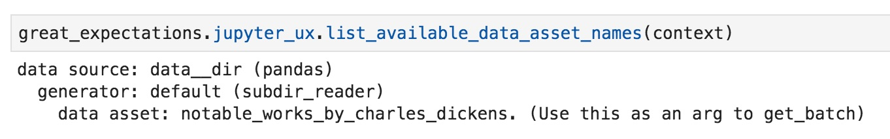
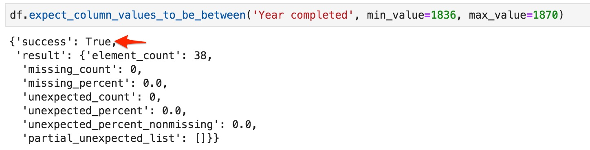
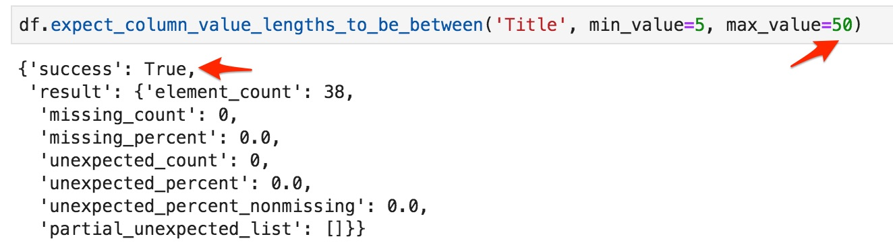

.. _tutorial_create_expectations:

Step 2: Create Expectations
==============================

.. toctree::
   :maxdepth: 2

Creating expectations is an opportunity to blend contextual knowledge from subject-matter experts and insights from profiling and performing exploratory analysis on your dataset.

Video
------

This brief video covers the basics of creating expectations

Get DataContext Object
-----------------------

A DataContext represents a Great Expectations project. It organizes storage and access for
expectation suites, datasources, notification settings, and data fixtures.
The DataContext is configured via a yml file stored in a directory called great_expectations;
the configuration file as well as managed expectation suites should be stored in version control.

Obtaining a DataContext object gets us access to these resources after the object reads its
configuration file.

::

    context = ge.data_context.DataContext()

To read more about DataContext, see: :ref:`data_context`

Data Assets
-------------

Get Batch
----------

.. image:: get_batch.jpg

Reader Options
---------------

Create Expectations
--------------------------------

Now that you have one of the data batches loaded, you can call expect* methods on the dataframe in order to check
if you can make an assumption about the data.

For example, to check if you can expect values in column "order_date" to never be empty, call: `df.expect_column_values_to_not_be_null('order_date')`

Some expectations can be created from your domain expertise. As everybody knows, Charles Dickens began his literary career with the publication of The Pickwick Papers in 1836 and kept writing until his death in 1870.

Other expectations can be created by examining the data in the batch. For example, we want to protect our pipeline against values of unreasonable length in the Title column. We don't know exactly what the limits of the "reasonable" are, but we can try some values and check if the data in the batch meets this expectation:

.. image:: expect_column_value_lengths_to_be_between_failure.jpg

Validating the expectation againt the batch resulted in failure - there are some values in the column that do not meet the expectation. "partial_unexpected_list" key in the result dictionary contains examples of non-conforming values. Examining these examples shows that some titles are longer than 30 characters. We adjust the max_value and rerun the expectation method:

This time validation was successful - all values in the column meet our expectation.

`expect_column_value_lengths_to_be_between`

How do I know which types of expectations I can add?
~~~~~~~~~~~~~~~~~~~~~~~~~~~~~~~~~~~~~~~~~~~~~~~~~~~~

* *Tab-complete* this statement, and add an expectation of your own; copy the cell to add more
* In jupyter, you can also use *shift-tab* to see the docstring for each expectation, to see what parameters it takes and get more information about the expectation.
* Here is a glossary of expectations you can add:
https://great-expectations.readthedocs.io/en/latest/glossary.html

Expectations include:

- ``expect_table_row_count_to_equal``
- ``expect_column_values_to_be_unique``
- ``expect_column_values_to_be_in_set``
- ``expect_column_mean_to_be_between``
- ...and many more

Visit the `glossary of
expectations <https://docs.greatexpectations.io/en/latest/glossary.html>`__
for a complete list of expectations that are currently part of the great
expectations vocabulary.

Review and Save Expectation Suite
---------------------------------

.. image:: get_expectation_suite_output.jpg

.. code-block::

    df.save_expectation_suite()

This method saves the expectation suite as a JSON file. DataContext determines the location of the file by convention:

.. image:: saved_expectation_suite_file.jpg
    :width: 450px

When you call `get_expectation_suite`, you might see this warning in the output:

.. image:: failing_expectations_warning.jpg
    :width: 350px

This warning counts the expectations that this batch did not meet. When you save an expectation suite, Great Expectations will drop all the failing (unmet) expectations before saving the suite to a file.

Sometimes we want to save an expectation even though it did not validate successfully on the current batch (e.g., we have a reason to believe that our expectation is correct and the current batch has bad entries). In this case we pass and additional argument to `save_expectation_suite` method:

.. code-block::

    df.save_expectation_suite(discard_failed_expectations=False)

