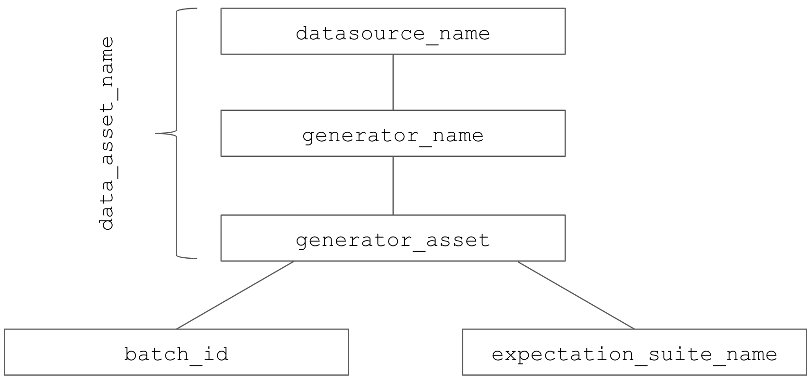

.. _tutorial_pipeline_integration:

Step 3: Pipeline integration
=================================

This tutorial covers integrating Great Expectations (GE) into a data pipeline.

We will continue the example we used in the previous section, where we created an expectation suite for the data
asset ``notable_works_by_charles_dickens``. That defined what we expect a valid batch of this data to look like.

Once our pipeline is deployed, it will process new batches of this data asset as they arrive. We will use
Great Expectations to validate each batch and ensure it matches our expectations for the relevant component of our
data application.

Just before calling the method that does the computation on a new batch, we call Great Expectations' validate method.
If the file does not pass validation, we can decide what to do—stop the pipeline, log a warning, send a notification
or perform some other custom action.

A Great Expectations DataContext describes data assets using a three-part namespace consisting of
**datasource_name**, **generator_name**, and **generator_asset**.

To run validation for a data_asset, we need two additional elements:

* a **batch** to validate; in our case it is a file loaded into a Pandas DataFrame
* an **expectation_suite** to validate against

Video
------

COMING SOON: This brief video covers the basics of integrating GE into a pipeline

Get a DataContext object
------------------------

A DataContext represents a Great Expectations project. It organizes storage and access for
expectation suites, datasources, notification settings, and data fixtures.
The DataContext is configured via a yml file stored in a directory called great_expectations.
**The configuration file and managed expectation suites should be stored in version control.**

Obtaining a DataContext object gets us access to these resources after the object reads its
configuration file:

.. code-block::

    context = ge.data_context.DataContext()

The DataContext constructor takes an optional parameter specifying the path to the ``great_expectations.yml`` file; by
default it will search in the current directory or relative to known great expectations project filepaths.

To read more, see: :ref:`data_context`.

Set a Run Id
-------------

A ``run_id`` links together validations of different data assets, making it possible to track "runs" of a pipeline and
follow data assets as they are transformed, joined, annotated, enriched, or evaluated. The run id can be any string;
by default, Great Expectations will use an ISO 8601-formatted UTC datetime string.

The Great Expectations DataContext object uses the run id to determine when :ref:`evaluation_parameters` should be
linked between data assets. After each validation completes, the DataContext identifies and stores any validation
results that are referenced by other data asset expectation suites managed by the context. Then, when a batch of data
is validated against one of those expectation suites, *with the same run id*, the context will automatically insert
the relevant parameter from the validation result. For example, if a batch of the ``node_2`` data_asset expects the
number of unique values in its ``id`` column to equal the number of distinct values in the ``id`` column from
``node_1``, we need to provide the same run_id to ensure that parameter can be passed between validations.

See :ref:`data_context_evaluation_parameter_store` for more information.

The default ``run_id`` generated by Great Expectations is built using the following code:

.. code-block::

    run_id = run_id = datetime.datetime.utcnow().isoformat().replace(":", "") + "Z"

Choose Data Asset and Expectation Suite
-----------------------------------------

We called our data asset ``notable_works_by_charles_dickens`` and created an expectation suite called ``default``.
Since default is the (you guessed it!) default name for an expectation suite, we can omit that parameter from many
calls. When there is no ambiguity, the DataContext will be able to infer the fully-normalized name for our data asset
(``data_dir/default/notable_works_by_charles_dickens``) from the generator_asset name that we provided.
For our validation, we will link all of the parameters and supply them to great_expectations.

Usually, we do not need to obtain an expectation suite without an associated batch of data (see the next section), but
if we do wish to obtain the expectation suite directly, the context makes that easy:

.. code-block::

  # This command will normalize the shortened data asset name to the full name "data_dir/default/notable_works_by_charles_dickens"
  # It will also provide (or create) the expectation suite with the name "default" since we did not specify an explicit name
  my_suite = context.get_expectation_suite("notable_works_by_charles_dickens")

Obtain a Batch to Validate
-----------------------------

Datasources and generators work together closely with your pipeline infrastructure to provide Great Expectations
batches of data to validate. The generator is responsible for identifying the ``batch_kwargs`` that a datasource will
use to load a batch of data. For example the :class:`~great_expectations.datasource.generator.\
filesystem_path_generator.SubdirReaderGenerator`
generator will create batches of data based on individual files and group those batches into a single data_asset based
on the subdirectory in which they are located. By contrast, the :class:`~great_expectations.datasource.generator.\
filesystem_path_generator.GlobReaderGenerator`
will also create batches of data based on individual files, but uses defined glob-style match patterns to group those
batches into named data assets.

``batch_kwargs`` from one of those filesystem reader generators might look like the following:

.. code-block::

  {
    "path": "/data/staging/user_actions/20190710T034323_user_actions.csv",
    "timestamp": 1562770986.6800103,
    "sep": null,
    "engine": "python"
  }

Notice that the generator is providing information to the datasource object describing what and how to read the batch.

For SQL and spark backends, ``batch_kwargs`` will usually define the query or table to use for validation.

Finally, for many integrations, it is possible to provide a reference to an existing batch of data, such as
a pandas or spark DataFrame. In such cases, the :py:class:`~great_expectations.datasource.generator.in_memory_generator.\
InMemoryGenerator` provides a straightforward mechanism to create a Great Expectations data batch
from existing objects; that leaves management of information about the specific batch to your existing pipeline runner.

If we request a batch of data from the DataContext without specifying specific ``batch_kwargs``, it will automatically
obtain the next ``batch_kwargs`` for the named DataAsset data for the specified DataAsset from the generator and then
use that to obtain a new batch from the datasource:

.. code-block::

  batch = context.get_batch("my_source/my_generator/my_asset", "my_expectations")

We can also specifically request and inspect or specify ``batch_kwargs``:

.. code-block::

  my_source = context.get_datasource("my_source")
  my_generator = my_source.get_generator("my_generator")
  next_kwargs = my_generator.yield_batch_kwargs("my_asset")

or

.. code-block::

  my_explicit_batch_kwargs = {
    "query": "select id, date, procedure_code from normalized_codes where date < '2019-07-01'"
  }
  batch = context.get_batch("my_source/my_generator/my_asset","my_expectations", my_explicit_batch_kwargs)

Validate
---------

Validation evaluates our expectations against the given batch and produces a report that describes observed values and
any places where expectations are not met. To validate the batch of data call the :meth:`~great_expectations.\
data_asset.data_asset.DataAsset.validate` method on the batch of data obtained from the DataContext:

::

  validation_result = batch.validate(run_id=run_id)

Review Validation Results
----------------------------

As part of an integrated pipeline, we may take specific actions based on the the result of the validation run. See
:ref:`validation_result` for more information about the validation_result result object. A common pattern is
to stop or issue a warning in the code:

.. code-block::

  if validation_result["success"]:
    logger.info("This file meets all expectations from a valid batch of {0:s}".format(data_asset_name))
  else:
    logger.warning("This file is not a valid batch of {0:s}".format(data_asset_name))

When a result store is configured (see below), it is possible to obtain validation results from the context, for example for
interactively reviewing results in a notebook or to easily display them in a dashboard.

.. code-block::

  validation_results = context.get_validation_result("my_datasource/my_generator/my_asset", my_run_id)

If run_id is omitted, GE will use the most recent run_id.

Send Notifications
-------------------

The DataContext can also send notifications using a user-provided callback function based on the validation result. GE
includes a slack-based notification in the base package. To enable a slack notification for results, simply specify
the slack webhook in the DataContext configuration:

.. code-block::

  result_callback:
    slack: https://slack.com/your_webhook_url

Save Validation Results
-------------------------

The DataContext object provides a configurable ``result_store`` where GE can store validation_result objects for
subsequent evaluation and review. By default, the DataContext stores results in the
``great_expectations/uncommitted/validations`` directory. To specify a different directory or use a remote store such
as ``s3``, edit the DataContext configuration object:

.. code-block::

  result_store:
    filesystem:
      base_directory: uncommitted/validations/
    s3:
      bucket: my_result_bucket
      key_prefix: validations

Validation results will be stored according to the same hierarchical namespace used to refer to data assets elsewhere
in the context, and will have the run_id prepended:
``base_location/run_id/datasource_name/generator_name/generator_asset/expectation_suite_name.json``.

Removing the result_store section from the configuration object will disable automatically storing validation_result
objects.

Save Failed Batches
---------------------

The pandas backend also supports saving a snapshot of the batch used for validation in the event of failed snapshots,
which can be useful especially in pipelines where GE is provided an in-memory DataFrame to validate at a midpoint in a
data pipeline.

The ``data_asset_snapshot_store`` uses the same configuration structure as the result_store, so can save either to a
local filesystem or to an s3 bucket. It will save a gzipped CSV of the dataset.