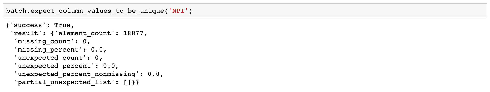
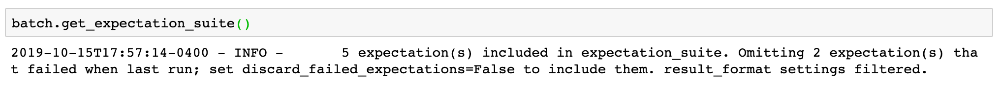

.. _tutorial_create_expectations:

Create Expectations
==============================

Creating expectations is an opportunity to blend contextual knowledge from subject-matter experts and insights from
profiling and performing exploratory analysis on your dataset. This tutorial covers creating expectations for a data asset in the Jupyter notebook.

Video
------

If you prefer videos to written tutorials, `James <https://github.com/jcampbell>`_ (one of the original core contributors) walks you through this turorial in a `video on YouTube <https://greatexpectations.io/videos/getting_started/create_expectations>`_.

0. Open Jupyter Notebook
------------------------

This tutorial assumes that:

* you ran ``great_expectations init`` and went through the steps covered in the previous tutorial: :ref:`tutorial_init`.
* your current directory is the root of the project where you ran ``great_expectations init``

You can either follow the tutorial with the dataset that it uses or you can execute the same steps on your project with your own data.

If you get stuck, find a bug or want to ask a question, go to `our Slack <https://greatexpectations.io/slack>`_ - this is the best way to get help from the contributors and other users.

The dataset is a folder with CSV files containing National Provider Identifier (NPI) data that are processed with pandas.

Jupyter notebooks is the interface for creating expectations.

The ``great_expectations init`` command created ``great_expectations/notebooks/`` folder in your project. The folder contains example notebooks for pandas, Spark and SQL datasources.

If you are following this tutorial using the NPI dataset, open the pandas notebook. If you are working with your dataset, see the instructions for your datasource:

.. content-tabs::

    .. tab-container:: tab0
        :title: pandas

        .. code-block:: bash

            jupyter notebook great_expectations/notebooks/pandas/create_expectations.ipynb

    .. tab-container:: tab1
        :title: pyspark

        .. code-block:: bash

            jupyter notebook great_expectations/notebooks/spark/create_expectations.ipynb

    .. tab-container:: tab2
        :title: SQLAlchemy

        .. code-block:: bash

            jupyter notebook great_expectations/notebooks/sql/create_expectations.ipynb

1. Get a DataContext Object
---------------------------

A DataContext represents a Great Expectations project. It organizes datasources, notification settings, data documentation sites, and storage and access for expectation suites and validation results.
The DataContext is configured via a yml file stored in a directory called ``great_expectations``.
This entire directory which includes configuration files as well as expectation suites should be stored in version control.

Obtaining a DataContext object gets us access to these resources after the object reads its
configuration file.

::

    context = ge.data_context.DataContext()

To read more about DataContext, see: :ref:`data_context`

2. List Data Assets
-------------------

A Data Asset is data you can describe with expectations.

.. content-tabs::

    .. tab-container:: tab0
        :title: pandas

        A Pandas datasource generates data assets from Pandas DataFrames or CSV files. In this example the pipeline processes NPI data that it reads from CSV files in ``npidata`` directory into Pandas DataFrames. This is the data you want to describe and specify with expectations. That directory and its files are a data asset, named "NPI data" (based on the directory name).

    .. tab-container:: tab1
        :title: pyspark

        A Spark datasource generates data assets from Spark DataFrames or CSV files. In this example the pipeline processes NPI data that it reads from CSV files in ``npidata`` directory into Pandas DataFrames. This is the data you want to describe and specify with expectations. If the example read the data into Spark DataFrames, we would think of this data asset as "data from the npidata directory that we read into Spark DataFrames" and give it a name "NPI data".

    .. tab-container:: tab2
        :title: SQLAlchemy

        A SQLAlchemy datasource generates data assets from tables, views and query results.

        * If the data resided in a table (or view) in a database, it would be accessible as a data asset with the name of that table (or view).
        * If the data did not reside in one table ``npidata`` and, instead, the example pipeline ran an SQL query that fetched the data (probably from multiple tables), the result set of that query would be accessible as a data asset. The name of this data asset would be up to us (e.g., "npidata" or "npidata_query").

Use this convenience method to list all data assets and expectation suites in your project (using the `DataContext`).

.. code-block:: python

    great_expectations.jupyter_ux.list_available_data_asset_names(context)

The output looks like this:

.. image:: ../images/list_data_assets.png
    :width: 600px

``npidata`` is the short name of the data asset. Full names of data assets in a DataContext consist of three parts, for example: ``data__dir/default/npidata``. You don't need to know (yet) how the namespace is managed and the exact meaning of each part. The :ref:`data_context` article describes this in detail.

3. Pick a data asset and set the expectation suite name
-------------------------------------------------------

The ``normalize_data_asset_name`` method converts the short name of a data asset to a full name:

.. code-block:: python

    data_asset_name = "npidata"
    normalized_data_asset_name = context.normalize_data_asset_name(data_asset_name)
    normalized_data_asset_name

.. code-block:: python

    expectation_suite_name = "warning"

4. Create a new empty expectation suite
---------------------------------------

Individual Expectations are organized into expectation suites. We recommend 'warning' or 'default' as the name
for a first expectation suite associated with a data asset.

.. code-block:: python

    context.create_expectation_suite(data_asset_name=data_asset_name,
                                     expectation_suite_name=expectation_suite_name)

If an expectation suite with this name already exists for this data_asset, you will get an error. If you would like to overwrite this expectation suite, set ``overwrite_existing=True``.

5. Load a batch of data to create Expectations
----------------------------------------------

Expectations describe data assets. Data assets are composed of batches. Validation checks expectations against a batch of data.

For example, a batch could be the most recent day of log data. For a database table, a batch could be the data in that table at a particular time.

To create expectations about a data asset you will load a batch of data as a Great Expectations :class:`Dataset <great_expectations.dataset.dataset.Dataset>` and then call expectation methods.

The DataContext's ``get_batch`` method is used to load a batch of a data asset:

.. code-block:: python

    batch = context.get_batch(normalized_data_asset_name,
                              expectation_suite_name,
                              batch_kwargs)

Calling this method asks the Context to get a batch of data from the data asset ``normalized_data_asset_name`` and attach the expectation suite ``expectation_suite_name`` to it. The ``batch_kwargs`` argument specifies which batch of the data asset should be loaded.

If you have no preference as to which batch of the data asset should be loaded, use the ``yield_batch_kwargs`` method on the data context:

.. code-block:: python

    batch_kwargs = context.yield_batch_kwargs(data_asset_name)

This is most likely sufficient for the purpose of this tutorial.

.. toggle-header::
    :header: However, if you want to use a specific batch, **click here to learn how to specify the right batch_kwargs**

        ``batch_kwargs`` provide detailed instructions for the datasource how to construct a batch. Each datasource accepts different types of ``batch_kwargs``:

        .. content-tabs::

            .. tab-container:: tab0
                :title: pandas

                A pandas datasource can accept ``batch_kwargs`` that describe either a path to a file or an existing DataFrame. For example, if the data asset is a collection of CSV files in a folder that are processed with Pandas, then a batch could be one of these files. Here is how to construct ``batch_kwargs`` that specify a particular file to load:

                .. code-block:: python

                    batch_kwargs = {'path': "PATH_OF_THE_FILE_YOU_WANT_TO_LOAD"}

                To instruct ``get_batch`` to read CSV files with specific options (e.g., not to interpret the first line as the
                header or to use a specific separator), add them to the the ``batch_kwargs``.

                See the complete list of options for `Pandas read_csv <https://pandas.pydata.org/pandas-docs/stable/reference/api/pandas.read_csv.html>`__.

                ``batch_kwargs`` might look like the following:

                .. code-block:: json

                    {
                        "path": "/data/npidata/npidata_pfile_20190902-20190908.csv",
                        "partition_id": "npidata_pfile_20190902-20190908",
                        "sep": null,
                        "engine": "python"
                    }

                |
                If you already loaded the data into a Pandas DataFrame, here is how you construct ``batch_kwargs`` that instruct the datasource to use your dataframe as a batch:

                .. code-block:: python

                    batch_kwargs = {'df': "YOUR_PANDAS_DF"}

            .. tab-container:: tab1
                :title: pyspark

                A pyspark datasource can accept ``batch_kwargs`` that describe either a path to a file or an existing DataFrame. For example, if the data asset is a collection of CSV files in a folder that are processed with Pandas, then a batch could be one of these files. Here is how to construct ``batch_kwargs`` that specify a particular file to load:

                .. code-block:: python

                    batch_kwargs = {'path': "PATH_OF_THE_FILE_YOU_WANT_TO_LOAD"}

                To instruct ``get_batch`` to read CSV files with specific options (e.g., not to interpret the first line as the
                header or to use a specific separator), add them to the the ``batch_kwargs``.

                See the complete list of options for `Spark DataFrameReader <https://spark.apache.org/docs/latest/api/python/pyspark.sql.html#pyspark.sql.DataFrameReader>`__

            .. tab-container:: tab2
                :title: SQLAlchemy

                A SQLAlchemy datasource can accept ``batch_kwargs`` that instruct it load a batch from a table, a view, or a result set of a query:

                If you would like to validate an entire table (or a view) in your database's default schema:

                .. code-block:: python

                    batch_kwargs = {'table': "YOUR TABLE NAME"}

                If you would like to validate an entire table or view from a non-default schema in your database:

                .. code-block:: python

                    batch_kwargs = {'table': "YOUR TABLE NAME", "schema": "YOUR SCHEMA"}

                If you would like to validate using a query to construct a temporary table:

                .. code-block:: python

                    batch_kwargs = {'query': 'SELECT YOUR_ROWS FROM YOUR_TABLE'}

        The examples of ``batch_kwargs`` above can also be the outputs of "generators" used by Great Expectations. You can read about the default Generators' behavior and how to implement additional generators in this article: :ref:`batch_generator`.

|
Now you have the contents of one of the files loaded as batch of the data asset ``data__dir/default/npidata``.

6. Author Expectations
-----------------------

Now that we have a batch of data, we can call ``expect`` methods on the data asset in order to check
whether this expectation is true for this batch of data.

For example, to check if we can expect values in column "NPI" to never be empty, call:
``df.expect_column_values_to_not_be_null('NPI')``

Some expectations can be created from your domain expertise; for example we might expect that most entries in the NPI
database use the title "Dr." instead of "Ms.", or we might expect that every row should use a unique value in the 'NPI'
column.

Here is how we can add an expectation that expresses that knowledge:

Other expectations can be created by examining the data in the batch. For example, we want to protect our pipeline
against improper values in the "Provider Other Organization Name Type Code" column. We don't know exactly what the
"improper" values are, but we can try some values and check if the data in the batch meets this expectation:

.. image:: ../images/expect_column_values_to_be_in_set_failure.png

Validating the expectation against the batch resulted in failure - there are some values in the column that do not meet
the expectation. The "partial_unexpected_list" key in the result dictionary contains examples of non-conforming values.
Examining these examples shows that some titles are not in our expected set. We adjust the ``value_set`` and rerun
the expectation method:

.. image:: ../images/expect_column_values_to_be_in_set_success.png

This time validation was successful - all values in the column meet our expectation.

Although we called ``expect_column_values_to_be_in_set`` twice (with different argument values), only one
expectation of type ``expect_column_values_to_be_in_set`` will be created for the column - the latest call
overrides all the earlier ones. By default, only expectations that were true on their last run are saved.

How do I know which types of expectations I can add?
~~~~~~~~~~~~~~~~~~~~~~~~~~~~~~~~~~~~~~~~~~~~~~~~~~~~

* *Tab-complete* the partially typed ``expect_`` method name to see available expectations.
* In Jupyter, we can also use *shift-tab* to see the docstring for each expectation, including the parameters it
  takes and to get more information about the expectation.
* Visit the :ref:`expectation_glossary` for a complete
  list of expectations that are currently part of the great expectations vocabulary. Here is a short preview of the glossary:

.. image:: ../images/glossary_of_expectations_preview.png
    :width: 400px

7. Review and save your Expectations
------------------------------------

.. image:: ../images/get_expectation_suite_output.png

.. code-block:: python

    df.save_expectation_suite()

The ``expectations_store`` attribute in ``great_expectations.yml`` configuration file controls the location where the DataContext saves the expectation suite.

When we call ``get_expectation_suite``, we might see this warning in the output:

When we save an expectation suite, by default, GE will drop any expectation that was not successful on its last run.

Sometimes we want to save an expectation even though it did not validate successfully on the current batch (e.g., we
have a reason to believe that our expectation is correct and the current batch has bad entries). In this case we pass
an additional argument to ``save_expectation_suite`` method:

.. code-block:: python

    df.save_expectation_suite(discard_failed_expectations=False)

8. View the Expectations in Data Docs
-------------------------------------

Data Docs compiles raw Great Expectations objects including Expectations and Validations into structured documents such as HTML documentation. By default the HTML website is hosted on your local filesystem. When you are working in a team, the website can be hosted in the cloud (e.g., on S3) and serve as the shared source of truth for the team working on the data pipeline.

To view the expectation suite you just created as HTML, rebuild the data docs and open the webstite in the browser:

.. code-block:: python

    context.build_data_docs()
    context.open_data_docs()

Read more about the capabilities and configuration of Data Docs here: :ref:`data_docs`.

Congratulations!
----------------

Now you you know the basics of creating expectations.

What is next? This is a collection of tutorials that walk you through a variety of useful Great Expectations workflows: :ref:`tutorials`.
