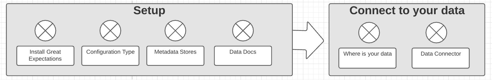

### Install Great Expectations and dependencies

If you haven’t already, install Great Expectations. [Example Local Python](/docs/guides/setup/installing/local)

### Create a Data Context

In Great Expectations, your Data Context manages your project configuration, so let’s go and create a Data Context for our tutorial project!

When you installed Great Expectations, you also installed the Great Expectations command line interface (CLI). It provides helpful utilities for deploying and configuring Data Contexts, plus a few other convenience methods. Note that since we’re using the V3 (Batch Request) API in this tutorial, all CLI commands will use the --v3-api flag.

To initialize your Great Expectations deployment for the project, run this command in the terminal from the ge_tutorials/ directory:

````console
great_expectations --v3-api init
````
You should see this:
````console
Using v3 (Batch Request) API

  ___              _     ___                  _        _   _
 / __|_ _ ___ __ _| |_  | __|_ ___ __  ___ __| |_ __ _| |_(_)___ _ _  ___
| (_ | '_/ -_) _` |  _| | _|\ \ / '_ \/ -_) _|  _/ _` |  _| / _ \ ' \(_-<
 \___|_| \___\__,_|\__| |___/_\_\ .__/\___\__|\__\__,_|\__|_\___/_||_/__/
                                |_|
             ~ Always know what to expect from your data ~

Let's configure a new Data Context.

First, Great Expectations will create a new directory:

    great_expectations
    |-- great_expectations.yml
    |-- expectations
    |-- checkpoints
    |-- notebooks
    |-- plugins
    |-- .gitignore
    |-- uncommitted
        |-- config_variables.yml
        |-- documentation
        |-- validations

OK to proceed? [Y/n]: <press Enter>
````

#### The ```great_expectations/``` directory structure

After running the ```init``` command, your ```great_expectations/``` directory will contain all of the important components of a local Great Expectations deployment. This is what the directory structure looks like:

* ```great_expectations.yml``` contains the main configuration of your deployment.
* The ```expectations/``` directory stores all your Expectations as JSON files. If you want to store them somewhere else, you can change that later.
* The ```notebooks/``` directory is for helper notebooks to interact with Great Expectations.
* The ```plugins/``` directory holds code for any custom plugins you develop as part of your deployment.
* The ```uncommitted/``` directory contains files that shouldn’t live in version control. It has a .gitignore configured to exclude all its contents from version control. The main contents of the directory are:
	* ```uncommitted/config_variables.yml```, which holds sensitive information, such as database credentials and other secrets.
	*  ```uncommitted/documentation```, which contains Data Docs generated from Expectations, Validation Results, and other metadata.
	*  ```uncommitted/validations```, which holds Validation Results generated by Great Expectations.
