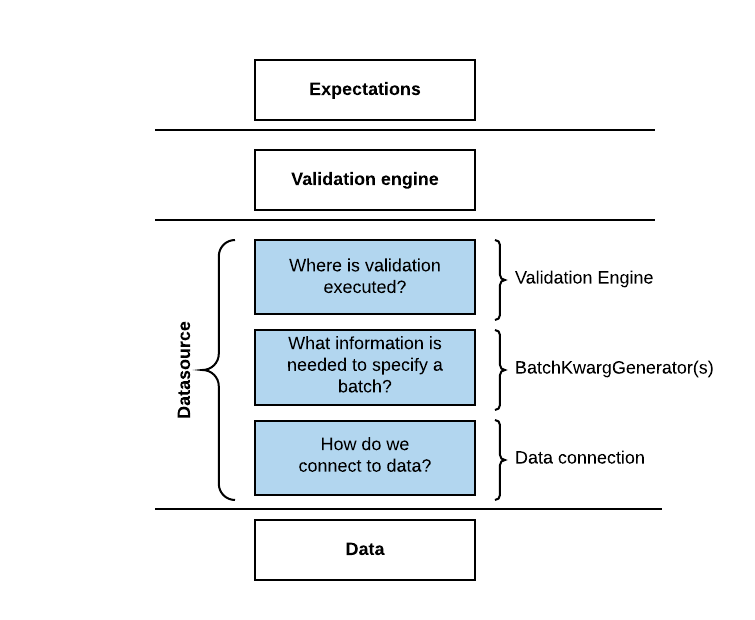

.. _getting_started__connect_to_data:

Connect to data
===============

Once you have a DataContext, you'll want to connect to data.  In Great Expectations, ``Datasources`` simplify connections, by managing configuration and providing a consistent, cross-platform API for referencing data.

Let's configure your first Datasource, by following the next steps in the CLI init flow:

.. code-block:: bash

    What data would you like Great Expectations to connect to?    
        1. Files on a filesystem (for processing with Pandas or Spark)
        2. Relational database (SQL)
    : 1

    What are you processing your files with?
        1. Pandas
        2. PySpark
    : 1

    Enter the path (relative or absolute) of a data file
    : data/notable_works_by_charles_dickens/notable_works_by_charles_dickens.csv

That's it! You just configured your first Datasource!

Before continuing, let's stop and unpack what just happened, and why.

Why Datasources?
----------------

*Validation* is the core operation in Great Expectations: "validate X data against Y Expectations."

Although the concept of data validation is simple, carrying it out can require complex engineering. This is because your Expectations and data might be stored in different places, and the computational resources for validation might live somewhere else entirely. The engineering cost of building the necessary connectors for validation has been one of the major things preventing data teams from testing their data.

Datasources solve this problem, by conceptually separating *what* you want to validate from *how* you to validate it. Datasources give you full control over the process of bringing data and Expectations together, then abstract away that underlying complexity when you validate X data against Y Expectations.

We call the layer that handles the actual computation a :ref:`Validation Engine`_. Currently, Great Expectations supports three Validation Engines: pandas, sqlalchemy, and pyspark. We will likely extend the library to support others in the future.

The layer that handles connecting to data is called a :ref:`Batch Kwarg Generator`_. Not all Batch Kwarg Generators can be used with all Validation Engines. It's also possible to configure a Datasource without a Batch Kwargs Generator.

You can read more about the inner workings of Datasources, Validation Engines, and Batch Kwarg Generators :ref:`here`_.

Configuring Datasources
-----------------------

When you completed those last few steps in ``great_expectations init``, you told Great Expectations that

1. you want to use Pandas as your :ref:`execution engine`_,
2. the data you want to connect to lives in a local filesystem, in the specific path to your data is ``data/notable_works_by_charles_dickens/notable_works_by_charles_dickens.csv``.
3. Based on that information, the CLI added the following entry into your ``great_expectations.yml`` file, under the ``datasources`` header:

.. code-block:: yaml

    files_datasource:
      class_name: PandasDatasource
      module_name: great_expectations.datasource
      data_asset_type:
        module_name: great_expectations.dataset
        class_name: PandasDataset

This configuration for a Datasource includes the following components:

* ``files_datasource`` is the name of the new Datasource.

* ``class_name`` : specifies the tool that will be used to connect to data, in this case `PandasDatasource`.

* ``data_asset_type`` (required): specifies the execution environment in which Expectations will be executed, in this case `PandasDataset`.

* This Datasource does not currently include a Batch Kwarg Generator, but if it did, it would include the path to the data: ``data/notable_works_by_charles_dickens/``

.. attention::

    We plan to upgrade this configuration API soon, with better names and more conceptual clarity. If at all possible, we will make those changes in a non-breaking way. If you have ideas, concerns or questions about this planned improvement, please join the :ref:`public discussion in Github issues <google.com>`__.

In the future, you can modify or delete your configuration by editing your ``great_expectations.yml`` file directly. For instructions on how to configure various Datasources, check out :ref:`How-to guides for configuring Datasources`_.

You can also use the :ref:`CLI to work with Datasources`_.

For now, let's continue to :ref:`getting_started__create_your_first_expectations`.