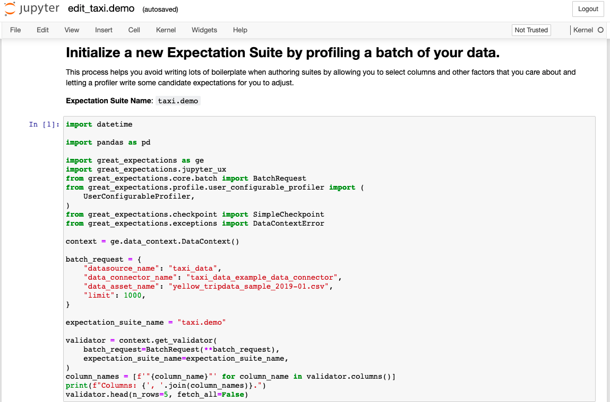

Expectations are the workhorse abstraction in Great Expectations. Each Expectation is a declarative, machine-verifiable assertion about the expected format, content, or behavior of your data. Great Expectations comes with dozens of built-in Expectations, and it’s possible to develop your own custom Expectations, too.

### Create an Expectation Suite using the CLI
The CLI will help you create your first Expectation Suite. Suites are simply collections of Expectations. In order to create a new suite, we will use the built-in profiler to automatically create an Expectation Suite called `getting_started_expectation_suite_taxi.demo`. Type the following into your terminal:

```console
great_expectations suite new
```

You will see the output below. Choose `3` to create the Expectation Suite Automatically, using a profiler, and `1` to profile the January taxi data in `yellow_tripdata_sample_2019-01.csv`.

This will open up a **Jupyter Notebook** that helps you create the new suite, we'll explain what happens next.

:::caution
Don’t execute the Jupyter Notebook cells just yet!
:::

```console
How would you like to create your Expectation Suite?
    1. Manually, without interacting with a sample batch of data (default)
    2. Interactively, with a sample batch of data
    3. Automatically, using a profiler
: 3

A batch of data is required to edit the suite - let's help you to specify it.


Which data asset (accessible by data connector "default_inferred_data_connector_name") would you like to use?
    1. yellow_tripdata_sample_2019-01.csv
    2. yellow_tripdata_sample_2019-02.csv
: 1

Name the new Expectation Suite [yellow_tripdata_sample_2019-01.csv.warning]: getting_started_expectation_suite_taxi.demo

Great Expectations will create a notebook, containing code cells that select from available columns in your dataset and
generate expectations about them to demonstrate some examples of assertions you can make about your data.

When you run this notebook, Great Expectations will store these expectations in a new Expectation Suite "getting_started_expectation_suite_taxi.demo" here:

  <path_to_project>/great_expectations/expectations/getting_started_expectation_suite_taxi/demo.json

Would you like to proceed? [Y/n]:  <press Enter>
```

**What just happened?**

You may now wonder why we chose the first file in this step. Here’s an explanation: Recall that our data directory contains two CSV files: `yellow_tripdata_sample_2019-01` and `yellow_tripdata_sample_2019-02`.

  - `yellow_tripdata_sample_2019-01` contains the January 2019 taxi data. Since we want to build an Expectation Suite based on what we know about our taxi data from the January 2019 data set, we want to use it for profiling.
  - `yellow_tripdata_sample_2019-02` contains the February 2019 data, which we consider the “new” data set that we want to validate before using it in production. We’ll use it later when showing you how to validate data.

Makes sense, right?

### Creating Expectations in Jupyter notebooks

Notebooks are a simple way of interacting with the Great Expectations Python API. You could also just write all this in plain Python code, but for convenience, Great Expectations provides you some boilerplate code in notebooks.

Since notebooks are often less permanent, creating Expectations in a notebook also helps reinforce that the source of truth about Expectations is the Expectation Suite, not the code that generates the Expectations.

**Let’s take a look through the notebook and see what’s happening in each cell**:



1. The first cell does several things: It imports all the relevant libraries, loads a Data Context, and creates a `Validator`, which combines a Batch Request to define your batch of data, and an Expectation Suite.
2. The second cell allows you to specify which columns you want to **ignore** when creating Expectations. Remember how we want to add some tests on the `passenger_count` column to ensure that its values range between 1 and 6? **Let’s comment just this one line to include it**:

```python file=../../../tests/integration/docusaurus/tutorials/getting-started/getting_started.py#L85-L89
```

3. The next cell is where you configure a `UserConfigurableProfiler` and instantiate it, which will then profile the data and create the relevant Expectations to add to your `taxi.demo` suite.

4. The last cell does several things again: It saves the Expectation Suite to disk, runs the validation against the loaded data batch, and then builds and opens Data Docs, so you can look at the Validation Results. *We will explain the validation step later in the “Validate your data” section.*

**Let’s execute all the cells** and wait for Great Expectations to open a browser window with Data Docs. **Go to the next step in the tutorial** for an explanation of what you see in Data Docs!
