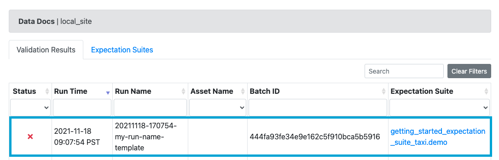
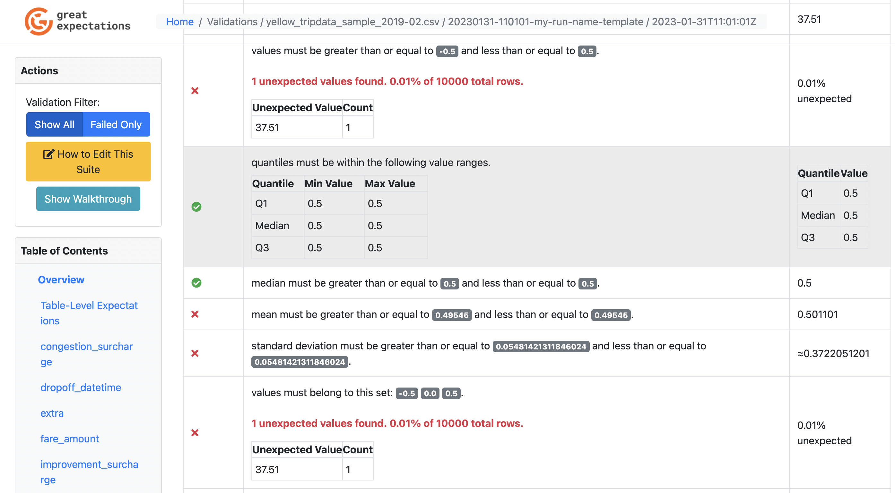

<table class="borderless center">
<tr>
    <td>
        
    </td>
    <td>
        
    </td>
    <td>
        
    </td>
    <td>
        
    </td>
    <td>
        
    </td>
    <td>
        
    </td>
    <td>
        
    </td>
</tr>
</table>

:::note Prerequisites

- Completed [Step 3: Create Expectations](./tutorial_create_expectations.md) of this tutorial.

:::

### Set up a Checkpoint
Let’s set up our first Checkpoint!  

A Checkpoint uses a Validator to run an Expectation Suite against a Batch (or Batch Request).  Running a checkpoint produces Validation Results.  Checkpoints can also be configured to perform additional Actions.  

For the purposes of this tutorial, the Checkpoint we create will run the Expectation Suite we previously configured against the Data we provide.  We will use it to verify that there are no unexpected changes in the February NYC taxi data compared to what our Profiler observed in the January NYC taxi data.

**Go back to your terminal** and shut down the Jupyter Notebook, if you haven’t yet. Then run the following command:


```console
great_expectations checkpoint new getting_started_checkpoint
```

This will **open a Jupyter Notebook** that will allow you to complete the configuration of your Checkpoint.

The Jupyter Notebook contains some boilerplate code that allows you to configure a new Checkpoint. The second code cell is pre-populated with an arbitrarily chosen batch request and Expectation Suite to get you started. Edit the `data_asset_name` to reference the data we want to validate (the February data), as follows:


```python file=../../../tests/integration/docusaurus/tutorials/getting-started/getting_started.py#L161-L174
```

You can then execute all cells in the notebook in order to store the Checkpoint to your Data Context.

#### What just happened?

- `getting_started_checkpoint` is the name of your new Checkpoint.

- The Checkpoint uses `getting_started_expectation_suite_taxi.demo` as its primary Expectation Suite.

- You configured the Checkpoint to validate the `yellow_tripdata_sample_2019-02.csv` (i.e. our February data) file.

### How to run validation and inspect your Validation Results

In order to build Data Docs and get your results in a nice, human-readable format, you can simply uncomment and run the last cell in the notebook. This will open Data Docs, where you can click on the latest validation run to see the Validation Results page for this Checkpoint run.



You’ll see that the test suite failed when you ran it against the February data.

#### What just happened? Why did it fail?? Help!?

We ran the Checkpoint and it successfully failed! **Wait - what?** Yes, that’s correct, this indicates that the February data has data quality issues, which means we want the validation to fail.

Click on the highlighted row to access the Validation Results page, which will tell us specifically what is wrong with the February data.



On the Validation Results page, you will see that the validation of the staging data *failed* because the set of *Observed Values* in the `passenger_count` column contained the value `0`! This violates our Expectation, which makes the validation fail.

**And this is it!**

We have successfully created an Expectation Suite based on historical data, and used it to detect an issue with our new data. **Congratulations! You have now completed the “Getting started with Great Expectations” tutorial.**
