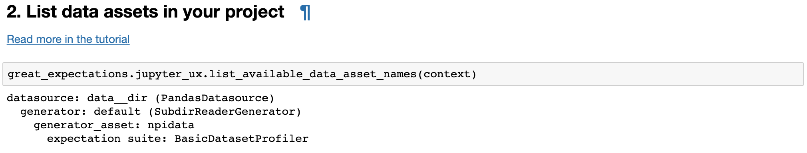

.. _tutorial_validate_data:

Validate Data
==============

Expectations describe data assets. Data assets are composed of batches. Validation checks expectations against a batch of data.

Validation = checking if a batch of data from a data asset X conforms to all expectations in expectation suite Y. Expectation suite Y is a collection of expectations that you created that specify what a valid batch of data asset X should look like.

To run validation you need:

* to specify which **data asset** the batch is from
* to specify an **expectation suite** to validate against
* to obtain the **batch** of data to be validated

This tutorial will explain each of these objects, show how to obtain them, execute validation and view its result.

Video
------

If you prefer videos to written tutorials, `James <https://github.com/jcampbell>`_ (one of the original core contributors) walks you through this turorial in a `video on YouTube <https://greatexpectations.io/videos/getting_started/integrate_expectations>`_.

0. Open Jupyter Notebook
------------------------

This tutorial assumes that:

* you ran ``great_expectations init`` and went through the steps covered in the previous tutorial: :ref:`tutorial_init`.
* your current directory is the root of the project where you ran ``great_expectations init``

The dataset is a folder with CSV files containing National Provider Identifier (NPI) data that are processed with pandas.

You can either follow the tutorial with the dataset that it uses or you can execute the same steps on your project with your own data.

If you get stuck, find a bug or want to ask a question, go to `our Slack <https://greatexpectations.io/slack>`_ - this is the best way to get help from the contributors and other users.

Validation is typically invoked inside the code of a data pipeline (e.g., an Airflow operator). This tutorial uses a Jupyter notebook as a validation playground.

The ``great_expectations init`` command created ``great_expectations/notebooks/`` folder in your project. The folder contains example notebooks for pandas, Spark and SQL datasources.

If you are following this tutorial using the NPI dataset, open the pandas notebook. If you are working with your dataset, see the instructions for your datasource:

.. content-tabs::

    .. tab-container:: tab0
        :title: pandas

        .. code-block:: bash

            jupyter notebook great_expectations/notebooks/pandas/validation_playground.ipynb

    .. tab-container:: tab1
        :title: pyspark

        .. code-block:: bash

            jupyter notebook great_expectations/notebooks/spark/validation_playground.ipynb

    .. tab-container:: tab2
        :title: SQLAlchemy

        .. code-block:: bash

            jupyter notebook great_expectations/notebooks/sql/validation_playground.ipynb

1. Get a DataContext Object
---------------------------

A DataContext represents a Great Expectations project. It organizes datasources, notification settings, data documentation sites, and storage and access for expectation suites and validation results.
The DataContext is configured via a yml file stored in a directory called great_expectations;
the configuration file as well as managed expectation suites should be stored in version control.

Obtaining a DataContext object gets us access to these resources after the object reads its
configuration file.

::

    context = ge.data_context.DataContext()

To read more about DataContext, see: :ref:`data_context`

2. List Data Assets
-------------------

A Data Asset is data you can describe with expectations.

.. content-tabs::

    .. tab-container:: tab0
        :title: pandas

        A Pandas datasource generates data assets from Pandas DataFrames or CSV files. In this example the pipeline processes NPI data that it reads from CSV files in ``npidata`` directory into Pandas DataFrames. This is the data you want to describe and specify with expectations. That directory and its files are a data asset, named "NPI data" (based on the directory name).

    .. tab-container:: tab1
        :title: pyspark

        A Spark datasource generates data assets from Spark DataFrames or CSV files. In this example the pipeline processes NPI data that it reads from CSV files in ``npidata`` directory into Pandas DataFrames. This is the data you want to describe and specify with expectations. If the example read the data into Spark DataFrames, we would think of this data asset as "data from the npidata directory that we read into Spark DataFrames" and give it a name "NPI data".

    .. tab-container:: tab2
        :title: SQLAlchemy

        A SQLAlchemy datasource generates data assets from tables, views and query results.

        * If the data resided in a table (or view) in a database, it would be accessible as a data asset with the name of that table (or view).
        * If the data did not reside in one table ``npidata`` and, instead, the example pipeline ran an SQL query that fetched the data (probably from multiple tables), the result set of that query would be accessible as a data asset. The name of this data asset would be up to us (e.g., "npidata" or "npidata_query").

Great Expectations' ``jupyter_ux`` module has a convenience method that lists all data assets and expectation suites known to a Data Context:

.. code-block:: python

    great_expectations.jupyter_ux.list_available_data_asset_names(context)

Here is the output of this method when executed in our example project:

``npidata`` is the short name of the data asset. Full names of data assets in a DataContext consist of three parts, for example: ``data__dir/default/npidata``. You don't need to know (yet) how the namespace is managed and the exact meaning of each part. The :ref:`data_context` article describes this in detail.

3. Pick a data asset and and expectation suite
----------------------------------------------

The previous section showed how to list all data assets and expectation suites in a project.

In this section you choose a data asset name from this list.

You set The ``normalize_data_asset_name`` method converts the short name of a data asset to a full name:

.. code-block:: python

    data_asset_name = "npidata"
    normalized_data_asset_name = context.normalize_data_asset_name(data_asset_name)
    normalized_data_asset_name

Choose the expectation suite you will validate the batch against:

.. code-block:: python

    expectation_suite_name = "warning"

3.a. If you don't have an expectation suite, let's create a simple one
~~~~~~~~~~~~~~~~~~~~~~~~~~~~~~~~~~~~~~~~~~~~~~~~~~~~~~~~~~~~~~~~~~~~~~~

If you don't have an expectation suite for this data asset, the notebook's next cell will create a suite of very basic expectations, so that you have some expectations to play with. The expectation suite will have `expect_column_to_exist` expectations for each column.

If you created an expectation suite for this data asset, you can skip executing the next cell (if you execute it, it will do nothing).

4. Load a batch of data to validate
-----------------------------------

Expectations describe data assets. Data assets are composed of batches. Validation checks expectations against a batch of data.

For example, a batch could be the most recent day of log data. For a database table, a batch could be the data in that table at a particular time.

In order to validate a batch of data you will load it as a Great Expectations :class:`Dataset <great_expectations.dataset.dataset.Dataset>`.

The DataContext's ``get_batch`` method is used to load a batch of a data asset:

.. code-block:: python

    batch = context.get_batch(normalized_data_asset_name,
                              expectation_suite_name,
                              batch_kwargs)

Calling this method asks the Context to get a batch of data from the data asset ``normalized_data_asset_name`` and attach the expectation suite ``expectation_suite_name`` to it. The ``batch_kwargs`` argument specifies which batch of the data asset should be loaded.

If you have no preference as to which batch of the data asset should be loaded, use the ``yield_batch_kwargs`` method on the data context:

.. code-block:: python

    batch_kwargs = context.yield_batch_kwargs(data_asset_name)

This tutorial and its notebook provide a playground for validation. When Great Expectations is integrated into a data pipeline, the pipeline calls GE to validate a specific batch (an input to a pipeline's step or its output).

.. toggle-header::
    :header: **Click here to learn how to specify batch_kwargs for fetching a particular batch**

        ``batch_kwargs`` provide detailed instructions for the datasource how to construct a batch. Each datasource accepts different types of ``batch_kwargs``:

        .. content-tabs::

            .. tab-container:: tab0
                :title: pandas

                A pandas datasource can accept ``batch_kwargs`` that describe either a path to a file or an existing DataFrame. For example, if the data asset is a collection of CSV files in a folder that are processed with Pandas, then a batch could be one of these files. Here is how to construct ``batch_kwargs`` that specify a particular file to load:

                .. code-block:: python

                    batch_kwargs = {'path': "PATH_OF_THE_FILE_YOU_WANT_TO_LOAD"}

                To instruct ``get_batch`` to read CSV files with specific options (e.g., not to interpret the first line as the
                header or to use a specific separator), add them to the the ``batch_kwargs``.

                See the complete list of options for `Pandas read_csv <https://pandas.pydata.org/pandas-docs/stable/reference/api/pandas.read_csv.html>`__.

                ``batch_kwargs`` might look like the following:

                .. code-block:: json

                    {
                        "path": "/data/npidata/npidata_pfile_20190902-20190908.csv",
                        "partition_id": "npidata_pfile_20190902-20190908",
                        "sep": null,
                        "engine": "python"
                    }

                |
                If you already loaded the data into a Pandas DataFrame, here is how you construct ``batch_kwargs`` that instruct the datasource to use your dataframe as a batch:

                .. code-block:: python

                    batch_kwargs = {'df': "YOUR_PANDAS_DF"}

            .. tab-container:: tab1
                :title: pyspark

                A pyspark datasource can accept ``batch_kwargs`` that describe either a path to a file or an existing DataFrame. For example, if the data asset is a collection of CSV files in a folder that are processed with Pandas, then a batch could be one of these files. Here is how to construct ``batch_kwargs`` that specify a particular file to load:

                .. code-block:: python

                    batch_kwargs = {'path': "PATH_OF_THE_FILE_YOU_WANT_TO_LOAD"}

                To instruct ``get_batch`` to read CSV files with specific options (e.g., not to interpret the first line as the
                header or to use a specific separator), add them to the the ``batch_kwargs``.

                See the complete list of options for `Spark DataFrameReader <https://spark.apache.org/docs/latest/api/python/pyspark.sql.html#pyspark.sql.DataFrameReader>`__

            .. tab-container:: tab2
                :title: SQLAlchemy

                A SQLAlchemy datasource can accept ``batch_kwargs`` that instruct it load a batch from a table, a view, or a result set of a query:

                If you would like to validate an entire table (or a view) in your database's default schema:

                .. code-block:: python

                    batch_kwargs = {'table': "YOUR TABLE NAME"}

                If you would like to validate an entire table or view from a non-default schema in your database:

                .. code-block:: python

                    batch_kwargs = {'table': "YOUR TABLE NAME", "schema": "YOUR SCHEMA"}

                If you would like to validate using a query to construct a temporary table:

                .. code-block:: python

                    batch_kwargs = {'query': 'SELECT YOUR_ROWS FROM YOUR_TABLE'}

        The examples of ``batch_kwargs`` above can also be the outputs of "generators" used by Great Expectations. You can read about the default Generators' behavior and how to implement additional generators in this article: :ref:`batch_generator`.

|
Now you have the contents of one of the files loaded as batch of the data asset ``data__dir/default/npidata``.

5. Set a Run Id
---------------

A ``run_id`` links together validations of different data assets, making it possible to track "runs" of a pipeline and
follow data assets as they are transformed, joined, annotated, enriched, or evaluated. The run id can be any string;
by default, Great Expectations will use an ISO 8601-formatted UTC datetime string.

The Great Expectations DataContext object uses the run id to determine when :ref:`evaluation_parameters` should be
linked between data assets. After each validation completes, the DataContext identifies and stores any validation
results that are referenced by other data asset expectation suites managed by the context. Then, when a batch of data
is validated against one of those expectation suites, *with the same run id*, the context will automatically insert
the relevant parameter from the validation result. For example, if a batch of the ``node_2`` data_asset expects the
number of unique values in its ``id`` column to equal the number of distinct values in the ``id`` column from
``node_1``, we need to provide the same run_id to ensure that parameter can be passed between validations.

See :ref:`data_context_evaluation_parameter_store` for more information.

The default ``run_id`` generated by Great Expectations is built using the following code:

.. code-block:: python

    run_id = datetime.datetime.utcnow().isoformat().replace(":", "") + "Z"

6. Validate the batch
---------------------

Validation evaluates our expectations against the given batch and produces a report that describes observed values and
any places where expectations are not met. To validate the batch of data call the :meth:`~great_expectations.\
data_asset.data_asset.DataAsset.validate` method on the batch:

.. code-block:: python

  validation_result = batch.validate(run_id=run_id)

In a data pipeline we may take specific actions based on the the result of the validation.

A common pattern is to check ``validation_result``'s ``success`` key (``True`` if the batch meets all the expectations in the expectation suite), and stop or issue a warning in the code in case of failure:

.. code-block:: python

  if validation_result["success"]:
    logger.info("This file meets all expectations from a valid batch of {0:s}".format(str(data_asset_name)))
  else:
    logger.warning("This file is not a valid batch of {0:s}".format(str(data_asset_name)))

The ``validation_result`` object has detailed information about every expectation in the suite that was used to validate the batch: whether the batch met the expectation and even more details if it did not. You can read more about the result object's structure here: :ref:`validation_result`.

You can print this object out:

.. code-block:: python

    print(json.dumps(validation_result, indent=4))

Here is what a part of this object looks like:

.. image:: ../images/validation_playground_result_json.png
    :width: 500px

Don't worry - this blob of JSON is meant for machines. :ref:`data_docs` provide an HTML view of both expectation suites and validation results that is more suitable for humans. You will see how to get to them in the next sections.

7. Validation Operators
-----------------------

The `validate` method evaluates one batch of data against one expectation suite and returns a dictionary of validation results. This is sufficient when you explore your data and get to know Great Expectations.
When deploying Great Expectations in a real data pipeline, you will typically discover additional needs:

* validating a group of batches that are logically related
* validating a batch against several expectation suites
* doing something with the validation results (e.g., saving them for a later review, sending notifications in case of failures, etc.).

Validation Operators provide a convenient abstraction for both bundling the validation of multiple expectation suites and the actions that should be taken after the validation. See the
:ref:`validation_operators_and_actions` for more information.

An instance of ``action_list_operator`` operator is configured in the default ``great_expectations.yml`` configuration file. ActionListValidationOperator validates each batch in the list that is passed as `assets_to_validate` argument to its `run` method against the expectation suite included within that batch and then invokes a list of configured actions on every validation result.

Below is the operator's configuration:

.. code-block:: bash

  action_list_operator:
    class_name: ActionListValidationOperator
    action_list:
      - name: store_validation_result
        action:
          class_name: StoreAction
      - name: store_evaluation_params
        action:
          class_name: ExtractAndStoreEvaluationParamsAction
      - name: update_data_docs
        action:
          class_name: UpdateDataDocsAction
      - name: send_slack_notification_on_validation_result
        action:
          class_name: SlackNotificationAction
          # put the actual webhook URL in the uncommitted/config_variables.yml file
          slack_webhook: ${validation_notification_slack_webhook}
          notify_on: all # possible values: "all", "failure", "success"
          renderer:
            module_name: great_expectations.render.renderer.slack_renderer
            class_name: SlackRenderer

We will show how to use the two most commonly used actions that are available to this operator:

Save Validation Results
~~~~~~~~~~~~~~~~~~~~~~~

The DataContext object provides a configurable ``validations_store`` where GE can store validation_result objects for
subsequent evaluation and review. By default, the DataContext stores results in the
``great_expectations/uncommitted/validations`` directory. To specify a different directory or use a remote store such
as ``s3``, edit stores section of the DataContext configuration object:

.. code-block:: bash

    stores:
      validations_store:
        class_name: ValidationsStore
        store_backend:
          class_name: FixedLengthTupleS3Backend
          bucket: my_bucket
          prefix: my_prefix

Validation results will be stored according to the same hierarchical namespace used to refer to data assets elsewhere
in the context, and will have the run_id prepended:
``base_location/run_id/datasource_name/generator_name/generator_asset/expectation_suite_name.json``.

Removing the result_store section from the configuration object will disable automatically storing validation_result
objects.

Send a Slack Notification
~~~~~~~~~~~~~~~~~~~~~~~~~

The last action in the action list of the Validation Operator above sends notifications using a user-provided callback
function based on the validation result.

.. code-block:: bash

  - name: send_slack_notification_on_validation_result
    action:
      class_name: SlackNotificationAction
      # put the actual webhook URL in the uncommitted/config_variables.yml file
      slack_webhook: ${validation_notification_slack_webhook}
      notify_on: all # possible values: "all", "failure", "success"
      renderer:
        module_name: great_expectations.render.renderer.slack_renderer
        class_name: SlackRenderer

GE includes a slack-based notification in the base package. To enable a slack notification for results, simply specify
the slack webhook URL in the uncommitted/config_variables.yml file:

.. code-block:: bash

  validation_notification_slack_webhook: https://slack.com/your_webhook_url

8. View the Validation Results in Data Docs
-------------------------------------------

Data Docs compiles raw Great Expectations objects including Expectations and Validations into structured documents such as HTML documentation. By default the HTML website is hosted on your local filesystem. When you are working in a team, the website can be hosted in the cloud (e.g., on S3) and serve as the shared source of truth for the team working on the data pipeline.

Read more about the capabilities and configuration of Data Docs here: :ref:`data_docs`.

One of the actions executed by the validation operator in the previous section rendered the validation result as HTML and added this page to the Data Docs site.

You can open the page programmatically and examine the result:

.. code-block:: python

    context.open_data_docs()

Congratulations!
----------------

Now you you know how to validate a batch of data.

What is next? This is a collection of tutorials that walk you through a variety of useful Great Expectations workflows: :ref:`tutorials`.

