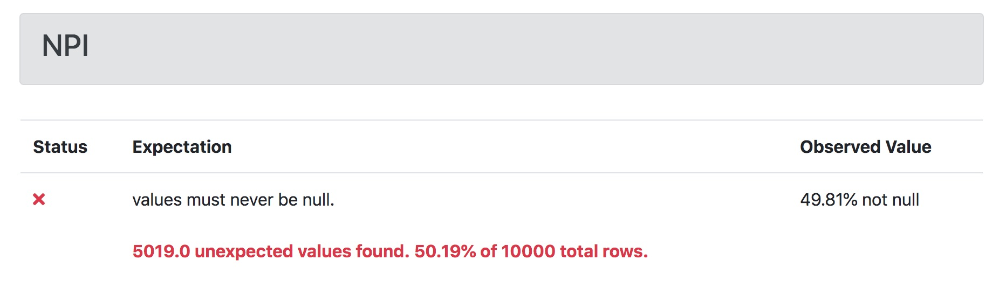
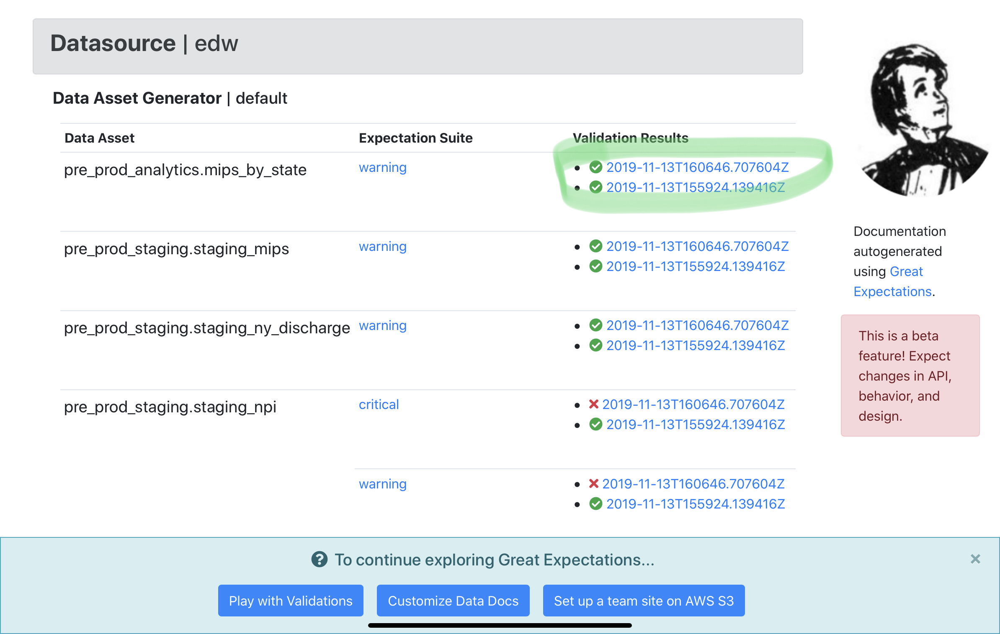
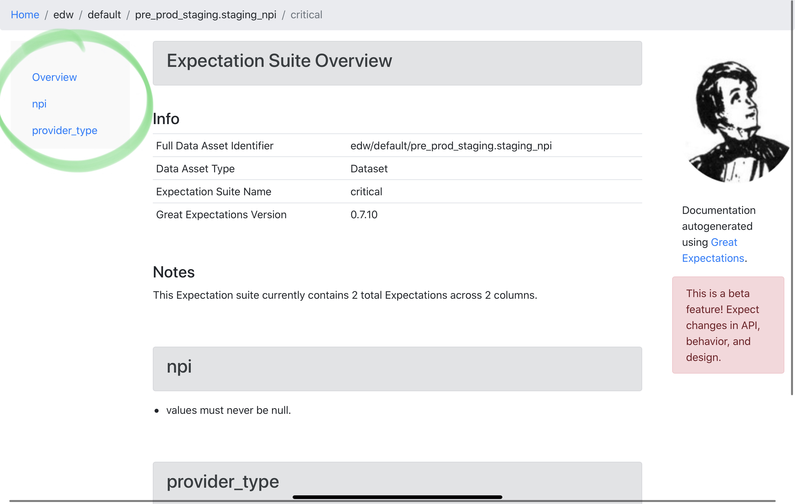
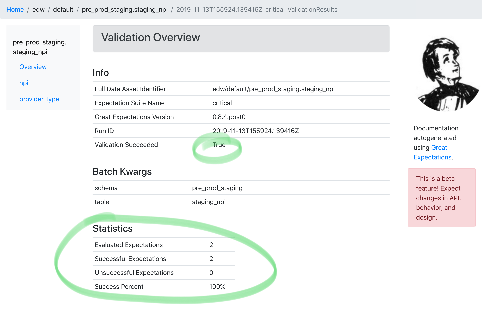
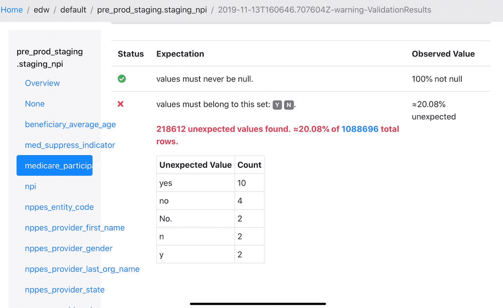

# Data Docs Walkthrough Prototype

An expectation is a falsifiable, verifiable statement about data.

Expectations provide a language to talk about data characteristics and data quality - humans-humans, humans-machines and machines-machines.

Expectations are both tests of data and its documentation.

This is an expectation:

It can be presented as a human-friendly HTML.

Also, in other languages:

An expectation can be presented in a machine-friendly JSON:

A machine can test if a dataset conforms to the expectation. 

Validation produces a validation result object:

This object has rich context about the test failure.

The validation result can be rendered in HTML:

Data team members can use this HTML to communicate about test failures.

This is the Data Docs home page!

These are the chunks of data that you have told Great Expectations about.

These are the Expectations Suites.

These are validation results that passed.

This is an overview of an Expectation Suite

This lists all the fields in your data.

These are validation results that failed.

This is the overview of a Validation.

This is a single passed Expectation. Note the observed value.

This is a single failed Expectation. Note the observed value.

This is a single failed Expectation. Note the observed value includes unexpected values from your data. This helps you debug pipeines faster.

This is a single failed Expectation. Note the observed value includes unexpected values from your data. This helps you debug pipeines faster.
