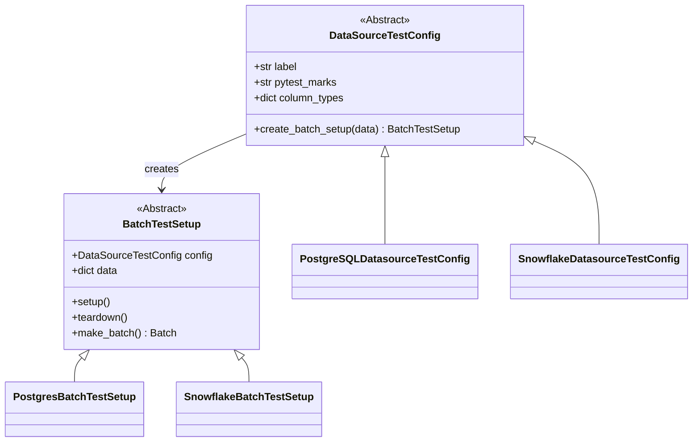
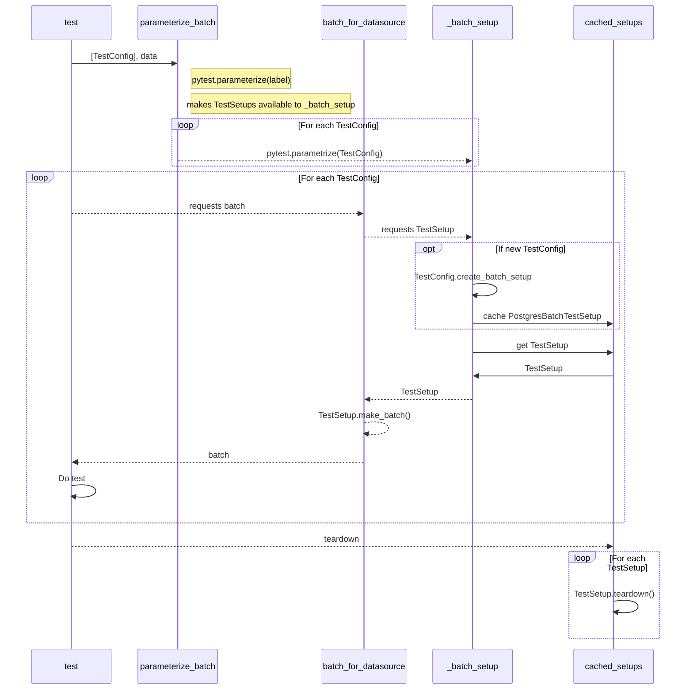

# DataSource and Expectation Integration Tests
Most of the tests in this directory make use of a few utilities that help load data into various data sources.
The following sections provide an overview of how it works.

## Overview of the primary classes

The following is a rough class diagram of the main classes involved in test testing utilities.
* DataSourceTestConfig is the public interface; instance are passed to `parameterize_batch_for_data_sources`
    * Holds optional schema information
    * Knows about pymarks
* BatchTestSetup these are instantiated behind the scenes
    * Holds data
    * Knows about the actual data source
    * Sets up / tears down data



## Overview of the main flow
The following shows the rough flow when running tests with `parameterize_batch_for_data_sources` and the `batch_for_datasource` fixture.

Some names have been truncated in the the diagram

An overview of the main pieces:

* test: this is the test you are writing
* parameterize_batch: `parameterize_batch_for_data_sources`
* `batch_for_datasource`: fixture that pulls in the batch for you
* _batch_setup: `_batch_setup_for_datasource`. fixture that handles caching test configs and calling setup
* cached_setups: ensures that identical TestSetups are only setup / torn down once to improve performance



## Onboarding a data source

Every data source this repository knows about — SQL backend, dataframe engine, object store,
tested or merely declared — states one **record** describing what it is and how its tests are
selected. The record is a frozen dataclass,
`tests/integration/test_utils/data_source_config/data_source_spec.py::DataSourceSpec`. A SQL
backend states a **sub-record**,
`tests/integration/test_utils/data_source_config/backend_spec.py::SqlBackendSpec`, which adds the
dialect facts that are meaningless for anything that speaks no dialect.

The shared classes already know how to read a record. Onboarding a data source that an existing
harness class can drive does not add a class shaped like the diagram above; it adds one
declaration. For SQL that is literally true — `SqlDatasourceTestConfig` and `SQLBatchTestSetup`
are shared across every dialect — and for a new *kind* of data source it is true of everything
except the batch-setup class that actually loads data.

The steps, in order: declare the record, choose tiers, add the wiring entries, register the
declaration, run the wiring drift check, run the data source's suite. Three worked examples run
through the whole walkthrough:

| Example | Kind | Why it is here |
| --- | --- | --- |
| `SingleStoreDatasourceTestConfig` (`.../data_source_config/singlestore.py`) | SQL backend, local container | The newest backend onboarded this way; shows the SQL sub-record and every wiring entry |
| `PandasDataFrameDatasourceTestConfig` (`.../data_source_config/pandas_data_frame.py`) | Non-SQL, in process | Shows a core record with no dialect facts, and a *shared* marker |
| `AZURE_BLOB_STORAGE` (`.../data_source_config/declaration_only.py`) | Declared, not tested | Shows a record with no config class, no marker and no tier |

### The record schema is a published contract

The field set below is read outside this walkthrough — by the suites that derive their
parameterization from it, by the wiring drift check, and by tooling that generates published
data-source material from the registry. **Adding a field is a shared-contract change, not a local
one.** A new field means a new fact every consumer may start depending on and every future
declaration has to consider, so it lands with the consumers reviewed, not quietly alongside the
one data source that wanted it. The same is true of adding a `SupportTier` member: a tier is a
claim about a suite, so a member arrives with the suite that earns it.

Core record (`DataSourceSpec`) — every data source, whatever kind:

| Field | Required | Meaning |
| --- | --- | --- |
| `label` | yes | Harness identity. Appears in the parameterized test id and orders the registry. Unique across all records. |
| `public_name` | yes | The user-facing name, the one a generated document prints. Deliberately *not* derived from `label`, and deliberately **not** unique — two records describing variants of one data source carry the same public name (both pandas records say `Pandas`). Where the shipped supported-data-source vocabulary has a member for this data source, this field carries that member's exact value. |
| `provisioning` | yes | Where a test run obtains an instance: `LOCAL_CONTAINER`, `LOCAL_FILE`, `EXTERNAL_CREDENTIALS`, or `IN_PROCESS`. |
| `execution_engine` | no | `PANDAS`, `SPARK` or `SQL`, where one engine owns the record. Left unset when the record names a *storage target* rather than an engine: an object store is read by more than one engine, so naming a single one would state something false. |
| `fluent_types` | no | The fluent datasource `type` literals this record corresponds to, so a suite parameterized over the fluent type registry can map its results back onto tier declarations. Many-to-many in both directions. |
| `provisioning_note` | no | Free text for what reaching a real instance actually takes, where the provisioning member alone does not say enough. |
| `marker` | no | The pytest marker name that selects this data source's tests; may differ from `label` (SQL Server's label is `mssql`, its marker is `sql_server`). `None` means no marker selects it. |
| `marker_scope` | no | `DEDICATED` or `SHARED` — see "Dedicated and shared markers" below. An undeclared scope reads as dedicated. |
| `tiers` | no | The named suites this data source participates in. Empty is a valid declaration. |
| `tier_case_exclusions` | no | Case key → reason, letting a tier member sit out one named case within that tier's suite. |
| `ci_lane` | no | `CiLaneRef(workflow_job=..., marker_token=...)`: the workflow job that runs this data source's lane and the marker token it selects on. |
| `dev_requirements_file` | no | Repo-relative path, e.g. `"reqs/requirements-dev-mysql.txt"`. |
| `task_runner_marker` | no | Key into the task runner's dependency map; `None` means no entry is needed. |
| `container_service` | no | Compose *directory* name under `assets/docker/`. |

SQL sub-record (`SqlBackendSpec`) — everything above, plus:

| Field | Required | Meaning |
| --- | --- | --- |
| `uses_schema` | yes | Whether the harness creates a per-test schema and qualifies tables with it. Required rather than defaulted on purpose: a backend that forgot it would silently inherit whichever shape the default named, and get tests exercising a shape nobody chose. |
| `transaction_mode` | no | `EXPLICIT_COMMIT` (default) or `AUTOCOMMIT`. |
| `table_schema_items` | no | Zero-argument factory returning dialect-required positional schema items for **one** table. |
| `column_type_overrides` | no | Python-type → SQLAlchemy-type overrides, merged over the shared default inference. |
| `insert_parameter_limit` | no | Positive bound on bound parameters per `INSERT`, or omitted for no chunking. |

Both are keyword-only and frozen. Keyword-only, because dataclass inheritance would otherwise
forbid the sub-record's required `uses_schema` from following the core record's defaulted fields.
Frozen, because a record describes what a data source *is* rather than the state of a run — which
makes it hashable, safely shareable across session-scoped machinery, and turns an accidental write
into an error where it happens.

Constructing a record has no side effect and performs no validation. Validation belongs to
registration, which is the deliberate act of joining the set the harness treats as "the data
sources that exist" — which is what lets a test build a throwaway record without affecting that
set.

### 1. Declare the record

A config states its record as the class variable `DATA_SOURCE_SPEC`, once. A non-SQL config
subclasses `DataSourceTestConfig` and declares a core record:

```python
@register_data_source_config
class PandasDataFrameDatasourceTestConfig(DataSourceTestConfig):
    DATA_SOURCE_SPEC = DataSourceSpec(
        label="pandas-data-frame",
        public_name="Pandas",
        provisioning=DataSourceProvisioning.IN_PROCESS,
        execution_engine=ExecutionEngineKind.PANDAS,
        fluent_types=frozenset({"pandas"}),
        marker="unit",
        marker_scope=MarkerScope.SHARED,
        ci_lane=CiLaneRef(workflow_job="unit-tests", marker_token="unit"),
        tiers=frozenset({SupportTier.CANONICAL_EXPECTATIONS}),
    )
```

A SQL config subclasses `SqlDatasourceTestConfig` and declares the sub-record:

```python
@register_sql_config
class SingleStoreDatasourceTestConfig(SqlDatasourceTestConfig):
    DATA_SOURCE_SPEC = SqlBackendSpec(
        label="singlestore",
        public_name="SingleStore",
        provisioning=DataSourceProvisioning.LOCAL_CONTAINER,
        execution_engine=ExecutionEngineKind.SQL,
        fluent_types=frozenset({"sql"}),
        marker="singlestore",
        ci_lane=CiLaneRef(workflow_job="marker-tests", marker_token="singlestore"),
        uses_schema=False,
        tiers=frozenset({SupportTier.CURATED_SQL}),
        column_type_overrides={str: sqltypes.VARCHAR(255)},
        dev_requirements_file="reqs/requirements-dev-singlestore.txt",
        task_runner_marker="singlestore",
        container_service="singlestore",
    )
```

`container_service` is meaningful only with `LOCAL_CONTAINER` provisioning; declaring it without
that provisioning is rejected, because nothing in the harness would ever start that service.

Fields beyond identity and provisioning are *extension points*: a declared fact that lets a shared
class do the right thing for this data source without an `if data_source == ...` branch inside it.
If a data source needs a fact the record has no field for, the fix is to add the field — as a
shared-contract change, per the section above — and give it a docstring explaining the problem it
solves, not to special-case the data source inside the shared setup or work around the gap locally
in its own module.

#### Declaration-only records: declaring a data source this repository does not test

A record does not need a config class. `tests/integration/test_utils/data_source_config/declaration_only.py`
holds the data sources this repository declares but does not exercise, registered through the
config-less entry point `register_data_source(spec)` rather than a class decorator:

```python
AZURE_BLOB_STORAGE = register_data_source(
    DataSourceSpec(
        label="azure-blob-storage",
        public_name="Azure Blob Storage",
        provisioning=DataSourceProvisioning.EXTERNAL_CREDENTIALS,
        fluent_types=frozenset({"pandas_abs", "spark_abs"}),
    )
)
```

**What such a record asserts:** this data source exists; here is the name its users know it by;
here is where a test run would obtain an instance; here are the fluent datasource types it is
reachable through; and here is whatever wiring genuinely exists for it in this repository.

**What it does not assert:** that any suite passes against it. It claims no tier, because no suite
in this repository runs against it, and a tier claim asserts that one does.

**Prefer declaring an untested data source to omitting it.** Requiring a config class would mean
the only data sources this repository can *describe* are the ones it happens to *run* — which is
exactly what makes "what data sources exist" unanswerable from code, and what lets a data source
be shipped, publicly documented, and invisible to every check here. A declaration-only record
makes the gap a fact in the registry that tooling can read and a maintainer can close, instead of
an absence nobody can see. Every record is held to the same registration rules whichever entry
point enrolled it, so a declaration-only record cannot be sloppier than a config-bound one.

**The one misreading to avoid: a declared CI lane and a tier claim are different assertions.** A
lane means a job installs this data source's dependencies and runs something. A tier means that
tier's suite passes here. Only the second is a support claim. Amazon S3 and Google Cloud Storage
show why the two are worth keeping apart: they declare real lanes that install their client
libraries, and they claim the fluent API tier because that tier's suite covers the fluent types
they are reached through — but claiming it says nothing about whether either store is reachable,
and neither claims a tier that would assert expectations run against them.

#### Dedicated and shared markers, and having no marker at all

`marker_scope` states whether the declared `marker` names this data source alone or a class of
data sources.

- **`DEDICATED`** (also what an *undeclared* scope means) — the marker names this data source and
  nothing else. **Uniqueness is enforced:** registering a second record claiming the same
  dedicated marker is rejected, naming both registrants. A record claiming a marker as its own is
  asserting the marker selects it and nothing else, and two records asserting that about one
  marker cannot both be right — a suite selecting on it would silently run tests belonging to
  another data source.
- **`SHARED`** — the marker names a *dependency class* that more than one data source belongs to.
  `aws_deps` names the tests needing the AWS client libraries; `spark` names everything
  Spark-dependent; `unit` names every unit test in the repository. **Uniqueness is not enforced,**
  because a dependency class can legitimately contain more than one data source, and rejecting the
  second record to declare it would be rejecting a true statement.

An undeclared scope reads as dedicated rather than shared, deliberately: a marker names one data
source unless a record says otherwise, so the relaxation is keyed on an explicit `SHARED`
declaration. Reading an undeclared scope as shared would silently drop the collision check for
every record that declares no scope.

Declaring a scope with no marker is rejected — a scope describes a marker, and there is none there
for it to describe.

**When a data source has no marker at all, declare none.** Do not invent one. The wiring drift
check rejects a coordinate that resolves to nothing, so naming a marker that has never been
declared in `pyproject.toml` fails it; naming nothing is the accurate statement that no marker
selects this data source. Azure Blob Storage declares no marker for exactly this reason. Note that
a record with no marker cannot claim a tier (see step 2) and cannot be registered *with a config
class*, because a config is parameterized into a suite by its mark and that mark has to resolve —
so a config-bound record always declares a marker, while a declaration-only one need not.

#### When the record is a SQL sub-record: the dialect extension points

Everything in this subsection applies to `SqlBackendSpec` only. Each field is a declared dialect
fact that keeps the shared `SQLBatchTestSetup` free of per-dialect branching.

- **`uses_schema`** — not every backend supports schema-scoped objects the way PostgreSQL,
  MySQL, SQL Server, Snowflake, Databricks, Redshift, and Trino do. Six backends declare
  `uses_schema=False`: SQLite, SingleStore, ClickHouse, BigQuery, Oracle, and the ad-hoc escape
  hatch — each for its own dialect reason, which its record's comment states (ClickHouse has no
  `CREATE SCHEMA` and carries the database in the connection string; an Oracle schema is a user,
  not a namespace a bare `CREATE SCHEMA` can create). The shared setup then never attempts to
  create or target a schema for them. Supplying a schema name to a backend that declares no schema support raises
  `ValueError("Schema name provided but use_schema is False for this
  datasource type.")` — verbatim, unchanged by this declaration mechanism.
- **`column_type_overrides`** — a dialect whose type handling differs from the shared inference
  map declares the difference here, and the shared setup merges the declared mapping over its own
  default Python-type-to-SQLAlchemy-type inference before creating any table. The declarants do
  not share one mapping: MySQL, Databricks, SingleStore, and the ad-hoc escape hatch declare only
  `{str: sqltypes.VARCHAR(255)}`, because those dialects reject a bare, length-less `VARCHAR`;
  Oracle declares that same `str` override *plus* `datetime`/`pd.Timestamp → TIMESTAMP` and a
  scale-carrying `DECIMAL` for `float`; Trino declares only `{float: sqltypes.FLOAT(precision=53)}`;
  and ClickHouse declares a seven-entry driver-typed mapping (see the guarded-import rule below).
  Declare the entries your dialect actually needs, and say why in a comment, as those records do.
- **`transaction_mode`** — not every backend supports an explicit `COMMIT`. Databricks, ClickHouse,
  and Trino declare `transaction_mode=TransactionMode.AUTOCOMMIT`, again for distinct dialect
  reasons — ClickHouse has no standard transactions at all, so both its rollback and its DBAPI
  commit are no-ops. The ad-hoc escape hatch reaches the same mode per instance rather than per
  class, by deriving a spec override from its `autocommit` field. The shared setup's commit helper
  reads this off the declaration instead of inspecting the connection's dialect, and skips the
  `conn.commit()` call for a backend that declares it.
- **`insert_parameter_limit`** — some backends cap the number of bound parameters a single
  `INSERT` can carry. Databricks declares `insert_parameter_limit=250`; the shared insert path
  reads this to decide whether to chunk a bulk insert, and by how much. A backend with no limit
  omits the field and gets a single unchunked statement.
- **`table_schema_items`** — a dialect-specific storage-engine construct (for example, a
  storage-engine clause some dialects require on `CREATE TABLE`) is not accepted as a SQLAlchemy
  `Table` keyword argument at all; it has to be supplied positionally, alongside the generated
  columns. This field is a zero-argument factory, not a stored instance, returning a fresh
  sequence of such items on every call. That is deliberate, not incidental: a construct like this
  binds to the first `Table` it is attached to, so reusing one instance across two tables would
  corrupt the second table's schema. The shared setup calls the factory once per table it
  creates — once for the primary table, once per extra table — never once for the whole setup.
  ClickHouse is the shipped worked example: `clickhouse.py` lines 37–45 define a factory returning
  a fresh `MergeTree` engine, and bind it to a name annotated with the framework's
  `TableSchemaItemFactory` alias so the record's declaration is checked against the alias rather
  than against a restatement of the signature. Read that first. The field's edge cases — the
  default `None` path, and a factory called once per table — are additionally pinned by throwaway
  declarations in `tests/integration/test_utils/test_sql_batch_test_setup.py`.

##### Two rules a first-time onboarder will get wrong

**1. A data source module must import successfully with its driver package absent.** The harness
package (`tests/integration/test_utils/data_source_config/__init__.py`) imports every data source
module unconditionally, and the shared verification lane (`tests/test_data_source_registry.py`,
which runs under the `project` marker) installs no SQL driver at all. If a module raises on import
in that lane, the whole package fails to import, which takes down every other data source's tests
along with it, since the whole suite is collected from one package.

A driver import or attribute dereference that would raise when the driver package is missing must
not sit at module scope unguarded. There are three acceptable shapes, and which one applies
depends on the field:

- **Defer it inside a method or factory.** This is available for any field whose declared type is
  itself a callable — `table_schema_items` is the only one today. Storing the factory function,
  rather than its result, means the dialect-specific work happens only when the factory is
  actually called, which is only when a test selected for that backend is running and its driver
  is installed.
- **A lazy compatibility-style accessor for the values**, i.e. referencing dialect-specific
  values through a compatibility layer that resolves to a safe stand-in when the underlying
  package is absent instead of raising — the pattern `great_expectations.compatibility.sqlalchemy`
  already uses for SQLAlchemy itself. Where such a shim exists for the values a backend needs, it
  can be referenced freely at module scope.
- **A mapping built at module scope behind an import guard that yields an empty mapping when the
  driver package is absent.** This is explicitly permitted — not a workaround. Where a backend's
  override values come from its driver, and no compatibility shim covers them, this is the only
  shape left: deferral is not available for that field the way it is for `table_schema_items`,
  because `column_type_overrides` is declared as a `Mapping`, not a `Callable`. Wrapping the
  driver-dependent construction in a function and calling that function at declaration time still
  evaluates it — and still raises — at import time, because it is the *value* that gets stored in
  the record, not a callable that could defer it. A backend whose override values come from its
  driver therefore writes the shape ClickHouse already ships (`clickhouse.py` lines 31–78):

  ```python
  try:
      from clickhouse_sqlalchemy import types as clickhouse_types
  except ImportError:
      clickhouse_types = None

  _COLUMN_TYPE_OVERRIDES = (
      {} if clickhouse_types is None else {str: clickhouse_types.Nullable(clickhouse_types.String)}
  )
  ```

  and passes `_COLUMN_TYPE_OVERRIDES` as `column_type_overrides=...`. Which of the two module-scope
  routes applies is decided by where the values come from, not by which is more common. The more
  common route is the compatibility layer: MySQL, Databricks, SingleStore, Oracle, Trino, and the
  ad-hoc escape hatch all take their override types from
  `great_expectations.compatibility.sqlalchemy` and declare them unguarded, because core SQLAlchemy
  types are what those dialects need. ClickHouse is the one backend today whose override values
  exist only in its own driver package, so it is the one that takes the guarded route — that is the
  pattern's shipped user, not a hypothetical.

  The consequence of the guarded shape is that the declared record becomes environment-dependent: populated where
  the driver is installed, empty where it is not. That is safe because the mapping's only consumer
  is type inference during table construction, which only runs inside a test that has already been
  selected for that backend's marker — but it also means no assertion about the override mapping's
  *contents* can run in the driver-free lane. Such an assertion has to run under the backend's own
  marker, where the driver is actually installed.

**2. Dialect table schema items are supplied by a factory returning positional items, not a
stored instance.** Covered above under `table_schema_items`, but worth restating on its own: such
constructs are not accepted as `Table` keyword arguments, and each table needs its own freshly
constructed items because the construct binds to the first table it is attached to.

### 2. Choose tiers

`tiers` is a `FrozenSet[SupportTier]` naming the suites this data source participates in.

- **`SupportTier.CANONICAL_EXPECTATIONS`** — the shared canonical expectation parameterization,
  the suite the expectation modules run. This is a statement about a *suite*, not about an engine:
  pandas, Spark and SQL data sources all declare it. Membership puts a data source in
  `ALL_DATA_SOURCES`, and — where the record also declares the SQL execution engine — in
  `SQL_DATA_SOURCES`.
- **`SupportTier.CURATED_SQL`** — the smaller curated SQL backend suite
  (`tests/integration/data_sources_and_expectations/test_curated_backend_suite.py`), which every
  curated-tier member inherits without editing that module. It keeps saying SQL because the suite
  it gates exists to prove dialect behavior, and so has no meaning for a data source that speaks
  no dialect.

Always write the declaration form, never a bare set literal:

```python
tiers=frozenset({SupportTier.CURATED_SQL})
```

`{SupportTier.CURATED_SQL}` alone is a `set`, and mypy rejects a `set` against the `FrozenSet`
field — `tests/` is inside mypy's checked files, so that is a hard failure, not a lint note. A data
source joining both tiers writes
`frozenset({SupportTier.CANONICAL_EXPECTATIONS, SupportTier.CURATED_SQL})`; one joining neither
omits the field. Claiming no tier is a valid, honest declaration meaning "this data source ships,
but no tier's suite proves it".

#### A tier claim obliges a marker and a CI lane

Registration rejects a record that claims any tier and declares no `marker`, and one that claims
any tier and declares no `ci_lane`. Under `LOCAL_CONTAINER` provisioning, a tier claim additionally
obliges a `container_service`. The drift check then re-checks the marker and lane against the
actual configuration files.

The reason, not just the rule: **a tier is a claim that a suite runs somewhere.** With no marker,
nothing can select this data source's tests; with no lane, nothing attests that they ever ran; and
for a locally containerized data source with no named compose service, nothing can start the thing
the suite would run against. A tier claim no lane attests to is how a support table starts
advertising coverage that never runs — the claim is published, nothing checks it, and the first
sign that it was never true is a user hitting the gap in production. These obligations are scaled
to the claim rather than imposed on every record precisely so that *not* claiming a tier stays an
honest, cheap option; the cost lands only where a claim is made.

#### The shared-parameterization criterion is mandatory for an engine-bound config

A record that has a config class **and** declares an `execution_engine` must either declare
`SupportTier.CANONICAL_EXPECTATIONS`, or have its label listed in the deliberate non-participants
literal in `tests/integration/test_utils/data_source_config/registry.py`, with the reason it sits
out. Registration rejects anything else.

The reason: a config the harness drives against a named engine runs that suite unless someone
decided otherwise, and that decision has to be written down. Silent omission is how three SQL
backends came to be missing from the suite — opting out required nothing, so nobody noticed it had
happened. The four curated-tier backends that sit out today each carry an entry stating that their
dialect behavior is proven by the curated suite instead.

The rule is keyed on those two facts together for a reason. A declaration-only record has no config
to instantiate and runs in no suite, so dragging it in would be inventing coverage; a config naming
no execution engine is one the derived engine lists cannot place either.

#### Excluding one case within a tier

If a tier member is a member but one specific case in that tier's suite is not meaningful for it,
the supported way to record that is a per-case entry in `tier_case_exclusions`, keyed by the
suite's published case key, with a required reason:

```python
tier_case_exclusions={"quoted_identifiers": "this dialect has no reserved-word column names"}
```

The wrong shapes are withdrawing from the tier entirely (that throws away every case the data
source *does* pass) and adding a data-source-specific `if` inside a shared case in the suite module
(that reintroduces the per-dialect branching the tier mechanism exists to avoid). The exclusion
accessor (`data_sources_for_tier_case`) is the only place an exclusion takes effect — every case in
the curated suite is parameterized through it rather than over the raw tier list, specifically so a
downstream exclusion is honored no matter which case asks.

**The per-case exclusion ceiling.** A record may declare at most two entries in
`tier_case_exclusions`, counted over the whole mapping — not per tier. Every exclusion counts
toward the ceiling regardless of what its reason records: an exclusion for observed
non-determinism costs exactly as much coverage as one for a genuine dialect gap. Registering a
declaration carrying a third exclusion raises `ValueError` at decoration time, naming the record,
the count, and every declared key. The remedy the error states is to escalate that data source's
tier participation — for example, dropping it from the tier rather than papering over three unmet
cases — not to raise the ceiling. The count is a property of one declaration in isolation (it needs
no other record's state and no published key set), which is why it is enforced at registration
rather than by a suite-level check.

The reasoning matters as much as the number. A single exclusion's reason makes *that* exclusion
answerable — a reviewer can read the string and judge it. But a set of exclusions is not
accountable just because each member is: nothing about reading three individually-justified
reasons tells you that, together, they have quietly hollowed out the tier's coverage of that data
source. Only a count does that. A documented limit whose purpose isn't understood is the one the
first inconvenienced maintainer raises instead of respecting — hence writing the reasoning down
here, not just the number.

Two caveats on "not per tier": today `tier_case_exclusions` carries no tier attribution at all —
a key is just a case key, and the ceiling counts however many are declared, full stop. This is
exact only because `SupportTier.CURATED_SQL` is currently the only tier that publishes case keys
a record can exclude by name. If a second tier ever grows its own per-case exclusion mechanism,
the ceiling as implemented today would count across both tiers combined rather than per tier, and
that must be made per-tier before a second publishing tier arrives, not after.

### 3. Add the wiring entries

A declared `marker`, `dev_requirements_file`, `task_runner_marker`, `container_service`, and
`ci_lane` are promises the record makes about entries that exist elsewhere in the repository.
Nothing derives those entries from the declaration — they have to be added by hand, in the same
change that adds the declaration. Declare only the coordinates that are true: an undeclared
coordinate is never demanded, while a declared one that resolves to nothing fails the drift check.

Using SingleStore's actual entries as the reference:

- **`pyproject.toml`**, `[tool.pytest.ini_options] markers`: a one-line entry for the marker,
  e.g. `"singlestore: mark a test as SingleStore-dependent.",`.
- **`tests/conftest.py`**, `REQUIRED_MARKERS`: the marker name added to this set, e.g.
  `"singlestore",`.
- **`tasks.py`**, `MARKER_DEPENDENCY_MAP`: an entry keyed by `task_runner_marker` naming the
  requirements file(s) and, for a locally containerized data source, the compose service(s):

  ```python
  "singlestore": TestDependencies(
      ("reqs/requirements-dev-singlestore.txt",),
      services=("singlestore",),
  ),
  ```

- **`.github/workflows/ci.yml`**: the marker token added to the relevant job's marker matrix
  (SingleStore's `ci_lane` names the `marker-tests` job; its token `singlestore` is one entry in
  that job's marker list).
- **`assets/docker/<container_service>/docker-compose.yml`**: the compose file for a
  `LOCAL_CONTAINER` data source, at the directory named by `container_service`. This directory name
  is the compose *directory*, not necessarily the compose *service* name inside it — SingleStore's
  `container_service="singlestore"` names the directory `assets/docker/singlestore/`, whose
  compose file defines a service called `singlestore_db`.
- **`reqs/requirements-dev-<name>.txt`**: the file named by `dev_requirements_file`, if the data
  source needs one. SQLite needs neither a requirements file nor a task-runner entry, and omits
  both fields.

A record with no marker, no lane and no wiring — Azure Blob Storage — adds nothing here, and that
is the correct outcome rather than an unfinished one.

### 4. Register the declaration

Registration enrols a record into the process-global registry the harness treats as "the data
sources that exist" — the set the derived tier and engine lists, the completeness checks, and the
wiring drift check all walk. There are three entry points, all in
`tests/integration/test_utils/data_source_config/registry.py`:

| Entry point | Use it for | What it adds |
| --- | --- | --- |
| `@register_sql_config` | A config class declaring a `SqlBackendSpec` | Everything below, plus the one rule that is a property of being a SQL config: the declared record must be a SQL sub-record |
| `@register_data_source_config` | A config class declaring any record | Everything below, plus the rule that a config-bound record must declare a marker |
| `register_data_source(spec)` | A record with no config class | The shared rules only; returns the record so a declaration module can bind it in one statement |

All three route through the same validation, so a record registered without a config class is held
to exactly the same rules as one registered with one. Rules that validated less on one path would
make them a property of *how* a record was registered rather than of the record.

Then add the new module's import to
`tests/integration/test_utils/data_source_config/__init__.py`, alongside the other data source
modules and **before** the `tiers` import (that file's own comment explains why the ordering
matters: the derived lists are built once, at that module's import time, from whatever the registry
holds at that moment, so a module imported after `tiers` would be silently absent from them even
though it registered successfully).

Registration runs the completeness checks, raising `ValueError` at decoration time — that is, at
import time, since a decorator runs when the class statement executes. Each message names the
offending declaration: by config class where there is one, and by label and public name where
there is not.

Well-formedness of one record, checked for every record:

| Failure | Remedy |
| --- | --- |
| Empty `label` | Give the declaration a non-empty `label`; it appears in the parameterized test id. |
| Empty `public_name` | Give the declaration the user-facing name. There is deliberately no fallback: deriving it from the label would invent a second spelling of a name the shipped vocabulary already fixes. |
| `marker` declared but empty | Give a non-empty marker name, or declare no marker at all — that is how a record says no marker selects it. |
| `marker_scope` declared with no `marker` | Declare the marker the scope describes, or drop the scope. |
| Empty `ci_lane.workflow_job` | Name the workflow job the lane runs in; a lane naming no job cannot be located in the workflow file at all. |
| Empty `ci_lane.marker_token` | Name the marker token that job selects on. |
| `container_service` declared without `LOCAL_CONTAINER` provisioning | Remove the field, or set `provisioning=DataSourceProvisioning.LOCAL_CONTAINER` if the data source really is locally containerized. |
| A `tier_case_exclusions` entry has an empty case key | Name the case being excluded. |
| A `tier_case_exclusions` entry has an empty or whitespace-only reason | Record why the case is excluded — an unexplained exclusion is exactly the silent narrowing the mechanism exists to prevent. |
| More than two `tier_case_exclusions` entries | See "The per-case exclusion ceiling" above — escalate this data source's tier participation rather than raising the limit. |

Obligations scaled to what the record claims:

| Failure | Remedy |
| --- | --- |
| Claims a tier but declares no `marker` | Declare the marker that selects its tests, or claim no tier. |
| Claims a tier but declares no `ci_lane` | Declare the lane that runs it, or claim no tier. |
| Claims a tier with `LOCAL_CONTAINER` provisioning but names no `container_service` | Name the compose service that starts it, or claim no tier. |
| Has a config class and an `execution_engine`, but declares neither `SupportTier.CANONICAL_EXPECTATIONS` nor an entry in the non-participants literal | Declare the criterion, or add this label to the non-participants with the reason it sits out. |

Uniqueness across the registry:

| Failure | Remedy |
| --- | --- |
| Duplicate `label` already registered | Rename the field; both registrants appear in the message. |
| Duplicate *dedicated* `marker` already registered | Rename the marker — or, where it really does name a class of data sources, declare `marker_scope=MarkerScope.SHARED` on **both** records. A shared marker is never checked for collision. |

Rules that are properties of the entry point used:

| Failure | Remedy |
| --- | --- |
| `@register_data_source_config` on a config whose record declares no `marker` | Declare a marker — a config is parameterized into a suite by its mark, so that mark has to resolve — or register the record on its own through `register_data_source`. |
| `@register_sql_config` on a config whose record is not a `SqlBackendSpec` | Declare a `SqlBackendSpec`, or register through `@register_data_source_config` if the data source has no dialect facts. |

Dialect-only rules, checked for a `SqlBackendSpec` and nothing else:

| Failure | Remedy |
| --- | --- |
| `insert_parameter_limit` is zero or negative | Use a positive integer, or omit the field entirely for no chunking limit. |
| `table_schema_items` declared but not callable | Pass a zero-argument factory function, or omit the field. (Registration checks only that it is callable — it is never invoked at registration time, since calling it would require the data source's driver package, which registration must not assume is installed.) |

Omitting `uses_schema` on a SQL sub-record is not in these tables because it never reaches
registration: it is a required constructor argument, so the omission is a `TypeError` at the
declaration itself, where a reader can see exactly what is missing.

Today the registry is populated by nothing more than the package's own modules importing
themselves and running their own registration decorators — a deterministic set of class-level side
effects, confined to two dictionaries, with no environment read anywhere in the process. That is a
deliberate replacement for an earlier mechanism in the shared SQL setup module that read an
environment variable and mutated the SQLAlchemy dialect enumeration as a side effect of that module
simply being imported. Importing the harness package today has no side effects beyond populating
the registry from its own declarations; it reads no environment variable and mutates no shared
enum.

Registered records are read back through the registry accessors — `iter_data_sources`,
`iter_data_source_specs`, `iter_data_source_configs`, `data_source_configs_for_tier`,
`data_source_configs_for_engine`, and `data_sources_for_tier_case` — all ordered by label. These
are the supported way to read membership; nothing downstream should reimplement exclusion
filtering or rebuild a list by hand. `isolated_registry()` is the seam a test uses to register
throwaway records without leaking them into the real set.

### 5. Run the wiring drift check

```
pytest tests/test_data_source_wiring.py -m project -q
```

This module (`tests/test_data_source_wiring.py`) is a *different* check from the registration
completeness checks above: registration validates that one declaration is well-formed in
isolation; the wiring drift check cross-references every *registered* record's declared
coordinates against the actual files those coordinates point at — `pyproject.toml`,
`tests/conftest.py`, `tasks.py`, `.github/workflows/ci.yml`, and `assets/docker/`. It is
parameterized over the registry, so each record is its own test case; it skips the coordinates a
record does not declare, so a record carrying nothing but identity and provisioning passes; and it
asserts presence only — never a count, an order, or a structural shape — so it survives unrelated
edits to any of those files. Its failure messages, and their remedies:

| Failure | Remedy |
| --- | --- |
| `marker` not in `pyproject.toml`'s markers list | Add the marker entry (step 3, first bullet). |
| `marker` not in `REQUIRED_MARKERS` | Add the marker to that set in `tests/conftest.py` (step 3, second bullet). |
| Declared `dev_requirements_file` does not exist on disk | Create the file at the declared path, or fix the declared path. |
| Declared `task_runner_marker` has no `MARKER_DEPENDENCY_MAP` entry | Add the entry in `tasks.py` (step 3, third bullet), or drop the declared key. |
| That entry does not list the declared `dev_requirements_file` | Add the file to the entry's requirement files, or fix whichever of the two is wrong. |
| Declared `ci_lane.workflow_job` has no matching job, or `ci_lane.marker_token` does not appear as a whole token in that job | Add the job, or add the token to that job's marker matrix in `.github/workflows/ci.yml`. Token matching is whole-token, not substring, so a token that is merely a prefix of one already present still fails. |
| Declared `container_service` has no compose file at `assets/docker/<service>/docker-compose.yml`, or the `MARKER_DEPENDENCY_MAP` entry doesn't list it among its services | Add the compose file, or add the service to the task-runner entry's `services`. |
| Claims a tier but declares no `marker`, or no `ci_lane` | Declare it, or claim no tier. Registration rejects this too; the drift check restates it against the real workflow and markers list. |

### 6. Run the data source's suite

Once the declaration is registered and its wiring entries exist, its marker selects its tests the
same way any other data source's does:

```
pytest tests/integration -m sqlite -q
```

Swap `sqlite` for the marker the record declares. For a data source with local-container
provisioning, start the container first — each such record names a directory under
`assets/docker/`, so for SingleStore:

```
docker compose -f assets/docker/singlestore/docker-compose.yml up -d
pytest tests/integration -m singlestore -q
```

The task runner will also start a marker's services for you if you pass `--up-services`.

A data source with no marker has no suite to run, and step 6 does not apply to it. That is the
whole content of a declaration-only record: it says what exists, and stops short of claiming
anything runs.

## Checking the registration rules without a database

The registry guard suite (`tests/test_data_source_registry.py`) is the fastest way to exercise the
registration-time invariants above without touching a database — it registers throwaway records
inside an isolation seam that snapshots and restores the real registry, so nothing it does leaks
between test runs or affects the accessors for any other test:

```
pytest tests/test_data_source_registry.py -m project -q
```

It also holds the **core-vocabulary alignment** check, which keeps this registry and the shipped
supported-data-source vocabulary that Expectations declare against from naming one data source two
different ways:

| Failure | Remedy |
| --- | --- |
| A member of the shipped vocabulary that no registered record carries as its `public_name` | Set the record's `public_name` to that member's exact value, or register a record for that data source. Never drop the member — that file is a shipped public surface. |
| The set of registered public names with no member has drifted from the reviewed literal | Adopt the member's exact value as the record's `public_name` if one was added upstream, or update the literal to record the new gap. |

The check is one-directional on purpose: every *member* must reach a record, but a record need not
have a member. Adding a member is a product decision about what the shipped package advertises,
and a test harness does not get to force one. The reviewed literal is what stops the single
direction from becoming a silent ratchet.

## The ad-hoc escape hatch's autocommit mechanism

`GenericSQLDatasourceTestConfig` (`tests/integration/test_utils/data_source_config/generic_sql.py`)
is the escape hatch for testing against a SQL backend that has no dedicated config: it carries no
registration decorator and never appears in the registry, so it never gates CI membership. Its
connection string is supplied at construction time, or, if left unset, read from the
`GX_TEST_GENERIC_SQL_CONNECTION_STRING` environment variable when its batch setup is constructed.

Because it is never registered, it never needs an entry in the non-participants literal described
in step 2 — a reader who knows only that it is a harness-driven SQL config will read its absence
there as an oversight, and it is not one.

Autocommit for this config has two routes. Neither is read at import; the environment variable is
read when the batch setup is constructed, and the field is folded into the config's own
declaration when the config is constructed:

1. **The `autocommit: bool` field on the config itself.** When `True`, `__post_init__` folds it
   into a per-instance declaration override — a copy of `DATA_SOURCE_SPEC` with
   `transaction_mode=TransactionMode.AUTOCOMMIT` and, deliberately, a label suffixed
   `_autocommit`. The label change matters: the session-scoped batch-setup cache is keyed on
   config equality, which compares `label`, not this field, so two instances differing only in
   `autocommit` would otherwise collide in the cache and silently share one setup — the second
   instance inheriting the first instance's transaction behavior.
2. **The `GX_TEST_GENERIC_SQL_AUTOCOMMIT` environment variable.** Read by
   `GenericSQLBatchTestSetup.__init__` and OR'd together with the field above. Unlike the field,
   this is process-global rather than per-instance, so it is never folded into the label — every
   escape-hatch setup in one run resolves it identically, so no two cache entries can disagree
   over it the way two differently-configured instances could.

Neither route mutates any module-level state or reads the environment at import time; both are
resolved fresh each time a `GenericSQLBatchTestSetup` is constructed.
